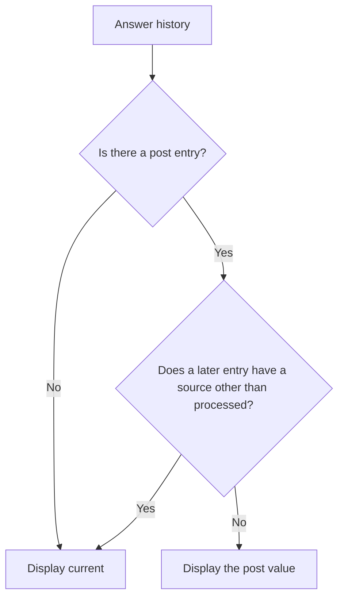

# How answer mutations work

An answer tells you what a field means now. Its history tells you how it reached that value during the request.

Those are different questions. An email address can be missing because nobody entered one, or because a change of contact method made it irrelevant.
Both situations leave an `undefined` answer, but only one involves clearing something the application previously stored.

Forge keeps a history alongside each answer so later request logic can distinguish those situations.
That history also lets a field show submitted input while validation reads a prepared version of the same answer.

## One answer has a current value and a history

An answer slot contains its `current` value and an ordered list of writes called `mutations`.
Each mutation records a value and a `source` describing where the write happened.

For example, an access effect loads an email address. The user submits a replacement with surrounding spaces, and a formatter trims them:

```typescript
{
  current: 'alex@example.com',
  mutations: [
    { value: 'old@example.com', source: 'access' },
    { value: '  alex@example.com  ', source: 'post' },
    { value: 'alex@example.com', source: 'processed' },
  ],
}
```

The latest write supplies `current`, while the earlier entries remain available.
`Answer('emailAddress')` and an effect's `getAnswer('emailAddress')` read the current value, so both see `alex@example.com`.
An effect reading `getAnswerHistory('emailAddress')` sees the record above, including the earlier values.

Most expressions only need the current value. Keeping the history alongside it gives rendering and persistence logic more information without changing what an ordinary answer reference means.

## The history belongs to one request

Every request starts with an empty answer record. When an access effect loads saved answers, its `setAnswer()` calls create the first entries for that request.
A value saved yesterday therefore appears as an `access` mutation today. Its history describes how it entered this request, not when the user originally supplied it.

That boundary matters after a redirect. The next request builds a new answer record from whatever the application loads.
The preceding request's `post`, `processed`, and clearing entries do not carry over automatically.

An answer history is therefore a record of request evaluation, not a durable audit trail.
It contains values and sources, without timestamps or the identity of the person who made a change.
Any storage or auditing across requests belongs to the application.

## Sources describe the writer, not whether the answer changed

A mutation source identifies the mechanism that wrote an answer.
Effects inherit their source from the hook running them: `setAnswer()` records `access` in an access hook and `submit` in a submit hook.
There isn't a separate `load` or `effect` source.

Preparation supplies the sources between those hooks.
On `POST`, the field's submitted value becomes a `post` mutation, and a formatter can append a `processed` mutation.
On `GET`, a missing current value receives a `default` mutation instead. A parser writes to a separate display slot, so parsing adds no mutation.

These entries record writes, not a minimal list of differences.
If an access effect loads `alex@example.com` and the user submits the same text, the history still contains both `access` and `post` entries.
The second entry tells you that submission supplied the value, even though its contents stayed the same.

A `post` value is also not necessarily the untouched HTTP body.
Field preparation normalises single and multiple values and applies the component's input-schema check before recording it.
The entry preserves the value accepted by that stage, before field formatters run.

:::deep-dive
---
title: Which writes produce an entry
description: Why some repeated values appear in history while unchanged formatter results and repeated reachability clearing do not.
summary: Show recording rules
---

Recording depends on the mechanism performing the write:

- An effect's `setAnswer()` always appends an entry, including when the value equals the current answer.
- A field's submitted-value pipeline always records `post`, including a missing submitted value.
- A formatter records `processed` only when its final result differs from the posted value under JavaScript's `!==` comparison.
- `GET` preparation records `default` when the current value is `undefined`, even when the resolved default is also `undefined`.
- Dependency clearing records `dependentWhen` when the field no longer applies, including when its current value is already `undefined`.
- Reachability clearing records `cleardown` only for an existing answer whose current value is not already `undefined`.

For strings, an unchanged formatter result adds no entry. For objects and arrays, a newly created value differs by reference even when its contents match.
A formatter pipeline contributes one final `processed` entry rather than an entry for each transformer.

These rules mean mutation count is not a count of edits by the user.
They also mean an absent `processed` entry doesn't prove that no formatter ran.

:::

## Rendering can need a different value from validation

The trimmed email example has two useful values.
Validation and submit effects need the prepared answer, `alex@example.com`, while a field re-rendering after a failed submission needs the attempted input.

On `POST`, field resolution finds the last `post` mutation.
When only `processed` mutations follow it, the field displays that posted value instead of `current`.
The spaces therefore remain visible even though validation reads the trimmed address.

A later clearing or submit write changes that decision:



If a dependency clears the address after formatting, the field resolves to the current `undefined` value.
If a submit effect replaces it, the field resolves to that replacement instead.
The history preserves the attempted input without allowing it to override a later decision about the answer.

`GET` has a different purpose: displaying answers loaded for this request.
A parser can place a display value in `parsed`, leaving `current` and its mutations unchanged.
Field resolution displays `parsed` when it is defined, otherwise it displays `current`.

A stored date can therefore remain `2026-09-25` for validation while its field displays separate day, month, and year values.
The display value isn't another saved answer, and `getAnswer()` continues to return the current value.

## Clearing keeps the reason an answer disappeared

Suppose an access effect loads an email address, but reachability determines that the email step no longer belongs to the current path.
Cleardown sets its current value to `undefined` and records the reason:

```typescript
{
  current: undefined,
  mutations: [
    { value: 'alex@example.com', source: 'access' },
    { value: undefined, source: 'cleardown' },
  ],
}
```

The slot remains in the answer record, with its earlier value available in history.
This differs from an answer that never had a value: both read as `undefined`, but the clearing entry explains why this one became empty.
Reachability cleardown also removes any parsed display value.

A field's `dependentWhen` condition records the same empty current value with a different source.
Dependency clearing happens during `POST` preparation, while reachability cleardown follows route evaluation on both `GET` and `POST` requests that reach that phase.
[Clearing answers that no longer apply](./clearing-answers-that-no-longer-apply) explains the different scopes of those decisions.

Explicit removal through an effect's `clearAnswer()` has a different meaning again.
It deletes the whole answer slot, including its history, rather than appending a clearing mutation.
A later history read therefore cannot identify that removal from a retained entry.

## Persistence needs the settled answer and the relevant history

Clearing changes the answer record for the current request. It doesn't remove an email address from the application's database or session store.
That external copy remains until application code updates it.

A save effect can read `getAllAnswers()` for the current values and `getAllAnswerHistories()` for the writes behind them.
The histories distinguish an automatic clearing operation from an answer that wasn't supplied.
That distinction matters when an API accepts partial updates: serialising an `undefined` property to JSON omits it rather than requesting deletion.

The relevant history is the one available when saving runs.
Reachability cleardown happens before submit hooks, but a submit effect can still write another value afterward.
An earlier clearing entry therefore doesn't establish that the final answer is empty.

For example, a history ending with `cleardown: undefined` describes an answer that remains cleared.
A history containing that entry followed by `submit: 'new@example.com'` describes a replacement.
The current value and latest write explain what remains, while the earlier entries explain how it got there.

[Clearing answers when a branch changes](../how-to-guides/clearing-answers-when-a-branch-changes) follows those clearing entries into an application's save effect.
