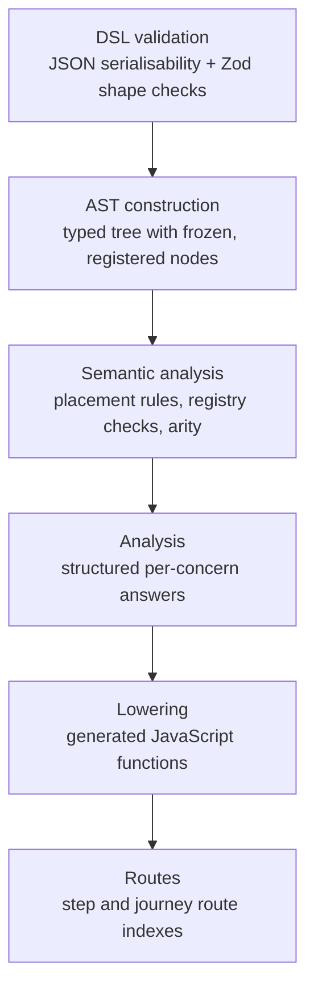

# How Forge compiles definitions and why

Journey definitions describe steps, fields, conditions, hooks, and navigation as data.
That data is useful for authors, but the engine cannot evaluate it on every request without
walking the full structure each time.

Forge compiles each definition into generated JavaScript functions before routes are
mounted. At request time, those functions run directly. The engine never re-interprets the
definition during a request.

That compile step gives Forge three properties:

- **Performance**: the structural cost is paid once, at registration. Requests run generated
  functions that V8 can optimise under load.
- **Security**: definitions are serialisable data and cannot carry executable code. Generated
  functions resolve behaviour by name from a registry, not from inline application code.
- **Purity per request**: compiled functions close over nothing and receive all request state
  through parameters. Each request gets a fresh context.

## What compilation replaces

Without compilation, every request walks the definition tree from root to leaves. The engine
interprets every expression, checks every predicate, and resolves every function name.
All of that happens during request handling.

That work is structural. The definition says the same thing on every request. Only the
request context differs.

Compilation answers those structural questions once, at registration, and encodes the
results into generated functions. Request evaluation then calls those functions with a
context snapshot and receives results directly.

The approach follows the same principle as AJV, which compiles JSON schemas into validation
functions, and Nunjucks, which compiles templates into render functions. Forge applies that
principle to journey evaluation.

## The compilation pipeline

When the application calls `forge.registerPackage()`, Forge runs six compilation stages.
Each stage produces output for the next, and each stage narrows what later stages can see.



The pipeline runs synchronously. A failure at any stage stops it, and the journey is never
partially compiled. This is why setup errors appear at registration rather than when a user
reaches a page during a request.

Each stage adds guarantees that the next stage relies on:

- DSL validation guarantees that the definition is serialisable and matches the Zod schemas.
- AST construction gives later stages a typed, queryable tree with parent links and source
  diagnostics.
- Semantic analysis guarantees that referenced functions exist, that components are
  registered, that iterator scopes are valid, and that effects appear only inside hooks.
- Analysis eliminates unknowns. Past this point, no stage queries the tree for structural
  answers.
- Lowering turns the model into compiled functions. Past this point, no tree or model data
  reaches the runtime.
- Route analysis builds the step and journey route indexes.

## Definitions are data, not code

The first stage, DSL validation, checks that the definition is JSON-serialisable. It
rejects JavaScript functions, symbols, dates, `undefined`, and non-plain objects. The
definition then passes through `JSON.stringify` and `JSON.parse` to confirm round-trip
fidelity.

This is the first security boundary. A definition that passes DSL validation contains no
executable code. Expressions in a definition are tagged data nodes: each one carries a
function type, a function name, and arguments.

```ts
Answer("emailAddress").pipe(Transformer.String.Trim());
```

This expression does not trim a value. It describes a value that Forge trims at request
time. The authored data says "read the email address answer, then trim it." Forge compiles
that description into a generated function and runs it during the answer preparation phase.

:::deep-dive
---
title: Why definitions must be serialisable
description: Serialisability prevents definitions from carrying executable code, which keeps the compilation boundary clean.
summary: Show the serialisability rule
---

Forge enforces serialisability because it draws the line between authored data and
executable behaviour. A definition can name a function (like `Condition.Equals`). It cannot
contain one.

The `JSON.stringify`/`JSON.parse` round-trip rejects:

- functions and class instances
- symbols and bigints
- `undefined` values
- objects with a non-plain prototype

If a definition carried executable code, the compilation pipeline could not reason about it
safely. Serialisability keeps the definition as inspectable, validatable, compilable data.
:::

## The tree and semantic checks

AST construction builds a typed tree from the validated definition. Each authored object
becomes a node with an ID, a type, and properties. A registration pass freezes every node
with `Object.freeze` and indexes them by ID and type.

Semantic analysis then runs a fixed set of rules over the tree. These rules check placement
and registry constraints that Zod schemas cannot express:

- `Loop.Item()` references must appear inside an `Iterator`.
- `Answer()` references must not appear inside access hooks, because answers are not
  prepared at that point.
- Effect functions must appear only inside hooks.
- Every referenced function name must exist in the function registry, with the correct
  arity.
- Every referenced component variant must exist in the function registry.

Rules collect errors rather than throwing, so one invalid definition reports every problem
together. Later stages assume that semantic analysis passed. If a later stage encounters a
state that the semantic rules forbid, it throws a `ForgeInternalError`, because the
situation is a pipeline bug.

## Building a model for compilation

Analysis walks the tree once and produces a `CompilationModel`. This stage answers every
structural question about the definition so that code generation never has to.

The model maps journeys and steps by node ID. Each journey model contains its steps in
document order, plus per-concern models for hooks, reachability, cleardown, and answer
preparation. Each step model contains its fields and per-concern models for hooks,
validation, resolve, and answer preparation.

The governing rule is strict: past analysis, there is no structural querying of the tree.
The model gives code generation everything it needs as typed, structured data.

:::deep-dive
---
title: Why analysis exists as a separate stage
description: Analysis separates structural questions from code emission so the code generator never needs to walk the tree.
summary: Show the analysis boundary
---

Without a separate analysis stage, the code generator walks the tree while it emits code.
That mixes two concerns: understanding the definition and producing functions from it.

Per-concern analyzers build each concern's model independently. Shared services provide
ownership indexing (which nodes belong to which step), ancestry walks, field classification,
and mount information. Each analyzer implements a fixed interface with zero collaborators, so
each concern's analysis is self-contained.

That separation keeps the code generator's job straightforward: read the model, emit the
function.
:::

## How definitions become functions

Lowering is the code-generation stage. It turns the `CompilationModel` into JavaScript
functions that the runtime calls during requests.

Phase compilers build a typed intermediate representation, not raw strings. `CodeFragment`
tokens and statement nodes go through `CodeGenerator`, and `SourceRenderer` renders them
into readable JavaScript source. The typed layer prevents injection: authored data from the
definition passes through `JSON.stringify` and can never become executable code in the
generated source.

`GeneratedFunctionCompiler` is the single place where functions are constructed. It calls
`new Function(...)` or `new AsyncFunction(...)` with the rendered source. Generated code
checks the value returned by each registered function call. If it is a promise or another
thenable, execution waits for it before continuing. Ordinary values continue without an
`await`, so an evaluator can return a promise without being declared `async`.

Forge compiles eight evaluation phases:

- **Answer preparation** reads posted values, applies formatters, and builds answer
  histories.
- **Validation** evaluates validation rules against answers and collects failures.
- **Entry validation** selects which validation group to run on entry.
- **Hooks** runs access lifecycle and submit hook functions.
- **Reachability** evaluates reachability facts for navigation decisions.
- **Field inventory** lists the fields that a step owns, for answer cleardown.
- **Resolve** evaluates block properties into render-ready data.
- **Route metadata** builds the route tree at the package level.

Rendering runs through component and renderer evaluators rather than generated rendering
code. Registration checks their entries and any block layout schema declared by the
selected renderer. The compiled resolve phase produces evaluated block data, and the
render phase calls the registered evaluators with that data.

:::deep-dive
---
title: What a generated function looks like
description: A simplified answer-preparation function shows how generated code reads context, calls registered functions through helpers, and returns work tasks.
summary: Show a generated function
---

Generated functions close over nothing. Everything arrives through parameters. Each function
receives a context snapshot (`ctx`), a runtime helper library (`_forgeHelpers`), and per-call
error attribution (`_forgeRuntimeDiagnostics`):

```js
(ctx, _forgeHelpers, _forgeRuntimeDiagnostics) => {
  "use strict";

  const isPost = ctx.request.method === "POST";
  const fieldPreparations = [];

  if (isPost) {
    const answerHistory = _forgeHelpers.ensureAnswerHistory(ctx, "name");
    let rawValue = _forgeHelpers.normalizePostValue(ctx.post["name"], false);
    _forgeHelpers.pushAnswerMutation(answerHistory, rawValue, "post");
  }

  return ctx.workTasks.answerPreparation(fieldPreparations);
}
```

The generated function does not call registered functions directly. Every call goes through
`_forgeHelpers.evaluateFunction()`, which looks the function up by name in the registry,
runs schema checks, calls the evaluator, and validates the output.

Most generated functions do not execute their child work themselves. They build and return
`WorkTask` trees through `ctx.workTasks.*` factories. The runtime work executor owns
sequencing, tracing, and failure handling.

Each compiled function also receives a unique `sourceURL` and an inline source map. V8
treats these as named scripts, so breakpoints in the debugger map back to the DSL path in
the definition.
:::

## Why definitions cannot carry code

Forge enforces a boundary between authored definitions and executable behaviour through
four layers.

**Definitions are inert data.** DSL validation rejects any value that is not
JSON-serialisable. Expressions in a definition are tagged data: a type, a name, and
arguments. A definition cannot contain a JavaScript function.

**Behaviour resolves by name.** When a definition references a condition, transformer,
generator, or effect, it names a function. The function registry provides the evaluator for
that name. Application code never appears in generated source.

**Generated code sees only what the runtime hands it.** Compiled functions are constructed
with `new Function`, so they close over nothing from the compilation scope. Their entire
input is the parameters the runtime passes: the context snapshot, the helper library, and
the diagnostics object.

**Iteration is bounded.** Authored iterators run against an iterator budget. The budget
prevents unbounded loops from authored collection expressions.

`new Function` is not a sandbox. Generated code shares the process globals. The guarantee
is that authored definitions cannot smuggle executable code into the engine. Every
executable path is either engine-emitted code or a developer-registered, name-resolved
function.

## Every request starts fresh

Every request receives a fresh context. The pipeline builds new objects for answers, domain
data, evaluation state, and the work executor. No mutable state carries from one request to
the next.

Compiled functions are shared across requests, but they hold no per-request state. They
receive the request-specific context through parameters and return results.

Answer preparation mutates `ctx.answers` in place during the request. This is deliberate:
later phases (validation, hooks, reachability, resolve) read the same answer history that
preparation built. That mutation is scoped to the request context and does not affect other
requests.
