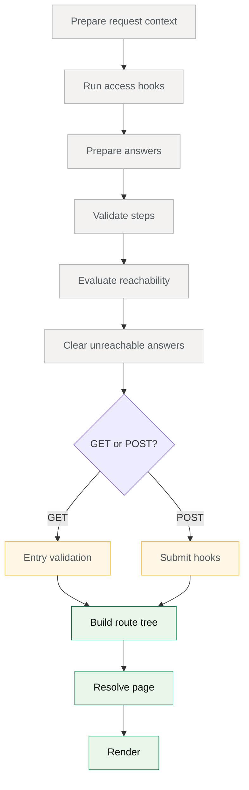

# How Forge runs a request

A Forge request starts with a mounted journey or step and a request snapshot.

The journey definition describes the stable shape of the flow, while the snapshot brings
the current request state: method, route params, query, submitted form data, headers,
cookies, session, and adapter-managed state. Forge evaluates those together and returns
an outcome.

Because every request is evaluated against the full journey, Forge does not treat each
page as a separate piece of route code with its own private rules. Access, answers,
validation, reachability, submission, clearing, routing, and rendering all read from the
same model.

## The definition is the plan

Authors write journeys as definitions. A definition describes the parts of the flow that
stay stable across requests:

- journeys and nested journeys
- steps and routes
- blocks and fields
- validation rules
- reachability rules
- access and submit hooks
- expressions
- references to functions and components

The definition reads as the service flow. It does not need to explain how Forge will run
it.

```ts
journey({
  code: "apply",
  path: "/apply",
  title: "Apply",
  steps: [personalDetailsStep, contactDetailsStep, checkAnswersStep],
});
```

When the application registers a package, Forge checks the definition and prepares it for
requests. If it finds a setup problem, Forge reports it and stops that package from
registering. These checks catch unknown components, unknown functions, invalid route
shapes, and duplicate mounted paths.

That early check is deliberate. Forge catches a missing component variant at registration
rather than when a user reaches that page halfway through a form.

## The request brings the current state

When a matching route is requested, the framework adapter gives Forge a request snapshot.

The snapshot is framework-neutral. Forge does not need the native Express, Remix, or
framework-specific request object. It only needs the request data the adapter passes in.

Stored journey answers are also part of the state Forge needs, but they are not on the
snapshot. Each request starts with an empty answer store. Access hooks load the stored
answers before the rest of the pipeline runs. Forge never fetches answers itself.

The application loads answers from session, a database, or another store through access
hooks. For ordinary rendering, the current step's answers are enough.
For reachability, resuming, and stale-answer clearing, Forge needs the answers for the
whole journey. It can only reason from the answers it receives.

## Forge evaluates requests in a predictable shape

For a step request, Forge runs phases in a fixed order:



The shared phases (grey) run on every step request. The method-specific phase (amber)
runs next. On `GET`, entry validation controls whether existing validation failures are
visible when the page opens. On `POST`, submit hooks can validate, save data, redirect,
return an error, or let the request continue. The terminal phases (green) run last if the
request still needs to render.

Any phase can halt the request early. An access hook or reachability check can redirect,
and a submit hook can return an error. When that happens, the later phases do not run.
Error traces name the phase that stopped the request, so a trace maps directly onto this
diagram.

Forge runs this sequence from the journey definition. Every request passes through the
same phase order. Only the request state changes, and that consistency keeps validation,
reachability, answer clearing, submit behaviour, and rendering aligned.

:::deep-dive
---
title: Why Forge runs phases in this order
description: Each phase gives the next one a more complete view of the request, so Forge can make one consistent decision.
summary: Show the phase order
---

The request phases are not extension points that authors choose between. They are the
order Forge uses to turn a journey definition and request snapshot into one outcome.

Access runs first because Forge needs to know whether the request can continue before
doing further work. An access hook can load state that the journey needs, or it can
redirect or return an error before the rest of the request runs.

Validation needs a settled answer state, so answer preparation runs before it. By that
point, Forge combined the answers it received with submitted values, defaults, parsing,
formatting, dependent field behaviour, and repeated field codes.

Reachability depends on validation because Forge needs to know how far progress can
safely extend. A step can still be reachable when it is invalid, because the user needs
to reach it to fix it. But an invalid step does not unlock later steps.

Once reachability is known, Forge can clear stale answers. It removes answers from
branches that no longer belong to the current path.

Entry validation and submit hooks follow the shared phases. On `GET`, entry validation
decides whether existing errors are visible when the page opens. On `POST`, submit hooks
can validate, save, redirect, return an error, or fall through to render with validation
messages.

The terminal phases (route tree, resolve, render) run last because rendering needs the
final request state. By the time a page renders, Forge already prepared answers, checked
reachability, cleared stale answers, and handled the method-specific branch.

That order is why Forge behaviour is connected. A validation rule can affect
reachability, reachability can affect answer clearing, and answer clearing can affect
what renders. The phases are separate, but they all read and refine the same request.
:::

:::deep-dive
---
title: What access can safely rely on
description: Access runs before prepared answers exist. It reads request state and loaded data, not answer state.
summary: Show the access boundary
---

Access runs before the rest of the pipeline, so it can shape the request by loading data,
checking permissions, or halting the request entirely.

The trade-off is that later Forge state doesn't exist yet.

Access can read route params, query values, headers, cookies, session state, raw submitted
data, and any data loaded by earlier access effects.

It cannot read formatted answers, parsed field values, validation results, reachability,
route data, or rendered page state. Those are produced in later request phases.

That boundary matters most on `POST`. Access can see the raw request body, but Forge
prepares submitted values as answers in a later phase. A decision that depends on parsed
field values, field validation, or submit-only behaviour can only run in submit
behaviour, because access runs before any of that state exists.

:::

## Requests are evaluated fresh

Forge treats each request as fresh work.

It does not assume that an earlier request ran in the same process, and it does not
remember a user's progress unless the application gives that progress back through
answers, session, cookies, or request state.

That makes Forge request behaviour straightforward to test. Given the same definition and
the same request state, Forge makes the same journey decision (apart from project effects
that call external code).

This stateless model matters most for reachability. Forge does not trust a remembered
"current step" value. It derives the current path from the journey definition and the
request state each time.

## The result is an outcome

A Forge request ends as a render, a redirect, or an error. Forge returns that outcome to
the adapter, and the adapter turns it into the real framework response.

This boundary lets Forge own the journey rules while the application keeps control of
HTTP, sessions, cookies, rendering technology, persistence, and response writing.

That boundary explains how the rest of Forge fits together:

- hooks load data, save data, or choose terminal outcomes
- answer preparation creates the answer state that later phases read
- validation decides whether data is acceptable
- reachability decides which steps belong to the current path
- rendering turns resolved page data into output
- framework integration turns Forge outcomes into web responses
