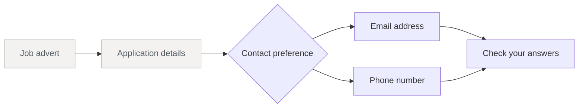
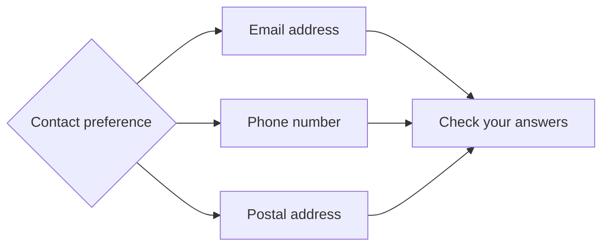

# Branching a journey based on an answer

Journeys rarely stay in a perfectly straight line. Ask someone how they'd like to be
contacted, for example, and the next useful question depends on their answer. An email
address is no help when they've chosen the phone, and asking for both just gives them
more form to wade through.

A branch gives that answer somewhere useful to lead. It can send each person to the
step that fits, skip the one that doesn't, then bring everyone back to a shared route
afterwards. Let's explore branching journeys! We'll add a contact preference branch to
a job application journey.

## Map the paths

Before we change the definition, it's worth drawing the journey we want. There are only
two paths here, but seeing the split and the join together makes the code much easier to
reason about:



The dimmed steps are the straight-line start of the journey - the advert and the
applicant's details - and they carry on exactly as before. The branch is the tail of
the journey, so that's where we'll focus.

There are two decisions in that picture, and they belong in two different places. The
contact preference step owns the split because that's where we have the answer that
chooses a route. Once the relevant detail has been collected, that details step can
point straight to "Check your answers".

That keeps the definition pleasantly close to the journey we just drew:

- choose a path after "Contact preference";
- collect the relevant detail;
- continue to "Check your answers".

We'll start with the `email-address`, `phone-number`, and `check-answers` steps already in the
journey. The contact preference field stores the choice under the answer code
`contactMethod`:

```typescript
const contactMethodField = GovUKRadioInput({
  code: 'contactMethod',
  fieldset: {
    legend: {
      text: 'How would you like to be contacted?',
      isPageHeading: true,
    },
  },
  items: [
    { value: 'email', text: 'Email' },
    { value: 'phone', text: 'Phone' },
  ],
  validWhen: [
    validation({
      condition: Self().match(Condition.IsRequired()),
      message: 'Select how you would like to be contacted',
    }),
  ],
})
```

Notice the option values: `email` and `phone`. Those are the stored answers our branch
will test, rather than the text the person sees.

## Build a two-way branch

Now we can turn that route map into navigation. Add a submission hook to the contact
preference step, then use its `next` array to choose the right details step once the
answer passes validation and is saved:

```typescript [[1, 16, "Answer('contactMethod')"], [2, 16, "Condition.Equals('email')"], [2, 20, "Condition.Equals('phone')"]]
const contactMethodStep = step({
  code: 'contact-method',
  path: '/contact-method',
  title: 'How would you like to be contacted?',
  blocks: [
    contactMethodField,
    GovUKButton({ text: 'Continue' }),
  ],
  onSubmission: [
    submit({
      validate: true,
      onValid: {
        effects: [ApplicationEffects.SaveAnswers()],
        next: [
          redirect({
            when: Answer('contactMethod').match(Condition.Equals('email')),
            goto: 'email-address',
          }),
          redirect({
            when: Answer('contactMethod').match(Condition.Equals('phone')),
            goto: 'phone-number',
          }),
        ],
      },
    }),
  ],
})
```

The redirects are tried from top to bottom, and the first match wins. Each one reads the
<s1>deciding answer</s1>, then its <s2>answer condition</s2> compares that answer with
the value for its route. An answer of `email` takes the first path. An answer of `phone`
doesn't match that condition, so reaches the second. With a condition and destination
for each answer, you can see both paths right there in the definition.

## Bring the paths back together

Once the person has supplied the relevant contact detail, both routes need to head to
"Check your answers". Give the details steps that same next destination once each answer
passes validation and is saved:

```typescript [[4, 14, "goto: 'check-answers'"], [4, 33, "goto: 'check-answers'"]]
const emailAddressStep = step({
  code: 'email-address',
  path: '/email-address',
  title: 'What is your email address?',
  blocks: [
    emailAddressField,
    GovUKButton({ text: 'Continue' }),
  ],
  onSubmission: [
    submit({
      validate: true,
      onValid: {
        effects: [ApplicationEffects.SaveAnswers()],
        next: [redirect({ goto: 'check-answers' })],
      },
    }),
  ],
})

const phoneNumberStep = step({
  code: 'phone-number',
  path: '/phone-number',
  title: 'What is your phone number?',
  blocks: [
    phoneNumberField,
    GovUKButton({ text: 'Continue' }),
  ],
  onSubmission: [
    submit({
      validate: true,
      onValid: {
        effects: [ApplicationEffects.SaveAnswers()],
        next: [redirect({ goto: 'check-answers' })],
      },
    }),
  ],
})
```

Both redirects name `check-answers` as their <s4>shared destination</s4>. That's all the
two routes need to meet there - no special join definition required.

Try the journey both ways. Choose "Email" and you'll visit `email-address`; choose
"Phone" and you'll visit `phone-number`. Whichever route you take, submitting the
details page should land you at "Check your answers". That's our first branch complete.

## Add another branch

"Email" and "Phone" cover the service today. If it starts offering contact by post,
the branch can grow with it:



First, give people the new option in the existing field:

```typescript
items: [
  { value: 'email', text: 'Email' },
  { value: 'phone', text: 'Phone' },
  { value: 'post', text: 'Post' },
],
```

That answer needs somewhere to go, so add a postal address step:

```typescript [[4, 14, "goto: 'check-answers'"]]
const postalAddressStep = step({
  code: 'postal-address',
  path: '/postal-address',
  title: 'What is your postal address?',
  blocks: [
    postalAddressFields,
    GovUKButton({ text: 'Continue' }),
  ],
  onSubmission: [
    submit({
      validate: true,
      onValid: {
        effects: [ApplicationEffects.SaveAnswers()],
        next: [redirect({ goto: 'check-answers' })],
      },
    }),
  ],
})
```

Its <s4>shared destination</s4> is still `check-answers`. Once the address is collected,
"Post" rejoins "Email" and "Phone" on the shared route.

There's now a "Post" option and a page ready to collect the address, but the two aren't
connected yet. Add "Post" to the same ordered redirects, with its own condition just
like "Email" and "Phone":

```typescript [[2, 11, "Condition.Equals('post')"]]
next: [
  redirect({
    when: Answer('contactMethod').match(Condition.Equals('email')),
    goto: 'email-address',
  }),
  redirect({
    when: Answer('contactMethod').match(Condition.Equals('phone')),
    goto: 'phone-number',
  }),
  redirect({
    when: Answer('contactMethod').match(Condition.Equals('post')),
    goto: 'postal-address',
  }),
]
```

Try all three answers now. "Post" leads to `postal-address`, while "Email" and "Phone"
still follow their original paths. The new <s2>answer condition</s2> has extended the
branch without disturbing the routes that were already working.

## Add a fallback branch

Writing every route as a condition makes each possible answer easy to see. When one
route should handle everything left over, though, we can make it a fallback instead.

"Post" is the final route here, so remove its condition. It will now catch anything
that hasn't matched "Email" or "Phone":

```typescript [[2, 3, "Condition.Equals('email')"], [2, 7, "Condition.Equals('phone')"], [3, 10, "redirect({ goto: 'postal-address' })"]]
next: [
  redirect({
    when: Answer('contactMethod').match(Condition.Equals('email')),
    goto: 'email-address',
  }),
  redirect({
    when: Answer('contactMethod').match(Condition.Equals('phone')),
    goto: 'phone-number',
  }),
  redirect({ goto: 'postal-address' }),
],
```

The <s2>answer conditions</s2> run in order: "Email" first, then "Phone". When neither
matches, the redirect list reaches the <s3>fallback branch</s3>. The displayed options
make "Post" the remaining choice, but the required rule also accepts other non-empty
strings. An unexpected submitted value reaches this fallback too.

That fallback must stay last. An unconditional redirect always matches, which would
leave any route beneath it with no chance to run. As the branch grows, keep every
specific condition above one final fallback:

```text
specific route
specific route
...
fallback route
```

Notice that the redirect doesn't test for `post`. Any unmatched value will reach
`postal-address`, not just the one we're expecting today. If you later add another valid
answer with a different destination, make "Post" conditional again and put the new
fallback underneath. Keep that unconditional route last, and every valid submission has
somewhere to go.

## Recap

- Put branching redirects on the step that collects the deciding answer.
- Read the answer with `Answer()`, then test each specific value with a condition.
- Remember that redirects run in order and stop at the first match.
- Bring separate paths back together by sending their final steps to the same
  destination.
- Give each new path its own conditional redirect.
- For a catch-all, make the final redirect unconditional and keep it beneath every
  specific route.

That's the branch built: it can split, grow, and come back together again. If users can
return and change the answer that selected their path, continue with
[Clearing answers when a branch changes](./clearing-answers-when-a-branch-changes).
