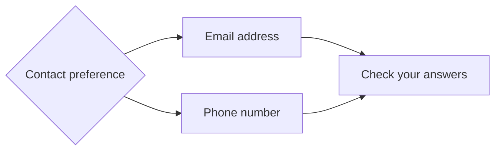

# Clearing answers when a branch changes

When an answer changes, a whole branch can drop out of a journey. The steps on that branch leave the route, but the answers they collected are still hanging around, and they shouldn't follow the journey any further.

Building on [Branching a journey based on an answer](./branching-a-journey-based-on-an-answer), we'll see how those stale answers get cleared, and how to make sure your own store hears about it too.

## Let reachability clear an abandoned branch

Here's the branching part of the job application journey again. It asks somebody how
they'd like to be contacted:



They choose email and enter `alex@example.com`. Later, they go back and choose phone instead. The email step is no longer on their route. So what happens to that address?

You don't need to write an effect just to clear `emailAddress`. When the new route is evaluated, the email step is found to be unreachable, and this <s3>reachability cleardown</s3> sets the current answers for its fields to `undefined`:

```typescript [[4, 3, "mutations: ["], [3, 5, "source: 'cleardown'"]]
{
  current: undefined,
  mutations: [
    { value: 'alex@example.com', source: 'post' },
    { value: undefined, source: 'cleardown' },
  ],
}
```

Notice that the old value hasn't vanished entirely: it's still sitting in the <s4>mutation history</s4> for the rest of the request. That small detail is useful: it lets an effect tell the difference between an answer that was never supplied and one that was *just cleared*. We'll lean on it later in this guide.

Where does this behaviour come from? There's no clearing configuration to add. It falls out of the branch you already described with <s3>conditional redirects</s3>:

```typescript [[3, 2, "redirect({"], [3, 6, "redirect({"]]
next: [
  redirect({
    when: Answer('contactMethod').match(Condition.Equals('email')),
    goto: 'email-address',
  }),
  redirect({
    when: Answer('contactMethod').match(Condition.Equals('phone')),
    goto: 'phone-number',
  }),
]
```

Because the definition states which answer chooses which route, it already says which steps stop applying when that answer changes. If a completed step falls off the reachable path, its field codes are cleared automatically. The dependency you wrote down is doing the work.

## Clear a conditional field with `dependentWhen`

Reachability handles whole steps. But sometimes a conditional answer lives on the *same page* as the choice it depends on. Say, an email address input that appears when someone picks "Email" from the radios above it.

Your first instinct might be `visibleWhen`, and it does hide the input. But hiding an input only answers "should this render?". It says nothing about a trickier question: does the answer someone typed in earlier *still count*? For that, add `dependentWhen` alongside it:

```typescript [[1, 4, "visibleWhen"], [2, 5, "dependentWhen"]]
const emailAddressField = GovUKTextInput({
  code: 'emailAddress',
  label: 'Email address',
  visibleWhen: Answer('contactMethod').match(Condition.Equals('email')),
  dependentWhen: Answer('contactMethod').match(Condition.Equals('email')),
  validWhen: [
    validation({
      condition: Self().match(Condition.IsRequired()),
      message: 'Enter your email address',
    }),
  ],
})
```

The two conditions look identical here, but they have very different jobs. The <s1>visibility condition</s1> controls whether the input is rendered. The <s2>dependency condition</s2> controls whether its answer still applies.

Now if the user switches to phone, the email address stops meeting its dependency condition. Its value becomes `undefined`, its validation is skipped (there's no point demanding an email address nobody needs), and a <s4>mutation</s4> records exactly why it was cleared:

```typescript [[2, 1, "source: 'dependentWhen'"]]
{ value: undefined, source: 'dependentWhen' }
```

A handy rule of thumb: `dependentWhen` for a conditional field on a step, reachability for fields on a whole branch. Either way, answers that no longer apply are gone before your submit effect ever runs. Which brings us to the part your application *does* need to handle.

## Apply clearing mutations in your save effect

So far, everything has happened inside one request. But your application probably keeps its own copy of the answers, in a session, a database, or an API. Clearing an answer from the request doesn't reach into your database and clear it there too. That copy of `alex@example.com` is still sitting in your store.

Keeping the two in sync is your <s5>save effect</s5>'s job, and this is where that <s4>mutation history</s4> earns its keep. Read the histories, collect the fields whose latest mutation cleared their value, and clear those before saving the answers that still apply:

```typescript [[4, 5, "context.getAllAnswerHistories()"], [5, 6, "fieldsToClear"], [4, 9, "history.mutations.at(-1)"], [2, 17, "dependentWhen"], [3, 18, "cleardown"], [5, 26, "answerStore.clearAnswers"], [5, 27, "answerStore.saveAnswers"]]
const SaveAnswers = effect('App.SaveAnswers', {
  factory: (deps: { answerStore: AnswerStore }) =>
    async (context, applicationId: string) => {
      // Mutation history tells us which missing answers were deliberately cleared.
      const answerHistories = context.getAllAnswerHistories()
      const fieldsToClear: string[] = []

      Object.entries(answerHistories).forEach(([fieldCode, history]) => {
        const latestMutation = history.mutations.at(-1)

        if (latestMutation === undefined) {
          return
        }

        const answerWasCleared = latestMutation.value === undefined
        const wasClearedAutomatically =
          latestMutation.source === 'dependentWhen' ||
          latestMutation.source === 'cleardown'

        if (answerWasCleared && wasClearedAutomatically) {
          fieldsToClear.push(fieldCode)
        }
      })

      // Clear stale values explicitly before saving the answers that still apply.
      await deps.answerStore.clearAnswers(applicationId, fieldsToClear)
      await deps.answerStore.saveAnswers(applicationId, context.getAllAnswers())
    },
})
```

One thing to be careful about: check the <s4>*latest* mutation</s4>. An answer can change several times during a single request, and it's the final mutation that tells you what should actually be persisted.

You might wonder why the clear has to be explicit at all. Couldn't you just save the current answers and let the `undefined` values do the talking? Not quite. Properties with an `undefined` value are usually dropped when an object is serialised to JSON, so an API that applies partial updates would never hear that the old value should go. Saying "clear these fields" out loud is the only way to be sure.

Now call the <s5>effect</s5> from the valid branch of the step where the user can change routes:

```typescript [[5, 6, "SaveAnswers"], [3, 9, "redirect({"], [3, 13, "redirect({"]]
onSubmission: [
  submit({
    validate: true,
    onValid: {
      effects: [
        SaveAnswers(Params('applicationId')),
      ],
      next: [
        redirect({
          when: Answer('contactMethod').match(Condition.Equals('email')),
          goto: 'email-address',
        }),
        redirect({
          when: Answer('contactMethod').match(Condition.Equals('phone')),
          goto: 'phone-number',
        }),
      ],
    },
  }),
],
```

By the time this effect runs, the submitted answers have been prepared, the `dependentWhen` conditions have been checked, and the reachable route has been recalculated. Every answer that no longer belongs has already been cleared, so the effect sees both kinds of clearing mutation, settled and ready to persist.

## Include dynamic field codes

There's one situation the automatic tracking can't see coming. Most field codes can be read straight from the blocks on a step. But repeated or generated blocks create their codes at runtime, so when the definition is inspected ahead of time, there's nothing there to find. `householdMember-1-name`, `householdMember-2-name`... how many will there be? Nobody knows until the request arrives.

For those, give the step a pattern with <s6>`cleardownFieldCodes`</s6>:

```typescript [[6, 5, "cleardownFieldCodes"]]
const householdMembersStep = step({
  code: 'household-members',
  path: '/household-members',
  title: 'Household members',
  cleardownFieldCodes: ['^householdMember-\\d+-name$'],
  blocks: [
    householdMembers,
    GovUKButton({ text: 'Continue' }),
  ],
})
```

If this step later becomes unreachable, the pattern is matched against whatever answer keys exist at that moment. A key like `householdMember-2-name` gets the same <s3>`cleardown` mutation</s3> as any ordinary field.

Don't reach for this by default, though: you only need patterns for codes that can't be read from the step definition. Static field codes are already tracked for you, no pattern required.

## Follow the answer through the request

Let's watch the whole thing happen once, end to end, with the job application journey.

Somebody has already chosen email and supplied an address. They return to the contact preference page and choose phone. That submission changes which route is reachable, so `emailAddress` becomes `undefined` and receives a <s3>`cleardown` mutation</s3>. The <s5>save effect</s5> spots that mutation, removes the address from the external store, then saves the answers that still belong to the journey. The old address is gone, from the request *and* from the store.

A conditional field on the same step takes a very similar trip. When its <s2>`dependentWhen` condition</s2> stops matching, its answer becomes `undefined` and receives a `dependentWhen` mutation, and the <s5>save effect</s5> handles it exactly the same way. The mutation source differs because the *reason* for clearing differs, but the destination is identical: the old answer no longer follows the user.

## Recap

Your journey can now leave an old branch behind without leaving its answers behind too.

Let's recap the key points.

- Let reachability clear fields on steps that no active branch can reach; describing the branch with conditional redirects is all the configuration you need.
- Use `dependentWhen` when an answer only makes sense while another condition is true; `visibleWhen` hides the input, but only `dependentWhen` retires its answer.
- Expect cleared answers to have a current value of `undefined` and a mutation source of either `cleardown` or `dependentWhen`.
- Handle those mutations in the same effect that keeps your external store in sync, and always check the *latest* mutation.
- Add dynamic field codes to `cleardownFieldCodes` when they can't be discovered from the journey definition.
