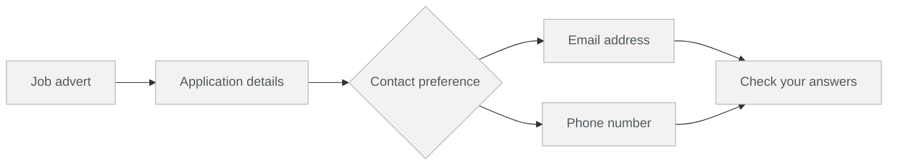
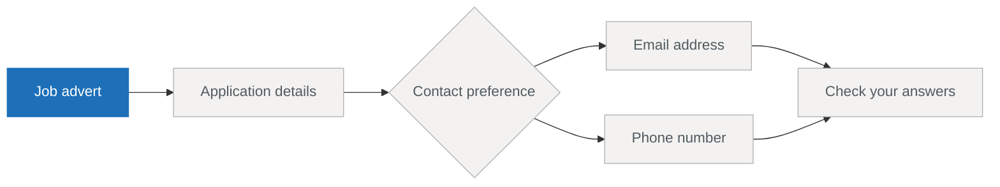
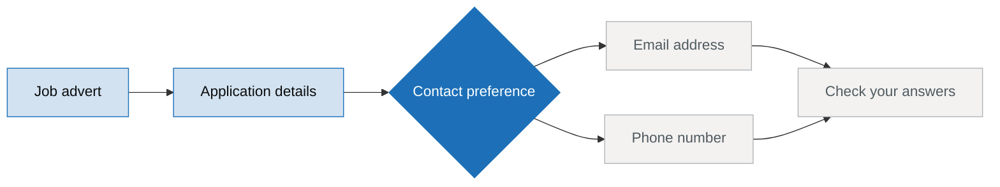
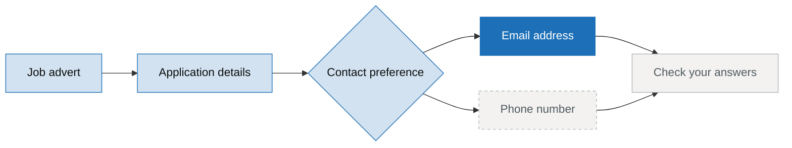
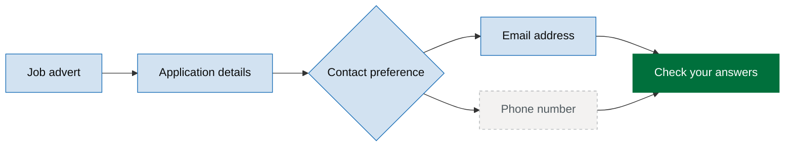

# Returning users to the right step

When somebody comes back to a half-finished journey, the last page they saw is not
always the page they need next. They might have finished it, or changed an answer that
takes them down a different branch. What matters is the first step that still needs
their attention.

Building on
[Branching a journey based on an answer](./branching-a-journey-based-on-an-answer),
we'll use saved answers and route checks to find that step and send returning users
straight there.

## Follow a returning request

Before we add anything, let's follow a real return to the journey. Alex started this
job application earlier: they read the advert, gave their name and CV, chose email, and
supplied an address:

```typescript
{
  fullName: 'Alex Fothergill',
  cv: 'alex-fothergill-cv.pdf',
  contactMethod: 'email',
  emailAddress: 'alex@example.com',
}
```

Today they follow a "Continue application" link back to the journey. Here's how that
request finds the right page:

::::frame-sequence
---
title: Resuming the job application
---

:::frame
---
title: A returning request arrives
---

===
The link opens the journey root and asks to resume. A journey access effect loads Alex's
saved answers into the request context before the route is checked. The request now has
what it needs to work out the route.
:::

:::frame
---
title: Start at the entry point
---

===
The route needs somewhere to begin. Saved answers tell us what is complete, not where
the journey starts. The job advert is marked as the entry point, so route checking starts
there. Nothing else is special about it: it is simply the first page of the journey.
:::

:::frame
---
title: Walk past completed steps
---

===
The job advert has nothing to fill in, and the saved answers pass validation for the
application details step. Both are complete, so the route follows the same redirects an
ordinary valid submission would use. Resume does not create a second set of routes.
:::

:::frame
---
title: Follow the branch the answer chose
---

===
The route now reaches a choice. The contact preference step is complete, and its
conditional redirects read the saved choice. Because Alex chose email, the route follows
the email branch. It never considers the phone step: that step belongs to the branch Alex
did not choose.
:::

:::frame
---
title: Stop at the frontier
---

===
The email step is complete too, but "Check your answers" still needs Alex's attention.
It is the first incomplete step on this route, known as the **frontier**. Route checking
stops here and the journey root redirects to it. If the email step were incomplete, the
route would stop there instead.
:::
::::

That decision depends on three things you add to the journey: saved answers, an entry
point, and a condition that turns resume on. The rest of this guide adds each one.

## Save the progress you want to resume

The journey route can be worked out from the answers alone. A step is complete when the
saved answers pass its validation, and the contact preference answer chooses the branch.
You do not need to maintain a separate "last visited page".

That only works if progress is saved as the user moves through the journey. Keep the
saving effect on the valid branch of each question:

```typescript [[1, 6, "ApplicationEffects.SaveAnswers"]]
onSubmission: [
  submit({
    validate: true,
    onValid: {
      effects: [
        ApplicationEffects.SaveAnswers(Params('applicationId')),
      ],
      next: [redirect({ goto: 'email-address' })],
    },
  }),
],
```

The <s1>saving effect</s1> makes this answer available on the next request. An invalid
submission never reaches this branch, so it does not count as progress.

## Load saved answers before choosing a route

A returning request does not automatically include the earlier answers. The loading in
the first frame is something you add. Load the answers from your store in a journey
access effect:

```typescript [[2, 8, "ApplicationEffects.LoadAnswers"]]
const jobApplicationJourney = journey({
  code: 'job-application',
  path: '/applications/:applicationId',
  title: 'Apply for a job',
  onAccess: [
    access({
      effects: [
        ApplicationEffects.LoadAnswers(Params('applicationId')),
      ],
    }),
  ],
  steps: [
    jobAdvertStep,
    applicationDetailsStep,
    contactMethodStep,
    emailAddressStep,
    phoneNumberStep,
    checkAnswersStep,
  ],
})
```

The <s2>loading effect</s2> should put every saved answer for this journey into the
request context. Loading only the current page leaves the route with too little
information: it might know there is an email address, without knowing that
`contactMethod` chose the email branch.

Journey access effects run before the route is checked. When a resume target is needed,
the answers that show the user's progress are ready.

## Mark where the journey begins

The route needs a clear place to start. For this journey, that is the first page, so mark
it as the entry point:

```typescript [[3, 6, "entryWhen: true"]]
const jobAdvertStep = step({
  code: 'job-advert',
  path: '/job-advert',
  title: 'Delivery driver',
  reachability: {
    entryWhen: true,
  },
  // ...
})
```

The <s3>entry point</s3> has one job: it starts a route through the journey. It does not
choose a branch. From there, the valid-submission redirects already on each step say
where to go next. Validation says whether a question is complete; redirects say which
question follows it. Together, they lead the route to the frontier from the walkthrough.

The same walk lands somewhere different for each saved state:

| Saved answers | Destination |
|---|---|
| No saved answers | `job-advert` (the entry point) |
| A name and CV | `contact-method` (the frontier) |
| ...and a contact preference of email | `email-address` (the frontier) |
| ...and an email address | `check-answers` (the frontier) |

The frontier follows the chosen branch. A saved phone number cannot complete the email
route, and an answer cleared after a branch change no longer counts as progress. The same
validation and route checks already used in the journey work out the destination.

## Turn resume on for returning links

Add `resumeWhen` to the journey's reachability settings. A query condition lets a
returning link explicitly ask to resume:

```typescript [[4, 6, "resumeWhen"], [5, 6, "Query('resume')"]]
const jobApplicationJourney = journey({
  code: 'job-application',
  path: '/applications/:applicationId',
  title: 'Apply for a job',
  reachability: {
    resumeWhen: Query('resume').match(Condition.Equals('true')),
  },
  onAccess: [
    access({
      effects: [
        ApplicationEffects.LoadAnswers(Params('applicationId')),
      ],
    }),
  ],
  steps: [
    jobAdvertStep,
    applicationDetailsStep,
    contactMethodStep,
    emailAddressStep,
    phoneNumberStep,
    checkAnswersStep,
  ],
})
```

Now a "Continue application" link can point to the journey root with the query present:

```text
/applications/AB123?resume=true
```

The <s5>query condition</s5> turns on <s4>resume behaviour</s4> for that request. If
there is saved progress, the request is redirected to the frontier. If there is not,
the same link takes someone who has not started to the entry point instead.

You can set `resumeWhen: true`, but that turns resume on for every `GET` in the journey.
Someone following a change link could be pulled away from the page they meant to edit and
sent back to the frontier. A condition keeps "continue where I left off" separate from
ordinary navigation.

Resume does not change what happens on a `POST`. The submission hook still decides what
happens after the answer the user has just given.

## Send old links to the frontier

Resume covers a deliberate return to the journey. There is a related case: someone opens
a bookmarked step that no longer belongs to their branch, such as the phone step after
choosing email.

If that old link should also lead to the next incomplete step, set
`unreachableRedirect` alongside `resumeWhen`:

```typescript [[6, 3, "unreachableRedirect: 'frontier'"]]
reachability: {
  resumeWhen: Query('resume').match(Condition.Equals('true')),
  unreachableRedirect: 'frontier',
},
```

The <s6>unreachable redirect</s6> only applies when the requested step does not fit the
current answers. A reachable change link still opens normally. If there is no frontier,
the entry point is the fallback.

## Test the saved states that matter

Resume is easiest to test with a few saved answer sets instead of one long click-through.
Let the real access effect load a controlled set of answers, request the journey root,
then check the redirect:

```typescript [[7, 3, "mockResolvedValue"], [8, 11, "client.get('/applications/AB123'"], [9, 17, "email-address"]]
it('should resume at email address when the email branch is incomplete', async () => {
  // Arrange
  answerStore.get.mockResolvedValue({
    fullName: 'Alex Fothergill',
    cv: 'alex-fothergill-cv.pdf',
    contactMethod: 'email',
  })
  const client = createClient()

  // Act
  const result = await client.get('/applications/AB123', {
    query: { resume: 'true' },
  })

  // Assert
  expectRedirectOutcome(result)
  expect(result.url).toContain('email-address')
})
```

The <s7>stored answers</s7> complete the application details and contact preference
steps, but not the email step. The <s8>request</s8> turns on resume, and the resulting
URL confirms that <s9>`email-address` is the frontier</s9>.

Give the other meaningful states their own tests: no saved answers should lead to
`job-advert`, a phone choice without a phone number should lead to `phone-number`, and
a completed email branch, including an email address, should lead to `check-answers`.
These small cases show whether a failure comes from loading, validation, branching, or
the resume condition.

## Recap

Returning users can now continue from the first step that still needs their attention.

- Save answers as each valid question is completed.
- Load the whole journey's saved answers in a journey access effect.
- Mark the start of the reachable path with `entryWhen`.
- Use a `resumeWhen` condition for deliberate "continue" links.
- Let validation and forward redirects determine the frontier.
- Use `unreachableRedirect: 'frontier'` when stale direct links should lead there too.
- Test a few meaningful saved states instead of replaying the whole journey.
