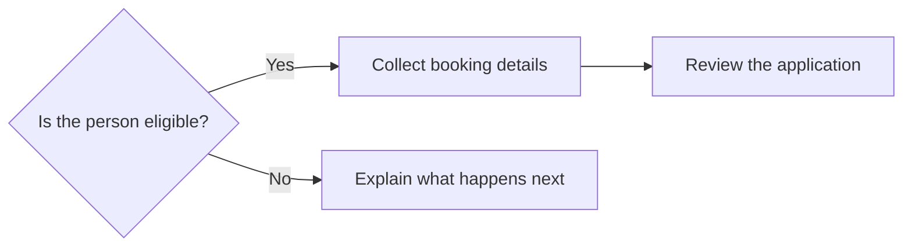
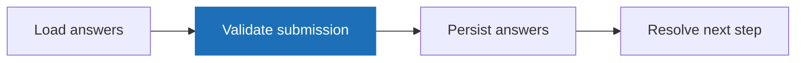

# Markdown kitchen sink

This page exists so we can see every rendering feature at once. It isn't linked from any
guide - delete it freely.

## Inline formatting

Text can be **bold**, *italic*, ***both***, ~~struck through~~, or `inline code`.
Links come in [named form](./create-forge-package) and bare autolinked form:
https://design-system.service.gov.uk. HTML entities like &amp; and &lt; survive too.

## Headings

### A third-level heading

#### A fourth-level heading

Body text under the deepest heading level we use.

## Lists

An unordered list, with nesting:

- First item
- Second item
  - A nested item
  - Another nested item
- Third item with `inline code`

An ordered list:

1. Describe the block
2. Register the component
3. Use it in a step

## Blockquote

> Components live on the rendering side of Forge, so the answer depends on the renderer
> your application uses.

## Table

| Piece | Owner | Purpose |
| ----- | ----- | ------- |
| Block shape | Author | What goes in the card |
| Template | Application | What the card looks like |
| Variant | Both | The join between them |

## Horizontal rule

Some text above the rule.

---

Some text below the rule.

## Image


## Attributes

This paragraph carries a class from the attrs plugin. {.govuk-inset-text}

## Code blocks

A plain fence with no language:

```
plain text, no highlighting
```

A highlighted TypeScript fence with code-step annotations:

```typescript [[1, 1, "step({"], [2, 3, "title: 'Kitchen sink'"], [3, 5, "AppBookingCard({"]]
export const kitchenSinkStep = step({
  path: '/kitchen-sink',
  title: 'Kitchen sink',
  blocks: [
    AppBookingCard({
      title: 'Visit to HMP Leeds',
      details: [{ label: 'Date', value: '12 May 2026' }],
    }),
  ],
})
```

The <s1>step</s1> is highlighted as step one, the <s2>title</s2> as step two, and the
<s3>component call</s3> as step three - the inline markers here should match the colours in
the fence above.

A Nunjucks fence:

```nunjucks
<div class="app-booking-card">
  <h2>{{ title }}</h2>
</div>
```

A text fence, as used for schematics:

```text
authoring   AppBookingCard({ title, details })
            ↓
variant     'appBookingCard'
            ↓
rendering   buildNunjucksComponent  →  template.njk  →  HTML
```

## Mermaid diagrams



## Frame sequence

::::frame-sequence
---
title: Journey lifecycle
---

:::frame
---
title: Load answers
---

===
The engine loads the journey's saved answers and builds the step's context before anything
renders. Every expression on the step evaluates against this snapshot.
:::

:::frame
---
title: Validate submission
---

===
Each field's rules fire in the order they're declared. Any failure short-circuits the
lifecycle here - nothing is persisted and the step re-renders with errors.
:::

:::frame
---
title: A prose-only frame
---
A frame with no `===` divider slides its whole body, and the caption below has no
description text.
:::
::::

## Deep dive

:::deep-dive
---
label: Extension demo
title: What a deep dive looks like
description: One-line framing shown above the disclosure.
summary: Show the body
---
The body is full markdown, so it can hold **bold text**, `inline code`, and lists:

- one
- two
:::

And one that starts open:

:::deep-dive
---
title: An open deep dive
defaultOpen: true
---
This one renders with its disclosure already expanded.
:::

## Notes

:::note
---
---
Notes are asides worth knowing but safe to skip. They take no options - every note looks
the same.
:::

:::note
---
---
The body is full markdown, so **bold text**, `inline code`, and lists all work here:

- one
- two
:::

## Params

:::param
---
name: path
type: string
required: true
---
The step's route path, relative to the journey mount point.
:::

:::param
---
name: reachability
type: ReachabilityConfig
required: false
---
Controls when the step is reachable. Has its own nested properties below.
:::

:::param
---
name: resumeWhen
type: Condition
required: false
parent: reachability
---
A nested param - it should render indented inside `reachability`.
:::

## Recap

- Everything above should render without errors.
- The code-step colours in the fence should match the inline markers.
- The nested param should sit inside its parent's rail.
