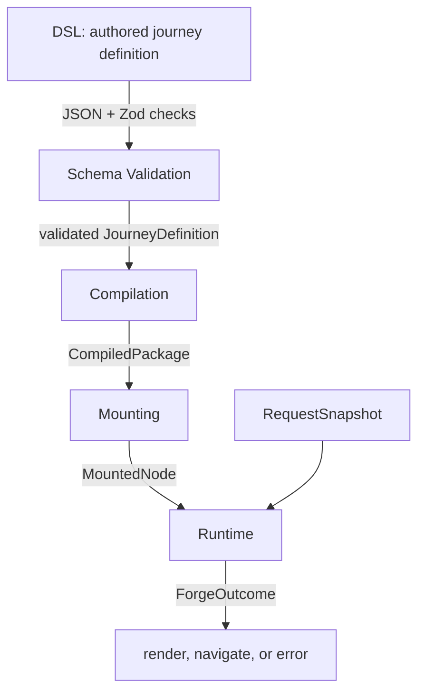
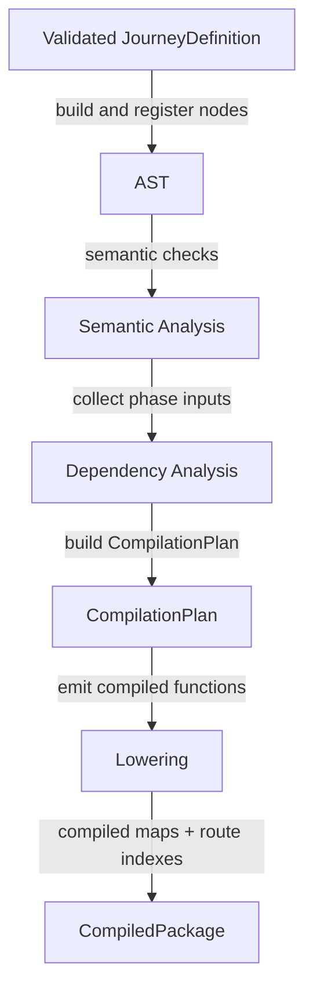
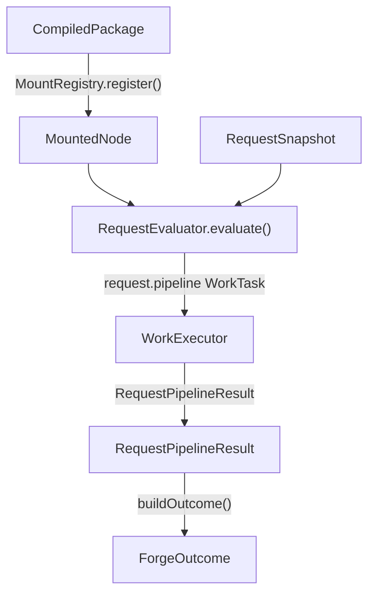

# Engine

The engine is the core Forge pipeline.

It takes an authored journey, checks it, compiles it, mounts it, and evaluates it for requests.
Most maintainers should understand the four broad stages before changing a subsystem.

## The Shape

Forge has four broad stages:

1. Authors write a journey in the Forge DSL.
2. Schema validation checks the raw authored shape.
3. Compilation turns the validated journey into runtime artifacts.
4. Runtime evaluates those artifacts for one mounted request.

## DSL

The DSL is the author-facing shape.
It lives outside this folder under [../authoring](../authoring).

Authors describe journeys, steps, blocks, hooks, conditions, generators, transformers, predicates, and references as plain TypeScript objects and helper calls.
That shape is built for people first.
It keeps journey definitions readable, but it is not the shape the engine wants to execute directly.

Important entry points:

- [../authoring/types](../authoring/types) defines the authoring object shapes.
- [../authoring/builders](../authoring/builders) defines expression and reference builders.
- [../authoring/built-ins/conditions](../authoring/built-ins/conditions), [../authoring/built-ins/generators](../authoring/built-ins/generators), and [../authoring/built-ins/transformers](../authoring/built-ins/transformers) define built-in function sets.
- [../authoring/utils](../authoring/utils) contains helpers for defining functions and function scopes.

## Schema Validation

Schema validation is the first engine check.
It lives under [validation](validation).

This stage checks that the authored definition is JSON-compatible and matches the broad Zod schemas.
It catches shape errors before the compiler builds AST nodes.
For example, it can reject a malformed block, a wrong property type, or a value that cannot be safely serialized.

This stage does not know enough to answer semantic questions.
It cannot decide whether `Item()` is inside an iterator, whether an effect function is inside a hook, or whether a component variant is registered.
Those checks need compiler state.

Read [validation/README.md](validation/README.md) for details.

## Compilation

Compilation turns a validated journey into runtime artifacts.
It lives under [compilation](compilation).

This stage builds the AST, validates semantic rules, gathers dependency inputs, lowers those inputs into compiled functions, and builds route indexes.
It pays that cost when a package is registered.
Request handling should not run any of this work.

The important output is `CompiledPackage`.
It contains route indexes plus compiled step and journey maps.
AST nodes, AST indexes, and compilation plans should not leave compilation.

Read [compilation/README.md](compilation/README.md) for details.

## Runtime

Runtime evaluates compiled artifacts for one request.
It lives under [runtime](runtime).

The framework layer selects a `MountedNode` and passes a `RequestSnapshot`.
`RequestEvaluator.evaluate()` builds a request pipeline, executes work tasks, records traces, and returns a `ForgeOutcome`.

Runtime calls compiled functions.
It does not rebuild AST nodes, plans, route indexes, or generated source.
That boundary is important.
It keeps compiler cost and compiler failures out of request handling.

Read [runtime/README.md](runtime/README.md) for details.

## Supporting Areas

- [Forge.ts](Forge.ts) is the public engine facade.
- [PackageInstance.ts](PackageInstance.ts) owns package-level validation and compilation.
- [registries](registries) owns function, component, and mount registries.
- [contracts](contracts) owns the shared types between validation, compilation, runtime, and framework adapters.
- [diagnostics](diagnostics) owns source locations and trace wiring.
- [errors](errors) owns engine error types and formatting.

## Where To Start

- To follow the whole path, read this file, then [compilation/README.md](compilation/README.md), then [runtime/README.md](runtime/README.md).
- To debug authoring shape errors, start in [validation](validation).
- To debug generated runtime behavior, start in [compilation/lowering](compilation/lowering) and the matching runtime phase under [runtime/evaluation/phases](runtime/evaluation/phases).
- To debug one request, start in [runtime/RequestEvaluator.ts](runtime/RequestEvaluator.ts) and [runtime/evaluation/request](runtime/evaluation/request).
