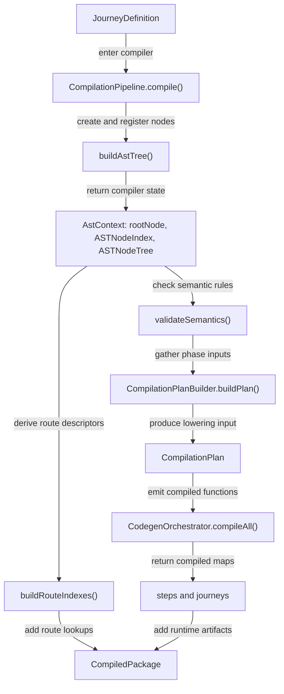
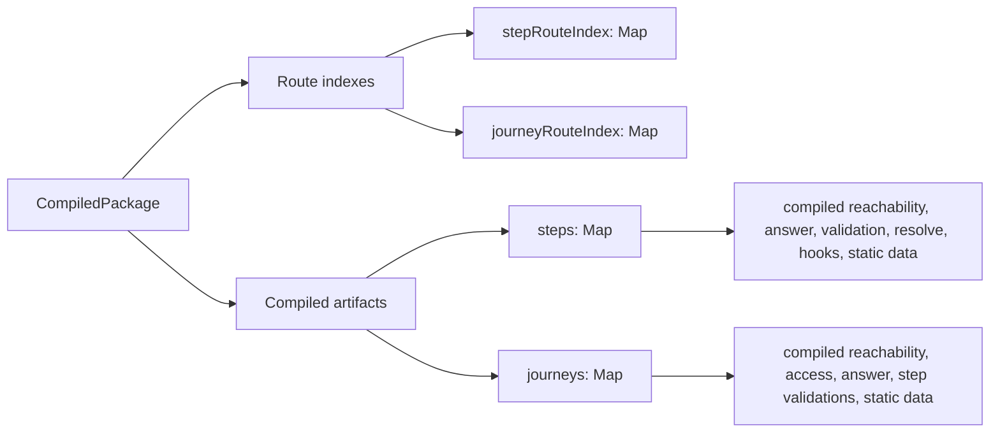

# Compilation

## Scope

This document covers `packages/forge-core/src/engine/compilation`.

This code turns a validated Forge journey definition into compiled journey artifacts.
It builds the AST, validates compiler-only rules, builds phase inputs, lowers those inputs into executable functions, and builds route indexes.

This document does not cover authoring helpers, Zod schema validation, runtime request execution, work task execution, or component rendering.

## Background

Compilation is the bridge between authored Forge configuration and runtime execution.

Authors write journeys as nested objects and DSL helpers.
That shape is useful for people, but the engine needs something more explicit before it can answer request-time questions.
For example, it needs to know which steps belong to each journey, which hooks apply to a step, which fields can affect reachability, and which generated function should prepare answers or resolve blocks.

The compiler pays that cost once when a package is loaded.
It turns the raw journey into registered AST nodes, checks rules that the schema cannot know, builds phase-specific dependency bundles, and compiles request-time work into functions.
The runtime can then look up a compiled step or journey by `NodeId` and call the functions it needs.

Compilation does not run a journey.
It builds the route indexes, runtime plans, compiled functions, and work-task-producing functions that later runtime code uses when a request arrives.
No part of compilation should run during request handling.
Runtime receives `CompiledPackage` and executes what is already there.

## Responsibilities

- Accept a validated `JourneyDefinition`.
- Build and register the AST for the journey.
- Validate semantic rules that depend on AST structure and registries.
- Build a `CompilationPlan` from registered AST nodes.
- Lower the `CompilationPlan` into `CompiledStep` and `CompiledJourney` maps.
- Build `StepRouteIndex` and `JourneyRouteIndex` from the AST.
- Return a `CompiledPackage`.
- Keep phase orchestration in one place without moving phase-specific rules into the root pipeline.

## Data Model

`CompilationPipeline` is the root compiler orchestrator.
It accepts a `JourneyDefinition` and returns a `CompiledPackage`.

`CompilationDependencies` carries the registries needed during semantic analysis and lowering:
- `functionRegistry`, used to validate function names and decide generated async behavior.
- `componentRegistry`, used to validate block variants and component metadata.

`AstContext` is local to `CompilationPipeline`.
It contains:
- `rootNode`, the root `JourneyASTNode`.
- `nodeRegistry`, an `ASTNodeIndex` for lookup by ID, broad type, and indexed subtype.
- `astNodeTree`, an `ASTNodeTree` for parent and ancestor lookup.

`CompilationPlan` is produced by dependency analysis.
It contains `stepInputs`, `journeyInputs`, and `reachabilityInputs`.
Those maps are shaped around lowering phases.

`CompiledPackage` is the final output.
It contains:
- `journeyCode`, copied from the root journey node.
- `stepRouteIndex`, a `Map<NodeId, StepRouteDescriptor>`.
- `journeyRouteIndex`, a `Map<NodeId, JourneyRouteDescriptor>`.
- `steps`, a `Map<NodeId, CompiledStep>`.
- `journeys`, a `Map<NodeId, CompiledJourney>`.

Route indexes and compiled maps are siblings in the final result.
Route indexes are built from AST structure.
Compiled maps are built from dependency analysis and lowering.
AST nodes, `ASTNodeIndex`, and `ASTNodeTree` do not leave compilation.
The only AST-derived value that crosses the boundary is `NodeId`, because route descriptors and compiled artifacts need the same stable key.

## Flow

Compilation starts when `CompilationPipeline.compile()` receives a validated `JourneyDefinition`.
The pipeline then runs the child phases in a fixed order.

The final result has two kinds of lookup data:

Compilation also has a deliberate symmetry with runtime phases.
Dependency analysis gathers inputs for the same concerns that the runtime later executes.
Lowering compiles those inputs into functions that usually return `WorkTask`s.
The request pipeline then runs those tasks through request-level handlers and phase work handlers.

The names are intentionally close, but they do not mean the same thing:

| Concern | Compilation input | Lowering output | Runtime request phase |
|---|---|---|---|
| Access hooks | `HookInputAnalyzer` collects inherited access hooks | `HookLifecycleCompiler.compileAccessLifecycle()` | `request.access` runs `access.lifecycle` |
| Submit hooks | `HookInputAnalyzer` collects step submit hooks | `HookLifecycleCompiler.compileSubmitHooks()` | `request.submit` runs `submit.lifecycle` on POST |
| Answer preparation | `AnswerPreparationInputAnalyzer` selects fields and map iterates | `StepAnswerPreparationCompiler.compile()` | `request.answer-preparation` runs `answer.preparation` |
| Validation | `ValidationInputAnalyzer` selects validating fields and map iterates | `StepValidationCompiler.compileOnSubmitValidation()` and `compileOnEntryValidation()` | `request.validities`, `request.entry-validation`, and `submit.validation` read or run validation work |
| Reachability | `ReachabilityPlanAnalyzer` builds the reachability state table, plan, and field inventory sources | `ReachabilityCompiler.compileFacts()` | `request.reachability` evaluates reachability |
| Resolve | `ResolveInputAnalyzer` selects the step, ancestors, and iterates | `StepResolveCompiler.compile()` | `request.resolve` runs `resolve.blocks` |
| Route metadata | `RouteMetadataInputAnalyzer` collects step and journey title/description/metadata | `RouteMetadataCompiler.compile()` (package scope) | `request.route-tree` hydrates the route tree |

*Note: Some runtime phases do not have lowering phase compilers.*

- [CompilationPipeline.ts](CompilationPipeline.ts) owns phase order.
  `compile()` runs AST building, semantic analysis, dependency analysis, lowering, and route index construction.
- [ast/README.md](ast/README.md) covers AST creation and registration.
  This phase builds `rootNode`, `ASTNodeIndex`, and `ASTNodeTree`.
- [semantic-analysis/README.md](semantic-analysis/README.md) covers semantic checks.
  This phase reads the registered AST and registries, then rejects legal-looking nodes that are illegal in their current compiler context.
- [dependency-analysis/README.md](dependency-analysis/README.md) covers plan building.
  This phase turns the registered AST into `CompilationPlan` inputs for step, journey, and reachability compilation.
- [lowering/README.md](lowering/README.md) covers code generation.
  This phase turns the `CompilationPlan` into `CompiledStep` and `CompiledJourney` maps.
- `CompilationPipeline.buildRouteIndexes()` builds route descriptors from `JourneyASTNode` and `StepASTNode`.
  It uses `getAncestorChain()` so route consumers can see the journey ancestry for each route.

## Boundaries

- `CompilationPipeline` owns compile order and final result assembly.
  It should not contain AST factory rules, semantic rule logic, dependency queries, or source emission details.
- `CompilationPipeline` owns the boundary between compiler mechanics and runtime artifacts.
  It should return route descriptors and compiled artifacts, not AST nodes, AST indexes, or AST trees.
- `ast/` owns AST creation, registration, node IDs, `Self()` resolution, and AST lookup structures.
  It should not validate semantic placement rules or emit runtime functions.
- `semantic-analysis/` owns compiler semantic checks.
  It should not mutate AST nodes, register dependencies, or generate code.
- `dependency-analysis/` owns `CompilationPlan` creation.
  It should not generate JavaScript or execute runtime work.
- `lowering/` owns generated source and compiled functions.
  It should not query the raw authored DSL or run request lifecycles.
- Route index construction currently lives in `CompilationPipeline`.
  It should stay separate from `CompilationPlan` unless route descriptors become lowering inputs.

## Quirks

- Route indexes are built after lowering, but they do not depend on lowering.
  They are built at the end because `compile()` assembles the final `CompiledPackage` there.
- Journey route descriptors include the journey itself in `ancestorJourneyIds`.
  Step route descriptors filter the step itself out and keep only ancestor journeys.
- The compiled artifacts are keyed by AST `NodeId`, not by route path or authored `code`.
  Route paths and codes can be user-facing values. Node IDs are the compiler's stable lookup keys for one compilation result.

## Constraints

- Pass only schema-valid `JourneyDefinition` values into `CompilationPipeline.compile()`.
  The compiler assumes the broad authoring shape has already been checked.
- Keep AST registration before semantic analysis.
  Semantic rules need `ASTNodeIndex`, `ASTNodeTree`, and registered template-aware context.
- Keep semantic analysis before dependency analysis.
  Dependency analyzers assume placement rules and registry references are already valid.
- Keep dependency analysis before lowering.
  `CodegenOrchestrator.compileAll()` consumes `CompilationPlan`, not raw journey definitions.
- Do not execute compiled functions during compilation.
  Generated functions may produce `WorkTask`s at request time, and the runtime executor owns that work.
- Do not run any compilation phase at request time.
  AST creation, semantic analysis, dependency analysis, lowering, and route index construction are package-load work.
  Running them during a request would move compiler cost and compiler failures into the runtime path.
- Keep route descriptor ancestry based on `ASTNodeTree`.
  Rebuilding it from paths would lose the actual nested journey structure.
- Preserve `NodeId` as the join key between route indexes, compilation plans, compiled steps, and compiled journeys.
  Mixing in route paths or authored codes can break lookup when values collide or change.
- Do not expose AST nodes, `ASTNodeIndex`, or `ASTNodeTree` outside compilation.
  Runtime code should consume `CompiledPackage`, not compiler inspection structures.

## Editing Notes

- To change compile order, start in [CompilationPipeline.ts](CompilationPipeline.ts).
  Check every child README before moving a phase, because most phases assume the previous phase's output.
- To add a new compiler phase before lowering, add the data contract first.
  Then update `CompilationPipeline.buildCompilationPlan()` or `CompilationPipeline.lowerCompilationPlan()` depending on where the phase belongs.
- To add a new lowering output on `CompiledStep` or `CompiledJourney`, start in `contracts/plans/compilationArtefacts.type.ts`.
  Then update dependency analysis inputs, lowering, and the runtime consumer together.
- To change route descriptor shape, update `contracts/routing/routeDescriptors.type.ts` and `CompilationPipeline.buildRouteIndexes()`.
  Then check route consumers in the runtime layer.
- To change how AST facts are found, update the child phase that owns the fact.
  Do not add raw AST searches to unrelated phases just because `CompilationPipeline` has access to `ASTNodeIndex`.

## Entry Points

- [CompilationPipeline.ts](CompilationPipeline.ts) answers what order the compiler phases run in.
- [ast/README.md](ast/README.md) explains how authored configuration becomes registered AST.
- [semantic-analysis/README.md](semantic-analysis/README.md) explains which AST placements and references are legal.
- [dependency-analysis/README.md](dependency-analysis/README.md) explains how compiler inputs are gathered for lowering.
- [lowering/README.md](lowering/README.md) explains how phase inputs become compiled functions.
- [../contracts/plans/compilationArtefacts.type.ts](../contracts/plans/compilationArtefacts.type.ts) defines `CompiledStep`, `CompiledJourney`, and `CompiledPackage`.
- [../contracts/routing/routeDescriptors.type.ts](../contracts/routing/routeDescriptors.type.ts) defines `StepRouteIndex`, `JourneyRouteIndex`, and their route descriptors.
