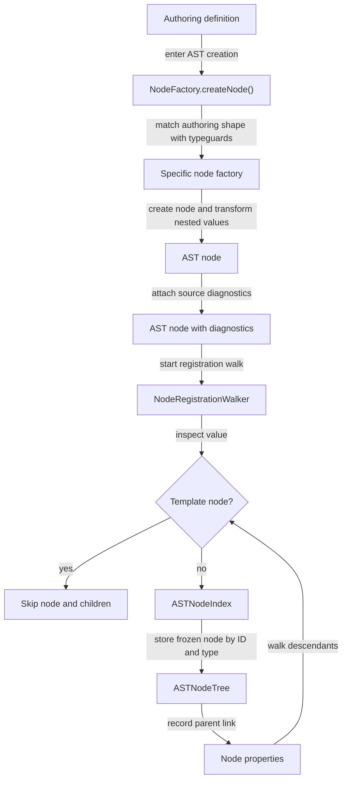

# AST Compilation

## Scope

This document covers `packages/forge-core/src/engine/compilation/ast`.

This code creates AST nodes from authoring definitions and registers those nodes for later compiler work.

This document does not cover expression evaluation, runtime execution, or generated output.

## Background

An AST is an Abstract Syntax Tree. It is the engine's intermediate representation of a journey as a big tree of nodes.

Authors write journeys in a DSL that is easy to read and write. That format is good for authoring, but not so good for
compiling. So to make later stages easier, we convert it into a tree of typed nodes, where each node has an ID and
a known role. That tree is much easier to inspect and transform than the original definition.

You might be thinking 'But... the authored definition is already tree-shaped!' and whilst true, it mixes plain objects,
references, conditions, and literals all together. The AST pulls those apart. A step becomes a step node.
A condition becomes a condition node. Importantly, a literal stays a literal.

That matters because later phases ask structural questions - 'which fields are in this step?', 'which expressions need
generated code?', 'which node an error should point back to?'. Those are easy to answer against an AST,
but super awkward to answer against the raw definition.

## Responsibilities

- Turn recognised authoring objects into AST nodes.
- Attach source diagnostics to those nodes while the original DSL path is still known.
- Register the created AST nodes by ID, indexed type, and parent relationship.

## Data Model

An AST node has an `id`, a `type`, optional `diagnostics`, and optional `properties`.

The broad node type comes from `ASTNodeType`.  Some node families also have an indexed subtype:
- expressions use `expressionType`
- predicates use `predicateType`
- hooks use `hookType`
- outcomes use `outcomeType`
- blocks use `blockType`

`ASTNodeIndex` indexes the broad type for every node.
It also indexes the subtype fields listed above.

Template nodes use `ASTNodeType.TEMPLATE`, whose runtime value is `AstNode.Template`.
They preserve AST-like structure but are excluded from normal AST registration.

### Example

A `Test` predicate shows the transform. Authors usually write the chainable DSL form:

```ts
Answer('field').match(Condition.Equals(true))
```

The builders turn that into the authoring definition that `NodeFactory` receives:

```jsonc
{
  type: 'PredicateType.Test',
  subject: { type: 'ExpressionType.Reference', path: ['answers', 'field'] },
  negate: false,
  condition: { type: 'FunctionType.Condition', name: 'Equals', arguments: [true] },
}
```

which becomes this AST node:

```jsonc
{
  id: 'compile_ast:1',
  type: 'AstNode.Predicate',
  predicateType: 'PredicateType.Test',
  properties: {
    subject: {                                  // nested definition promoted to its own node
      id: 'compile_ast:2',
      type: 'AstNode.Expression',
      expressionType: 'ExpressionType.Reference',
      properties: { path: ['answers', 'field'], base: undefined },
      diagnostics: ...
    },
    condition: {
      id: 'compile_ast:3',
      type: 'AstNode.Expression',
      expressionType: 'FunctionType.Condition',
      properties: { name: 'Equals', arguments: [true] },
      diagnostics: ...
    },
    negate: false,
  },
  diagnostics: {
    source: {
      path: ['steps', 0, 'blocks', 0, 'validWhen', 0],
      formattedPath: 'travel-declaration > personal-details > blocks[0] (…) > validWhen[0]',
    },
  },
}
```

## Flow

AST building is a two-pass process, driven in sequence by `CompilationPipeline.buildAstTree()`.
The first pass (`NodeFactory.createNode()`) builds the node tree from authoring definitions.
The second pass (`NodeRegistrationWalker.register()`) walks that tree to assign any missing compile IDs, resolve `Self()`, and index each node.



- [NodeFactory.ts](nodes/NodeFactory.ts) starts node creation.
  `createNode()` checks that the input is an object, identifies the authoring type with typeguards, and delegates to a specific factory.
- The specific factory creates one AST node.
  Node-specific values go under `properties`.
- Factories call back into `NodeFactory` for nested values that may contain another node.
  The methods are `createChildNode()`, `transformChild()`, and `transformValue()`.
- `NodeFactory` tracks the current DSL path during recursion.
  `withDiagnostics()` uses that path to attach source information to the node.
- [NodeRegistrationWalker.ts](ast-state/NodeRegistrationWalker.ts) starts registration.
  The walker skips template nodes, assigns a compile ID when an AST-shaped value has no ID, resolves `Self()` references, registers each ordinary AST node in `ASTNodeIndex`, and records parent links in `ASTNodeTree`.

## Boundaries

- Node factories create node structure.
  They should not register nodes.
- `NodeRegistrationWalker` owns registration-time behavior.
  That includes missing compile IDs, parent links, and `Self()` resolution.
- Ancestor and lookup-by-type are separately handled
  `ASTNodeIndex` owns lookup, `ASTNodeTree` owns ancestry.
- `TemplateFactory` owns conversion between AST-shaped values and template nodes.
  Template nodes should not be treated as ordinary AST nodes.

## Quirks

- Templates are AST-shaped but not AST nodes.
  Iterate payloads describe forms that do not exist until runtime data provides collection items.
  They are kept as templates so compile-time planning does not treat those forms as already materialised.
- Template compilation and instantiation happen in different phases.
  `TemplateFactory.compile()` runs at compile time, freezing the iterator payload into a template.
  `TemplateFactory.instantiate()` is static and runs at request time, rebuilding AST nodes from that template once per collection item. The rebuilt nodes have no IDs; the next `NodeRegistrationWalker` pass assigns fresh IDs.
  Deferring instantiation to runtime is the reason templates exist: the form is materialised only when the iterated collection is known.
- `Self()` is resolved during registration.
  Node factories can see the current DSL path, but they do not know the containing field stack.
  The registration walk has that context, so it replaces `Self()` while registering the tree.
- The index and tree are separate structures.
  `ASTNodeIndex` answers lookup questions by ID or type.
  `ASTNodeTree` answers ancestry questions.

## Constraints

- Do not register template nodes.
  If these are registered, they are added to the AST tree and pulled into compilation plans,
  even though they are not materialized. The registration walk returns immediately
  for `isTemplateNode(value)`, and `isASTNode()` excludes `ASTNodeType.TEMPLATE`, to prevent that.
- Do not add `Self()` resolution to node factories.
  `Self()` resolution depends on the current field stack and the field whose `code` property owns the current traversal.
  That state exists in `NodeRegistrationWalker`, not in `NodeFactory`.
- Keep `Self()` valid for its resolution context.
  `NodeRegistrationWalker.resolveSelfReference()` throws in three cases:
  - `self_outside_field` when `Self()` is used with no containing field on the stack.
  - `self_inside_code` when the current code owner is the containing field (`Self()` inside that field's own `code`).
  - `missing_field_code` when the containing field has no `code` for `Self()` to resolve to.
- Do not mutate nodes after registration.
  `ASTNodeIndex.register()` stores `Object.freeze(node)`.
- Do not use one ID counter for compile AST nodes and template nodes.
  `NodeIDGenerator` has separate counters for `compile_ast` and `template`.
- Do not move semantic analysis before registration.
  It is tempting to reject a bad journey before building the tree, but semantic rules consume the registry and tree that registration produces.
  `ASTSemanticValidator` queries `ASTNodeIndex` (e.g. every function node via `findByType`) and `ASTNodeTree` (ancestry for scope rules), so those structures must already exist.
  The `Self()` errors that the walker throws are failures of a required normalization step, not free-standing validation that could run earlier.

## Editing Notes

- To add a new authoring node type, update `NodeFactory.createNode()`.
  It should recognise the new typeguard and delegate to a factory.
- To add a new expression, predicate, hook, outcome, or block subtype, return the broad `ASTNodeType` plus the subtype field used by that family.
  If the subtype should be queryable through `ASTNodeIndex.findByType()`, add it to `ASTNodeIndex.getNodeSubType()`.
- To transform nested authoring values, call back into `NodeFactory`.
  Use `createChildNode()` when the child must be an AST node.
  Use `transformChild()` when the child may be a primitive, array, object, or AST node.
- To add data that should not be transformed, assign it directly in the factory.
  Existing examples include `metadata`, `data`, and some config values.
- To change iterate template behavior, start in `IterateFactory` and `TemplateFactory`.
  Do not make iterator payloads ordinary registered descendants unless the registration behavior is also changed.

## Entry Points

- [NodeFactory.ts](nodes/NodeFactory.ts) dispatches authoring definitions to node factories.
- [NodeRegistrationWalker.ts](ast-state/NodeRegistrationWalker.ts) registers nodes and handles `Self()`.
- [ASTNodeIndex.ts](ast-state/ASTNodeIndex.ts) stores nodes by ID and type.
- [ASTNodeTree.ts](ast-state/ASTNodeTree.ts) stores parent links.
- [getAncestorChain.ts](ast-state/getAncestorChain.ts) walks parent links in `ASTNodeTree` to return a node's ancestor chain.
- [TemplateFactory.ts](nodes/template/TemplateFactory.ts) compiles and instantiates template nodes.
