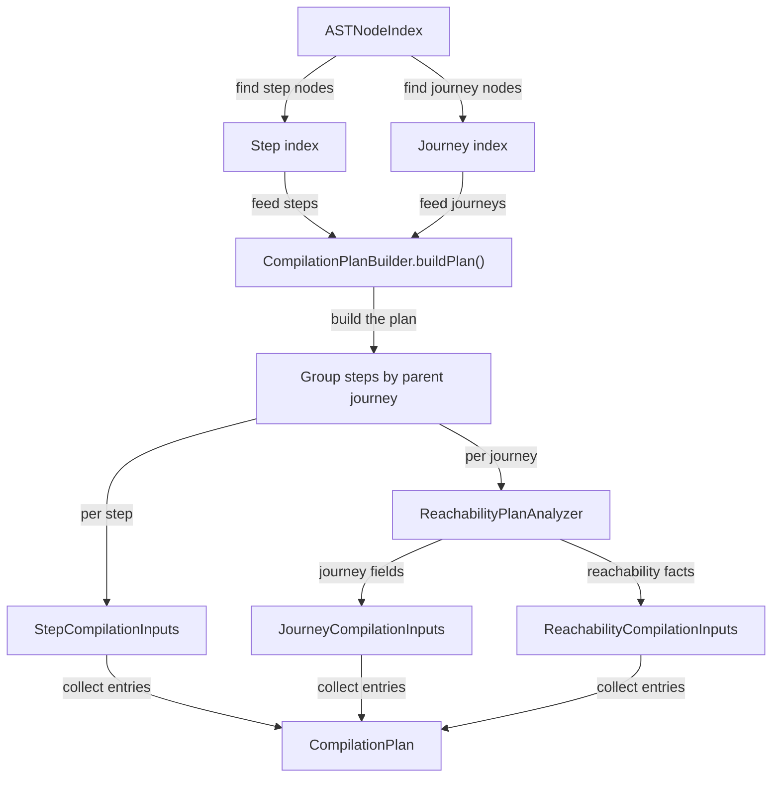

# Dependency Analysis

## Scope

This document covers `packages/forge-core/src/engine/compilation/dependency-analysis`.

This code reads the registered AST and builds the `CompilationPlan` that lowering consumes.
It decides which AST nodes and runtime facts each phase compiler needs.

This document does not cover AST creation, semantic validation, JavaScript generation, runtime
execution, or route index construction.

## Background

Dependency analysis is the compiler pass that turns a whole AST into phase-specific work lists.

The AST tells us everything that exists in the journey. But lowering - the next stage where we ask domain
questions like "is this step valid?" - needs the inputs for each question gathered into easy-to-evaluate
lists, rather than scattered across the tree. For example, a step compiler needs its own runtime metadata, fields,
hooks, validations, iterate nodes, and ancestor journeys. A journey compiler needs navigation facts and the fields
from the steps that belong to that journey. Navigation compilation needs reachability entries, cleardown fields,
forward redirects, and field inventory sources.

"Can lowering just query the AST directly?" sure, but then every phase compiler would need to rediscover the same
tree facts. It would also make ordering rules harder to see. Dependency analysis keeps those questions in one place,
so lowering receives explicit inputs instead of searching the AST repeatedly.

## Responsibilities

- Build `StepCompilationInputs` for every step in a journey.
- Build `JourneyCompilationInputs` for every journey with steps.
- Build `ReachabilityCompilationInputs` for every journey with steps.
- Group steps under their parent journey.
- Build runtime plans for steps and journeys.
- Resolve field inventories, hook inheritance, validation inputs, resolve inputs, and reachability facts.
- Keep AST querying out of lowering phase compilers where possible.

## Data Model

`CompilationPlan` is the main output.
It contains three maps:
- `stepInputs`, keyed by step node ID.
- `journeyInputs`, keyed by journey node ID.
- `reachabilityInputs`, keyed by journey node ID.

`StepCompilationInputs` contains:
- `core`, with the `stepNode`, the `runtimePlan` (a `StepRuntimePlan`), and parent `navigationId`.
- `answerPreparation`, with field blocks and map iterate nodes for the step.
- `hooks`, with inherited access hooks and submit hooks for the step.
- `validation`, with the step node, validating field blocks, and map iterate nodes.
- `resolve`, with the step node, ancestor journeys, and all iterate nodes.

`JourneyCompilationInputs` contains the journey runtime plan, field blocks from the journey's steps,
map iterate nodes from those steps, and journey access hooks.

`ReachabilityCompilationInputs` contains the parent `navigationId`, the reachability state table, the richer reachability
compilation plan, and field inventory sources for each reachable entry.

The analyzers share two core structures:
- `ASTNodeIndex` answers lookup questions by broad type or subtype.
- `ASTNodeTree` answers ancestry and descendant questions.

`FieldInventoryAnalyzer` is shared by several analyzers because field and iterate lookup is needed by answer
preparation, validation, resolve, and navigation inventory.

### Example

A journey with two steps starts as registered AST nodes:

```jsonc
{
  journey: {
    id: 'compile_ast:1',
    type: 'AstNode.Journey',
    properties: { path: '/travel-declaration', code: 'travel-declaration' },
  },
  steps: [
    {
      id: 'compile_ast:2',
      type: 'AstNode.Step',
      properties: { path: '/personal-details', code: 'personal-details' },
    },
    {
      id: 'compile_ast:3',
      type: 'AstNode.Step',
      properties: { path: '/summary', code: 'summary' },
    },
  ],
}
```

`CompilationPlanBuilder.buildPlan()` groups both steps under the journey and produces plan entries:

```jsonc
{
  stepInputs: Map {
    'compile_ast:2' => {
      core: {
        stepNode: { id: 'compile_ast:2', ... },
        runtimePlan: {
          stepId: 'compile_ast:2',
          path: 'personal-details',
          staticData: {},
        },
        navigationId: 'compile_ast:1',
      },
      answerPreparation: { fieldBlocks: [...], mapIterateNodes: [...] },
      hooks: { accessHooks: [...], submitHooks: [...] },
      validation: { stepNode: ..., validatingFieldBlocks: [...], mapIterateNodes: [...] },
      resolve: { stepNode: ..., ancestorJourneys: [...], allIterateNodes: [...] },
    },
  },
  journeyInputs: Map {
    'compile_ast:1' => {
      runtimePlan: { journeyId: 'compile_ast:1', path: 'travel-declaration', staticData: {} },
      stepFieldBlocks: [...],
      stepMapIterateNodes: [...],
      accessHooks: [...],
    },
  },
  reachabilityInputs: Map {
    'compile_ast:1' => {
      navigationId: 'compile_ast:1',
      stateTable: { entries: [...], ... },
      reachabilityPlan: { stateTable: ..., entries: [...], resumeAlways: false },
      fieldInventorySources: [...],
    },
  },
}
```

The important transform is not changing AST nodes.
It is turning one tree into the exact dependency bundles each lowering compiler needs.

## Flow

Dependency analysis starts when `CompilationPlanBuilder.buildPlan()` receives a step index and a journey index.
It groups steps by parent journey, builds step inputs, builds journey inputs, and builds reachability inputs.



- [CompilationPlanBuilder.ts](CompilationPlanBuilder.ts) owns the pass orchestration.
  It creates shared analyzers, groups steps by parent journey, and returns the final `CompilationPlan`.
- [shared/RuntimePlanAnalyzer.ts](shared/RuntimePlanAnalyzer.ts) builds `StepRuntimePlan` and `JourneyRuntimePlan`.
  It normalizes paths and merges static `data` from ancestor journeys and the current node.
- [shared/FieldInventoryAnalyzer.ts](shared/FieldInventoryAnalyzer.ts) finds field blocks, validating field blocks, map iterate nodes, and all iterate nodes for a step.
  It also builds field inventory sources from reachability entries.
- [answer-preparation/AnswerPreparationInputAnalyzer.ts](answer-preparation/AnswerPreparationInputAnalyzer.ts) builds field and map-iterate inputs for answer preparation.
- [hooks/HookInputAnalyzer.ts](hooks/HookInputAnalyzer.ts) resolves access hooks from ancestor journeys through the current step.
  It reads submit hooks from the current step only.
- [validation/ValidationInputAnalyzer.ts](validation/ValidationInputAnalyzer.ts) builds validation inputs from the step, validating field blocks, and map iterate nodes.
- [resolve/ResolveInputAnalyzer.ts](resolve/ResolveInputAnalyzer.ts) builds resolve inputs from the step, ancestor journeys, and all iterate nodes.
- [reachability/ReachabilityPlanAnalyzer.ts](reachability/ReachabilityPlanAnalyzer.ts) builds navigation runtime entries and richer reachability compilation entries.
- [reachability/ForwardNavigationAnalyzer.ts](reachability/ForwardNavigationAnalyzer.ts) extracts forward redirect outcomes from submit hooks.
  It preserves one outcome group per submit hook.
- [reachability/RequestTimeReferenceAnalyzer.ts](reachability/RequestTimeReferenceAnalyzer.ts) detects `post`, `params`, `query`, and `request` references that cannot be evaluated at compile time.

## Boundaries

- `CompilationPlanBuilder` owns plan assembly.
  It should not contain the details of every phase-specific AST query.
- Analyzer classes own AST queries for one concern.
- Reachability analysis owns compile-time navigation facts.
  Runtime navigation still evaluates the compiled navigation function with request data.
- `FieldInventoryAnalyzer` owns shared field and iterate lookup.
  Phase analyzers should reuse it instead of each writing their own descendant scans.

## Quirks

- The name is a bit broader than the code.
  This phase collects inputs for later compilers. It does not build a general graph of which AST nodes
  depend on which other AST nodes.
- `getAncestorChain()` includes the node itself.
  `CompilationPlanBuilder.buildPlan()` uses the second-to-last ancestor ID to find a step's parent journey,
  which is easy to misread as an off-by-one mistake.
- The plan is shaped around lowering phases, not around the smallest possible data structure.
  That means some analyzers may select overlapping AST facts. The duplication keeps each lowering compiler's inputs explicit.

## Constraints

- Run dependency analysis after semantic analysis.
  The analyzers assume effects, outcomes, hooks, validations etc. are all valid.
- Run dependency analysis before lowering.
  `CodegenOrchestrator.compileAll()` consumes `CompilationPlan`, not raw step and journey maps.
- Keep analyzer outputs as AST node references and plan metadata.
  Generated code belongs in lowering, not in this pass.
- Do not make lowering compilers recompute shared AST inventories.
  That would split the same dependency rules across multiple phases.
- Keep phase-specific rules in the phase README and analyzer.
  The top-level README should explain the pass shape, not duplicate every local rule.

## Editing Notes

- To add a new lowering phase input, start in `contracts/plans/compilationPlan.type.ts`.
  Add the input shape, then add an analyzer or extend the nearest existing analyzer.
- To add another step-level input, update `StepCompilationInputs` and `CompilationPlanBuilder.buildStepInputs()`.
  Keep the same shape as the existing analyzer calls.
- To add another journey-level input, update `JourneyCompilationInputs` and `CompilationPlanBuilder.buildJourneyInputs()`.
  Check whether the data belongs to the journey itself or to the journey's steps.
- To change a phase-specific rule, start in that phase's README and analyzer.
  The local README should explain the rule and the file that owns it.
- To change shared field, iterate, path, or static-data behavior, start in [shared/README.md](shared/README.md).
  Several phase analyzers depend on those definitions.

## Entry Points

- [CompilationPlanBuilder.ts](CompilationPlanBuilder.ts) builds the full `CompilationPlan`.
- [shared/RuntimePlanAnalyzer.ts](shared/RuntimePlanAnalyzer.ts) answers what runtime metadata belongs to a step or journey.
- [shared/FieldInventoryAnalyzer.ts](shared/FieldInventoryAnalyzer.ts) answers which field blocks and iterate nodes belong to a step.
- [answer-preparation/AnswerPreparationInputAnalyzer.ts](answer-preparation/AnswerPreparationInputAnalyzer.ts) answers what answer preparation needs to compile for a step or journey.
- [hooks/HookInputAnalyzer.ts](hooks/HookInputAnalyzer.ts) answers which hooks apply to a step or journey.
- [validation/ValidationInputAnalyzer.ts](validation/ValidationInputAnalyzer.ts) answers which validation inputs belong to a step.
- [resolve/ResolveInputAnalyzer.ts](resolve/ResolveInputAnalyzer.ts) answers which ancestor journeys and iterate nodes resolve needs.
- [reachability/ReachabilityPlanAnalyzer.ts](reachability/ReachabilityPlanAnalyzer.ts) answers what navigation and reachability facts belong to a journey.
- [reachability/ForwardNavigationAnalyzer.ts](reachability/ForwardNavigationAnalyzer.ts) answers which submit outcomes can move the user forward.
- [reachability/RequestTimeReferenceAnalyzer.ts](reachability/RequestTimeReferenceAnalyzer.ts) answers whether a predicate depends on request-time state.
