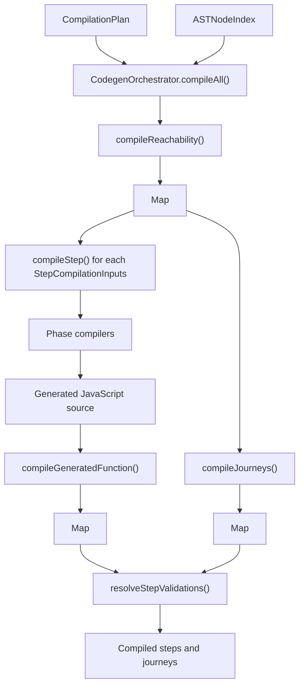

# Lowering

## Scope

This document covers `packages/forge-core/src/engine/compilation/lowering`.

This code turns a `CompilationPlan` into compiled functions for journeys, steps, hooks, validation, answer preparation, resolve, and navigation.
It emits JavaScript source strings and compiles them into `Function` or `AsyncFunction` instances.

This document does not cover AST creation, semantic validation, dependency analysis, route index construction, or runtime execution.

## Background

Lowering is the engine's code generation phase.

The earlier compiler phases have already built a registered AST and a `CompilationPlan`.
Those structures are good for compiler code, but they are not what we want to interpret on every request.
Journeys can have many steps, nested blocks, iterator templates, predicates, hooks, and function calls.
Walking all of that structure for every request would repeat the same decisions again and again.

Lowering pays that cost once.
It writes JavaScript source for each runtime phase, compiles that source, and hands the compiled functions to the runtime.
For example, a field formatter becomes a direct call through `_forgeHelpers.evaluateFunction(...)`.
A validation rule becomes a generated function that builds validation work tasks.
A navigation plan becomes a generated function that evaluates reachability and forward outcomes.
Generated functions do not usually run their child work directly.
They return `WorkTask` objects through `ctx.workTasks`, and the runtime work executor decides how to run those tasks.

"Is this just runtime logic built out of strings?" Sort of, but deliberately so.
The generated strings are treated as a compiler output.
They are wrapped with diagnostics, built through `CodeEmitter`, and tested both as source and as executable functions.
The runtime executes the compiled functions later; lowering does not run request lifecycles itself.

We also prefer to build as functions because it simplifies some of the sync/async handling that can come with
the whole 'build your own functions' approach, and we also get the benefits of V8/TurboFan optimizing our functions
under heavy-load - so Forge remains performant!

## Responsibilities

- Compile every `StepCompilationInputs` entry into a `CompiledStep`.
- Compile every `JourneyCompilationInputs` entry into a `CompiledJourney`.
- Compile every `ReachabilityCompilationInputs` entry into a `CompiledReachabilityFactsFunction`.
- Emit inspectable JavaScript source for phase compilers.
- Construct sync or async functions based on discovered `await` usage.
- Build generated functions that return `WorkTask`s instead of running child work directly.
- Pass runtime helper functions into generated functions through `_forgeHelpers`.
- Attach runtime diagnostics so generated failures can point back to AST nodes and DSL paths.
- Keep generated-function construction errors separate from runtime evaluation errors.

## Data Model

`CompilationDependencies` contains the registries lowering needs while generating source:
- `functionRegistry`, used by `ExpressionDispatcher` to decide whether generated function calls need `await`.
- `componentRegistry`, carried with the lowering dependencies for compilers that need component metadata.

`CompilationPlan` is the input from dependency analysis.
`CodegenOrchestrator.compileAll()` consumes it and returns:
- `steps`, a `Map<NodeId, CompiledStep>`.
- `journeys`, a `Map<NodeId, CompiledJourney>`.

`CompiledStep` contains the step runtime plan, the shared navigation plan, compiled lifecycle functions, compiled answer preparation, compiled validation, compiled entry validation, compiled resolve, and `compiledStepValidations`.

`CompiledJourney` contains the journey runtime plan, the shared navigation plan, compiled access lifecycle, compiled answer preparation, and `compiledStepValidations`.

Most compiled functions return a `WorkTask` or a promise of one.
The task describes what should happen next: the handler kind, the task key, the props, and any child tasks.
For example, validation returns a step validation task that contains field and domain validation tasks.
Resolve returns a resolve-blocks task that contains resolve-block tasks.

Generated functions are created by `compileGeneratedFunction()`.
It wraps source with runtime diagnostics, passes `_forgeHelpers` and `_forgeRuntimeDiagnostics` as extra parameters that the runtime supplies on each call, and calls `createCompiledFunction()` with either `Function` or `AsyncFunction`.

The main source-building helpers are:
- `CodeEmitter`, which owns indentation and variable names.
- `ExpressionDispatcher`, which compiles expressions and tracks iterator scope, `@self`, and `usesAwait`.
- `RuntimeValueCompiler`, which turns authored values into the runtime values used at request time.
- `ScopedTemplateCompiler`, which emits iterator/template loops and compiled template instance IDs.
- `DiagnosticEmitter`, which wraps expressions and function calls with node and source metadata.

### Example

An authored field can trim a submitted value:

```ts
field({ code: 'name', formatters: [Transformer.String.Trim()] })
```

After AST creation and dependency analysis, `StepAnswerPreparationCompiler` receives a `FieldBlockASTNode` whose
formatter is a `FunctionType.Transformer` node. It emits source shaped like this:

```js
(ctx, _forgeHelpers, _forgeRuntimeDiagnostics) => {
  "use strict";

  const isPost = ctx.request.method === "POST";
  const fieldPreparations = [];

  if (isPost) {
    const answerHistory = _forgeHelpers.ensureAnswerHistory(ctx, "name");
    let rawValue = _forgeHelpers.normalizePostValue(ctx.post["name"], false);
    _forgeHelpers.pushAnswerMutation(answerHistory, rawValue, "post");

    let formattedValue = rawValue;
    const formatterResult = _forgeHelpers.evaluateFunction(
      ctx,
      _forgeRuntimeDiagnostics,
      {
        nodeId: "compile_ast:7",
        functionName: "Trim",
        functionType: "FunctionType.Transformer",
      },
      "Trim",
      [formattedValue],
    );

    if (formatterResult !== undefined) {
      formattedValue = formatterResult;
    }
    if (formattedValue !== rawValue) {
      _forgeHelpers.pushAnswerMutation(answerHistory, formattedValue, "processed");
    }
  }

  return ctx.workTasks.answerPreparation(fieldPreparations);
}
```

The important transform is not just the formatter call.
The compiler has also chosen the request branch, answer-history mutation order, helper call shape,
diagnostic metadata, and sync/async function constructor.
The returned `ctx.workTasks.answerPreparation(...)` value is part of that transform.
The generated function builds the work description; it does not execute the answer-preparation handler itself.

## Flow

Lowering starts when `CodegenOrchestrator.compileAll()` receives a `CompilationPlan` and `ASTNodeIndex`.
It compiles navigation first, then journeys, then steps, then links compiled validations back onto every compiled step and journey.



- [CodegenOrchestrator.ts](CodegenOrchestrator.ts) owns compile order.
  Navigation is compiled first because `compileStep()` and `compileJourneys()` share the same `ReachabilityStateTable`.
- [phase-compilers/answer-preparation/StepAnswerPreparationCompiler.ts](phase-compilers/answer-preparation/StepAnswerPreparationCompiler.ts) compiles GET and POST answer preparation.
- [phase-compilers/hooks/HookLifecycleCompiler.ts](phase-compilers/hooks/HookLifecycleCompiler.ts) compiles access lifecycles and submit hook lifecycles.
- [phase-compilers/reachability/ReachabilityCompiler.ts](phase-compilers/reachability/ReachabilityCompiler.ts) compiles reachability and navigation functions.
- [phase-compilers/reachability/StepFieldInventoryCompiler.ts](phase-compilers/reachability/StepFieldInventoryCompiler.ts) compiles field inventory used by navigation.
- [phase-compilers/resolve/StepResolveCompiler.ts](phase-compilers/resolve/StepResolveCompiler.ts) compiles render/resolve work for a step.
- [phase-compilers/validation/StepValidationCompiler.ts](phase-compilers/validation/StepValidationCompiler.ts) compiles submit validation and entry-validation group selection.
- [expressions/ExpressionDispatcher.ts](expressions/ExpressionDispatcher.ts) is the shared expression entry point used by the phase compilers.
- [function-construction/GeneratedFunctionCompiler.ts](function-construction/GeneratedFunctionCompiler.ts) wraps generated source, attaches diagnostics, injects helpers, and constructs the executable function.

## Boundaries

- `CodegenOrchestrator` owns phase compile order.
  It should not contain source-emission details.
- Phase compilers own statement-shaped generated source for one runtime phase.
  They should not query the AST for missing inputs that dependency analysis should have provided.
- `ExpressionDispatcher` owns expression-shaped source.
  Phase compilers should use it for nested expressions instead of hand-writing expression dispatch.
- `RuntimeValueCompiler` owns turning arbitrary authored values into runtime values.
  Phase compilers should pass it a policy (a small config object of optional hooks, `RuntimeValueCompilerPolicy`) to handle special-shaped values, instead of duplicating object and array traversal.
- `ScopedTemplateCompiler` owns iterator/template loop semantics.
  Phase compilers should not each implement their own `Item()` and `Loop` stack.
- `ScopedTemplateCompiler` owns compiled template block IDs.
  Template block IDs are built from the template node ID and active iterator index path.
  Field code is answer identity and metadata, not render block identity.
- `GeneratedFunctionCompiler` owns the `new Function` boundary.
  Other lowering code should return source strings or compiled functions through this helper.
- Lowering emits executable functions.
  It should not execute request lifecycles or call runtime work handlers.
- Generated functions build `WorkTask` graphs.
  They should describe child work through `ctx.workTasks.*`, not run child handlers directly.

## Quirks

- Generated functions close over nothing useful.
  Everything they need is passed in when the runtime calls them: request state, helper functions, and diagnostic state.
  That keeps a compiled function portable. It can sit on a compiled step or journey without secretly
  depending on the compiler instance that created it.
- Compiled functions usually return work, not final phase output.
  The runtime executor owns sequencing, concurrency, first-match behavior, tracing, and completion.
- Compiled functions don't run their children.
  As above, the runtime executor handles this. By returning `WorkTasks`, we can properly track runtime work, super
  inspired by React's Fiber model.
- Async is discovered during expression compilation.
  `ExpressionDispatcher.usesAwait` flips when a registered async function is compiled, and `compileGeneratedFunction()` chooses `AsyncFunction`.
- Hook lifecycles force async.
  Effects are awaited even when the current hook list does not visibly contain an async function.
- Navigation compiles before steps and journeys.
  The compiled navigation function is attached to a shared `ReachabilityStateTable` object that compiled steps and journeys also carry.
- `compiledStepValidations` is resolved after every step is compiled.
  A navigation plan can reference a step that appears later in the compile pass.
- Direct function expressions are not wrapped twice for diagnostics.
  `ExpressionDispatcher` lets `_forgeHelpers.evaluateFunction()` carry function metadata instead of adding an outer `evaluateTracked()` wrapper.
- `CodeEmitter` tracks lexical and function-scoped names differently.
  `var` names cannot be reused across sibling scopes, but `const` and `let` names can when their scopes do not overlap.

## Constraints

- Keep lowering after dependency analysis.
  Phase compilers expect explicit inputs, not raw AST discovery.
- Keep lowering before runtime execution.
  The runtime consumes compiled functions and work tasks; it should not generate source.
- Use `compileGeneratedFunction()` for generated functions.
  Bypassing it loses helper injection, async selection, diagnostics, and `ForgeCompilationError` wrapping.
- Reset `ExpressionDispatcher` for each generated function.
  Iterator frames, `@self`, local variable counters, and `usesAwait` are per-function state.
- Preserve generated diagnostics.
  Runtime errors need node IDs, function names, function types, and DSL source paths to be useful.
- Preserve phase ordering in `CodegenOrchestrator.compileAll()`.
  Navigation must be attached before compiled steps and journeys reuse the navigation plan.
- Do not import runtime implementation details into lowering.
  Lowering should emit calls to work-task factories and helper interfaces, not execute runtime handlers directly.
- Do not make generated functions call child work directly.
  Returning `WorkTask`s keeps execution order, tracing, and failure handling in the runtime work executor.
- Keep generated source readable.
  Tests and production diagnostics depend on source that can be inspected when a generated function fails.

## Editing Notes

- To add a new compiled output, start with the output type in `contracts/`, then add the input shape in `CompilationPlan`,
  then add a phase compiler and wire it through `CodegenOrchestrator`.
- To change expression syntax, start in `ExpressionDispatcher`.
  Add a sibling compiler when the expression has a distinct shape, then route it from `dispatchExpression()`.
- To change function call emission, start in `PipelineNodeCompiler.compileFunction()` and `DiagnosticEmitter`.
  Keep function metadata attached for runtime diagnostics.
- To change generated variable naming or indentation, start in `CodeEmitter`.
  Do not hand-format multi-line generated source in phase compilers unless `CodeEmitter` cannot express it.
- To change iterator template behavior, start in `ScopedTemplateCompiler`.
  Then check answer preparation, validation, resolve, and field inventory.
- To change template block identity, keep resolve and validation on `ScopedTemplateCompiler.compileTemplateInstanceIdExpression()`.
  Do not derive block IDs from field code.
- To change how dynamic block property values are built, start in `RuntimeValueCompiler`.
  Pass phase-specific behavior through its policy hooks (the optional methods on `RuntimeValueCompilerPolicy`).
- To change answer preparation, hook, reachability, resolve, or validation output, start in that phase compiler and its colocated tests.
- To debug generated output, call the relevant `generateSource()` method in a phase compiler test.
- We'd recommend maybe doing a bit of research on this codegen approach, AJV and Nunjucks have some great
  documentation on this, which inspired our approach!

## Entry Points

- [CodegenOrchestrator.ts](CodegenOrchestrator.ts) compiles the full `CompilationPlan`.
- [compilationDependencies.type.ts](compilationDependencies.type.ts) defines the registries available during lowering.
- [function-construction/GeneratedFunctionCompiler.ts](function-construction/GeneratedFunctionCompiler.ts) wraps source, injects helpers, and compiles generated functions.
- [function-construction/compiledFunctionFactory.ts](function-construction/compiledFunctionFactory.ts) is the only `Function` and `AsyncFunction` construction site.
- [function-construction/GeneratedFunctionHelpers.ts](function-construction/GeneratedFunctionHelpers.ts) defines `_forgeHelpers` used by generated source.
- [emitters/CodeEmitter.ts](emitters/CodeEmitter.ts) builds readable JavaScript source with scoped variable names.
- [emitters/DiagnosticEmitter.ts](emitters/DiagnosticEmitter.ts) emits runtime diagnostic wrappers.
- [emitters/FieldCodeEmitter.ts](emitters/FieldCodeEmitter.ts) emits field-code expressions for answers, metadata, and `Self()`.
- [expressions/ExpressionDispatcher.ts](expressions/ExpressionDispatcher.ts) compiles AST and template expressions.
- [structures/RuntimeValueCompiler.ts](structures/RuntimeValueCompiler.ts) turns authored values into the runtime values used at request time.
- [structures/ScopedTemplateCompiler.ts](structures/ScopedTemplateCompiler.ts) emits iterator/template traversal and template instance IDs.
- [phase-compilers/answer-preparation/StepAnswerPreparationCompiler.ts](phase-compilers/answer-preparation/StepAnswerPreparationCompiler.ts) compiles answer-preparation work.
- [phase-compilers/hooks/HookLifecycleCompiler.ts](phase-compilers/hooks/HookLifecycleCompiler.ts) compiles access and submit hook work.
- [phase-compilers/reachability/ReachabilityCompiler.ts](phase-compilers/reachability/ReachabilityCompiler.ts) compiles reachability and navigation work.
- [phase-compilers/reachability/StepFieldInventoryCompiler.ts](phase-compilers/reachability/StepFieldInventoryCompiler.ts) compiles navigation field inventory.
- [phase-compilers/resolve/StepResolveCompiler.ts](phase-compilers/resolve/StepResolveCompiler.ts) compiles resolve/render work.
- [phase-compilers/validation/StepValidationCompiler.ts](phase-compilers/validation/StepValidationCompiler.ts) compiles validation work.
