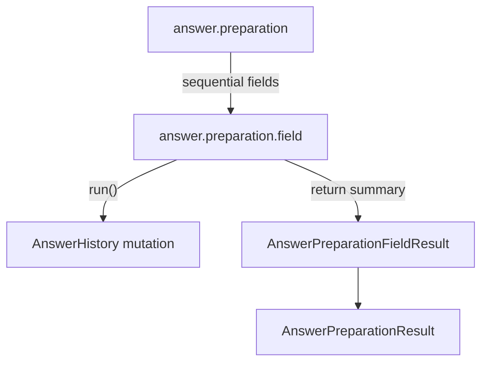

# Answer Preparation Phase

## Scope

This document covers `packages/forge-core/src/engine/concerns/answer-preparation/runtime`.

This code runs compiled field answer-preparation tasks.
It records post input, parser output, formatter output, and answer mutations into `context.domain.answers`.

This document does not cover request phase ordering, generated answer-preparation source, or hook effects.

## Background

Answer preparation turns incoming field values into answer history.

Compiled answer-preparation functions decide which field tasks exist.
This runtime phase decides how those tasks run and how their results are collected.
For example, a field can receive a post value, run parsers, run formatters, and push one or more mutations onto its `AnswerHistory`.

The raw post data is not enough.
Later phases need the current answer, the parsed value, and the mutation trail.
Validation reads prepared answers.
Hooks read prepared answers.
Resolve uses prepared answers to fill field values.

This phase does not parse authored DSL.
It calls compiled `run()` functions that already contain that logic.

## Responsibilities

- Run field answer-preparation tasks in declaration order.
- Execute one compiled field `run()` function per field task.
- Return `AnswerPreparationResult` with per-field summaries.
- Trace field code, mode, mutation count, and parse status.
- Leave answer mutation to compiled field code and helper functions.

## Data Model

`AnswerPreparationWorkProps` contains `fields`, a list of `FieldAnswerPreparationWorkTask`.

`FieldAnswerPreparationWorkProps` contains:
- `code`, the field answer key.
- `mode`, the preparation mode.
- `run()`, the compiled function that mutates answer history and returns `AnswerPreparationFieldResult`.

`AnswerPreparationWorkHandler` returns `AnswerPreparationResult`.
It contains the child field results.

`FieldAnswerPreparationWorkHandler` returns `AnswerPreparationFieldResult`.
The result records the field code, mode, mutations, and parsed state.

### Example

Compiled answer preparation returns a task like this:

```ts
ctx.workTasks.answerPreparation([
  ctx.workTasks.fieldAnswerPreparation('field:name', {
    code: 'name',
    mode: 'POST',
    run: async () => ({ code: 'name', mode: 'POST', current: 'Ada', mutations: [], parsed: 'Ada' }),
  }),
])
```

Runtime runs the field task and folds the output:

```ts
{
  fields: [
    { code: 'name', mode: 'POST', current: 'Ada', mutations: [], parsed: 'Ada' },
  ],
}
```

## Flow



- [AnswerPreparationWorkHandler.ts](AnswerPreparationWorkHandler.ts) runs field tasks sequentially and folds child outputs.
- [FieldAnswerPreparationWorkHandler.ts](FieldAnswerPreparationWorkHandler.ts) calls the compiled field `run()` function.

## Boundaries

- `AnswerPreparationWorkHandler` owns field task ordering.
  It should not know parser or formatter details.
- `FieldAnswerPreparationWorkHandler` owns calling `run()`.
  It should not mutate answers itself.
- Compiled answer-preparation source owns answer mutation rules.
  Runtime should not recreate parser, formatter, or post-value logic here.
- Request handlers own when answer preparation runs.
  This phase should not know `GET` or `POST` pipeline branches.

## Quirks

- Field tasks run sequentially.
  Answer mutation order matters because later mutations update `AnswerHistory.current`.
- The parent trace records the whole answer store at finish.
  This is why answer snapshots show the post-preparation state.
- Field trace records `parsed` as a boolean.
  The trace should show whether parsing happened without storing arbitrary parsed data as metadata.

## Constraints

- Keep field execution sequential.
  Concurrent field mutation would make answer history ordering harder to reason about.
- Do not bypass compiled `run()`.
  That would duplicate generated helper behaviour and drift from lowering.
- Keep mutation summaries small.
  Trace metadata should not become another copy of the answer store.

## Editing Notes

- To change answer-preparation folding, start in `AnswerPreparationWorkHandler`.
- To change one field task execution, start in `FieldAnswerPreparationWorkHandler`.
- To change parser or formatter behaviour, start in the lowering answer-preparation compiler instead.
- To add trace fields, update the relevant `WorkInstrumentation`.

## Entry Points

- [RequestAnswerPreparationWorkHandler.ts](RequestAnswerPreparationWorkHandler.ts) answers where the `request.answer-preparation` phase calls the compiled function.
- [AnswerPreparationWorkHandler.ts](AnswerPreparationWorkHandler.ts) answers how field preparation tasks run as a phase.
- [FieldAnswerPreparationWorkHandler.ts](FieldAnswerPreparationWorkHandler.ts) answers how one compiled field preparation runs.
- [../contracts/AnswerPreparationWork.type.ts](../contracts/AnswerPreparationWork.type.ts) defines the props and result types.
