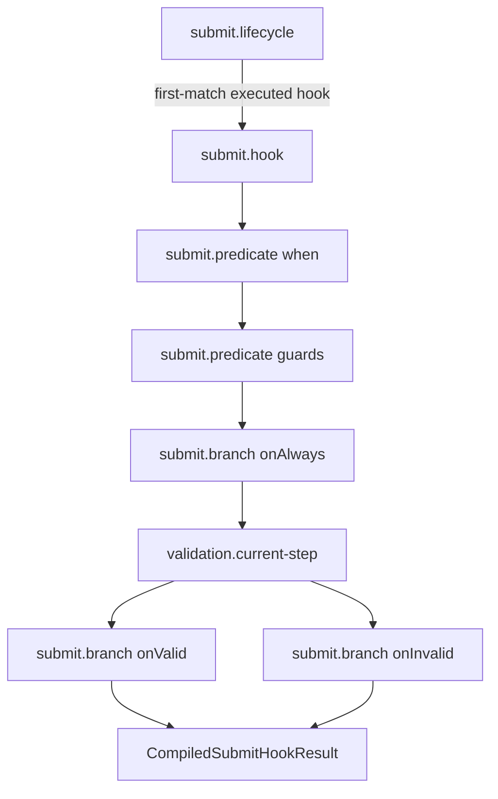

# Hook Phases

## Scope

This document covers `packages/forge-core/src/engine/concerns/hooks/runtime`.

This code runs access and submit hook lifecycles.
It executes hook predicates, effects, validation stages, branches, and next functions as runtime work.

This document does not cover hook lowering, request phase ordering, or effect function APIs.

## Background

Hooks are lifecycle work with early-exit rules.

Access hooks can stop a request with redirect or error before later phases run.
Submit hooks can run validation, choose valid or invalid branches, run effects, and return redirect or error outcomes.
Both lifecycles are modeled as `WorkTask` trees so the executor can trace each stage and stop at the right point.

The raw compiled hook props are not enough.
Runtime still needs to decide which stages run, which branch is selected, when validation is recorded, and when later hooks are skipped.

## Responsibilities

- Run access hook lifecycles in first-match order.
- Run submit hook lifecycles in first-match order.
- Gate hooks with `when` and guard predicates.
- Run hook effects for side effects.
- Schedule the validation-owned `validation.current-step` task as a hook stage.
- Select `onAlways`, `onValid`, and `onInvalid` branches.
- Map hook `next()` outcomes to compiled hook results.
- Omit empty unselected branch traces where possible.

## Data Model

Access work uses:
- `access.lifecycle`.
- `access.hook`.
- `access.hook.when`.
- `access.hook.next`.
- `hook.effect`.

Submit work uses:
- `submit.lifecycle`.
- `submit.hook`.
- `submit.predicate`.
- `validation.current-step` (owned by [validation](../../validation/runtime/README.md)).
- `submit.branch`.
- `hook.effect`.

`HookStageResult<T>` has:
- `status: 'continue'`, for stages that let the hook continue.
- `status: 'terminal'`, for stages that end the hook with a result.

`CompiledAccessHookResult` carries:
- `executed`.
- `outcome`.
- optional redirect or error fields.

`CompiledSubmitHookResult` carries:
- `executed`.
- `validated`.
- optional `isValid`.
- `outcome`.
- optional redirect or error fields.

### Example

A submit hook runs configured stages in this order:

```ts
[
  when,
  guards,
  onAlways,
  validation,
  onValid,
  onInvalid,
]
```

The first terminal stage ends the hook:

```ts
{ status: 'terminal', result: { executed: true, validated: true, isValid: false, outcome: 'redirect', redirect: '/retry' } }
```

The lifecycle stops after the first hook that executed:

```ts
{ executed: true, validated: true, isValid: false, outcome: 'redirect', redirect: '/retry' }
```

## Flow



- [AccessLifecycleWorkHandler.ts](AccessLifecycleWorkHandler.ts) runs access hooks until one returns a non-`continue` outcome.
- [AccessHookWorkHandler.ts](AccessHookWorkHandler.ts) runs one access hook as `when`, effects, then `next`.
- [AccessHookWhenWorkHandler.ts](AccessHookWhenWorkHandler.ts) stops an access hook when `when` is false.
- [AccessHookNextWorkHandler.ts](AccessHookNextWorkHandler.ts) maps access `next()` output to access results.
- [SubmitLifecycleWorkHandler.ts](SubmitLifecycleWorkHandler.ts) runs submit hooks until one executes.
- [SubmitHookWorkHandler.ts](SubmitHookWorkHandler.ts) runs one submit hook's ordered stages.
- [SubmitHookPredicateWorkHandler.ts](SubmitHookPredicateWorkHandler.ts) stops a submit hook when `when` or guards fail.
- [CurrentStepValidationWorkHandler.ts](../../validation/runtime/CurrentStepValidationWorkHandler.ts) runs current-page validation and stores `currentPageValidation`.
  It belongs to the validation concern, not this one, because the work it does is validation; the hook lifecycle only owns its position after `onAlways`.
- [SubmitBranchWorkHandler.ts](SubmitBranchWorkHandler.ts) gates and runs `onAlways`, `onValid`, or `onInvalid`.
- [HookEffectWorkHandler.ts](HookEffectWorkHandler.ts) runs one effect and always continues.

## Boundaries

- Lifecycle handlers own hook-to-hook selection.
  Individual hook handlers should only fold one hook.
- Hook handlers own stage ordering.
  Request handlers should not know hook internals.
- Predicate handlers own early non-execution.
  Effects should never run when predicates fail.
- `CurrentStepValidationWorkHandler` owns executing validation and storing `currentPageValidation`.
  Branches read `currentPageValidation.isValid`; they never run validation or write validation state themselves.
- Branch handlers own valid/invalid selection.
  Submit hook lowering should only provide branch tasks.
- Effect handlers own running effects.
  They should not decide redirects or validation.

## Quirks

- Access lifecycle stops on a non-`continue` outcome.
  A continue result still lets later access hooks run.
- Submit lifecycle stops on the first hook that executed.
  A hook can execute and still continue, and later hooks should not run.
- Access `when=false` returns `executed: false` and `outcome: 'continue'`.
  That skips the hook without halting the lifecycle.
- Submit predicate failure returns `executed: false`.
  It means this hook did not run, so the lifecycle can try the next hook.
- `onAlways` does not count as validated.
  Only `onValid` and `onInvalid` carry validation state.
- Unselected submit branches call `omitFromTrace()`.
  The trace should show the selected path, not empty branch noise.

## Constraints

- Keep access stage order as `when`, effects, `next`.
  Running effects before `when` would execute skipped hooks.
- Keep submit stage order as `when`, guards, `onAlways`, validation, `onValid`, `onInvalid`.
  Branch selection depends on validation being recorded before valid/invalid branches.
- Keep hook groups as `first-match`.
  Sequentially running all stages would execute branches or effects that should be skipped.
- Keep effects as non-terminal.
  Effects can mutate state but should not end a hook by themselves.
- Keep the validation stage scheduling `validation.current-step` with the hook's groups and `includeSubmissionOnly: true`.
  That keeps submit branches and render aligned on the same stored current-page result.

## Editing Notes

- To change access lifecycle selection, start in `AccessLifecycleWorkHandler`.
- To change one access hook's stage order, start in `AccessHookWorkHandler`.
- To change submit lifecycle selection, start in `SubmitLifecycleWorkHandler`.
- To change one submit hook's stage order, start in `SubmitHookWorkHandler`.
- To change validation stage behavior, start in the validation concern's `CurrentStepValidationWorkHandler`.
- To change valid/invalid branch selection, start in `SubmitBranchWorkHandler`.
- To change effect execution, start in `HookEffectWorkHandler`.

## Entry Points

- [RequestAccessWorkHandler.ts](RequestAccessWorkHandler.ts) answers how the `request.access` phase can halt a request.
- [RequestSubmitWorkHandler.ts](RequestSubmitWorkHandler.ts) answers how the `request.submit` phase maps hook results to halts or continues.
- [AccessLifecycleWorkHandler.ts](AccessLifecycleWorkHandler.ts) answers how access hooks are sequenced.
- [AccessHookWorkHandler.ts](AccessHookWorkHandler.ts) answers how one access hook runs.
- [AccessHookWhenWorkHandler.ts](AccessHookWhenWorkHandler.ts) answers how access `when` gates a hook.
- [AccessHookNextWorkHandler.ts](AccessHookNextWorkHandler.ts) answers how access `next()` maps to outcomes.
- [SubmitLifecycleWorkHandler.ts](SubmitLifecycleWorkHandler.ts) answers how submit hooks are sequenced.
- [SubmitHookWorkHandler.ts](SubmitHookWorkHandler.ts) answers how one submit hook runs.
- [SubmitHookPredicateWorkHandler.ts](SubmitHookPredicateWorkHandler.ts) answers how submit predicates gate execution.
- [CurrentStepValidationWorkHandler.ts](../../validation/runtime/CurrentStepValidationWorkHandler.ts) answers how the validation stage runs and stores its result.
- [SubmitBranchWorkHandler.ts](SubmitBranchWorkHandler.ts) answers how submit branches select and return outcomes.
- [HookEffectWorkHandler.ts](HookEffectWorkHandler.ts) answers how hook effects run.
