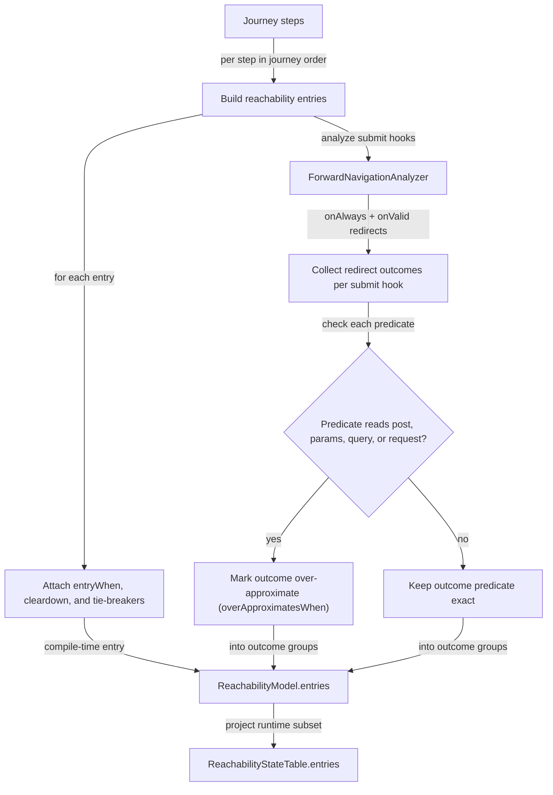

# Reachability Inputs

## Scope

This document covers `packages/forge-core/src/engine/concerns/reachability/analysis`.

This code builds navigation and reachability facts for a journey.
It decides which steps appear in navigation, which predicates guard those steps, and which submit outcomes can move the user forward.

This document does not cover runtime navigation evaluation or generated navigation code.

## Inputs Built

`ReachabilityAnalyzer.analyzeJourney()` returns a `ReachabilityModel`.
It contains:
- `stateTable`, the smaller runtime reachability table.
- `entries`, the richer compile-time reachability entries.
- `resumeAlways` and `resumeWhen`, which describe resume behavior.

Each reachability entry can include:
- `entryWhen`, for step entry predicates.
- `forwardOutcomeGroups`, one group per submit hook with redirect outcomes.
- `cleardownFieldCodes`, copied from the step.
- `reachabilityTieBreakers`, copied from step reachability config.

`ForwardNavigationAnalyzer` extracts redirect outcomes from submit hooks.
`RequestTimeReferenceAnalyzer` detects references that cannot be evaluated during compile-time navigation.

## Flow

## Rules

- Preserve step order.
  Navigation uses the authored order of the steps grouped under the journey.
- Keep one `ForwardOutcomeGroup` per submit hook.
  Submit hook cascade semantics apply within a hook, not across all hooks at once.
- Treat `post`, `params`, `query`, and `request` as request-time namespaces.
  Predicates that read them make forward navigation `over-approximate`.
- Include `onValid` redirects only when the submit hook validates.
  Non-validating hooks cannot reach an `onValid` branch.
- Do not inherit `unreachableRedirect`.
  The current journey gets its own value or defaults to `entry`.
- Do inherit `disableReachabilityChecks` unless the current journey overrides it.

## Editing Notes

- To change resume behavior, entry predicates, tie-breakers, cleardown fields, or reachability-disabled inheritance, start in `ReachabilityAnalyzer`.
- To change which submit outcomes count as forward navigation, start in `ForwardNavigationAnalyzer`.
- To change request-time namespaces, update `RequestTimeReferenceAnalyzer.REQUEST_TIME_NAMESPACES`.
- Keep `ReachabilityStateTable.entries` smaller than `ReachabilityModel.entries`.
  Runtime navigation does not need all compiler-only metadata.

## Entry Points

- [ReachabilityAnalyzer.ts](ReachabilityAnalyzer.ts) builds the navigation and reachability plans.
- [ForwardNavigationAnalyzer.ts](ForwardNavigationAnalyzer.ts) extracts redirect outcomes from submit hooks.
- [RequestTimeReferenceAnalyzer.ts](RequestTimeReferenceAnalyzer.ts) detects request-time references.
