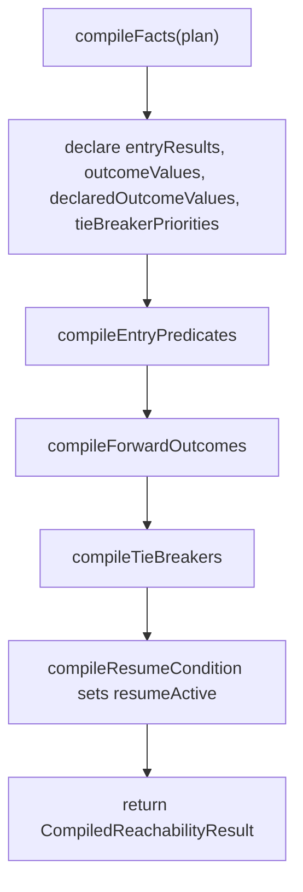
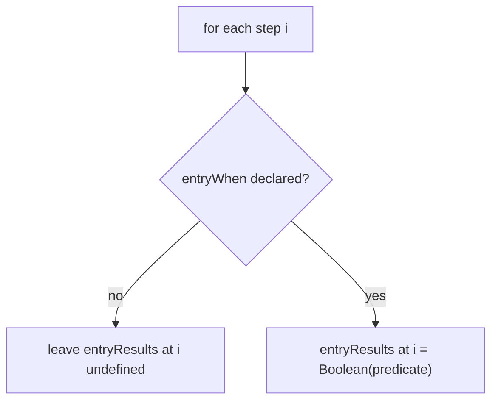
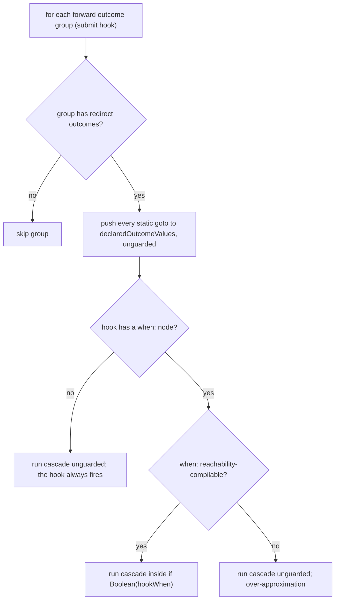
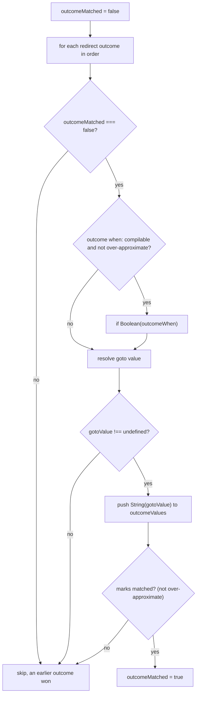
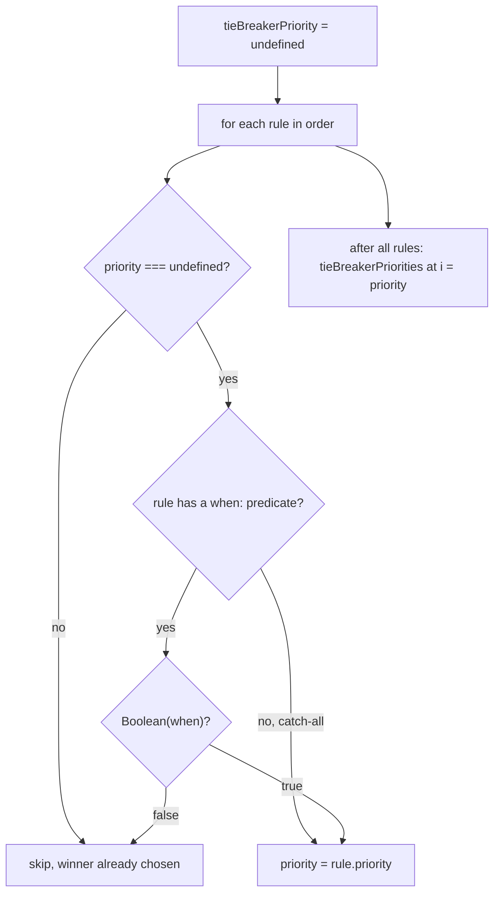
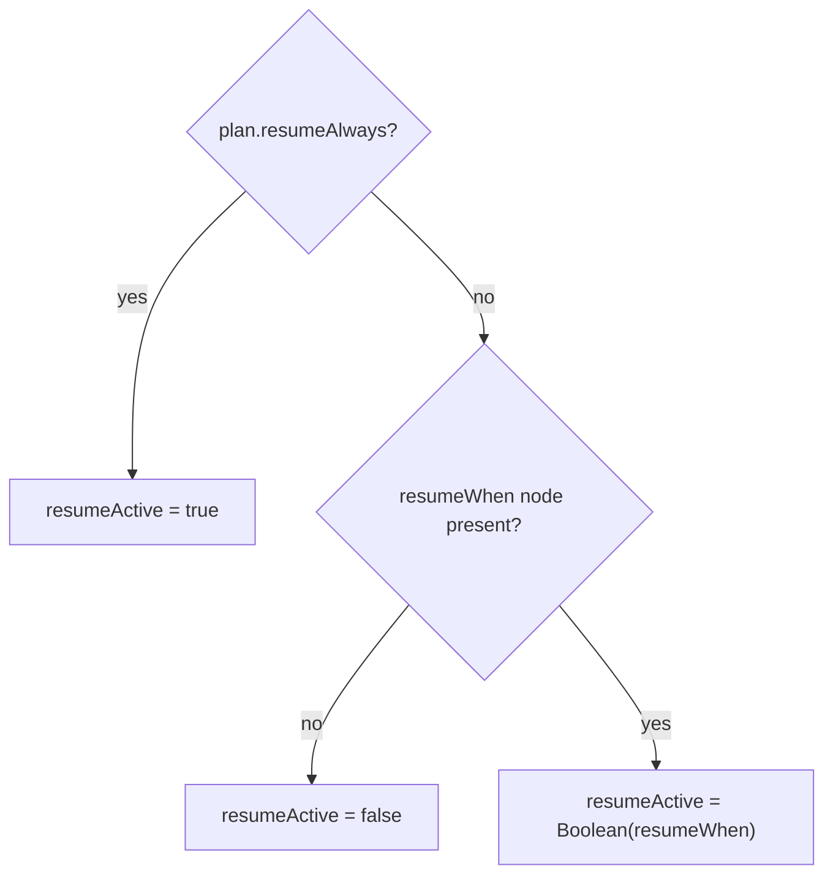

# Reachability Compiler

## Scope

This document covers `packages/forge-core/src/engine/concerns/reachability/lowering`.

This code compiles the dynamic half of reachability: the facts function.
It emits a function that evaluates a journey's authored reachability expressions — entry predicates, forward outcomes, tie-breakers, and the resume condition — into a `CompiledReachabilityResult`.

This document does not cover the static graph walk.
The reachability state function that turns these facts into reachable step state is assembled in `CodegenOrchestrator` over `evaluateReachabilityState` (in [graph](graph)), not here.
It also does not cover runtime redirect handling, or the per-step field inventory, which is [answer-cleardown](../../answer-cleardown/README.md)'s own compiled artifact.

## Inputs

`ReachabilityCompiler.compileFacts()` receives a `ReachabilityModel`, whose `entries` are the journey's steps in declaration order.
Analysis provides it.

## Work Returned

`compileFacts()` returns a `CompiledReachabilityFactsFunction`.
That function returns a `CompiledReachabilityResult`, not a `WorkTask`:
- `entryResults`, per-step entry predicate result, or `undefined` where a step declares no `entryWhen`.
- `outcomeValues`, per-step forward goto paths after the cascade narrows them by guard.
- `declaredOutcomeValues`, every authored static goto per step, unguarded, for the devtools graph.
- `tieBreakerPriorities`, per-step resolved priority, or `undefined`.
- `resumeActive`, the journey-level resume result.

Every per-step array is indexed by `plan.entries` order.
The compiled state function consumes them later to walk the graph.

## Flow

The facts function emits one declaration block, then each algorithm in turn, then returns the result:

## Algorithms

Each subsection describes the runtime control flow the generated code performs, not the compile-time emit loop.

### Entry predicates

A step can declare an `entryWhen` predicate that makes it an extra entry point when the predicate holds.
A step with no predicate leaves its slot `undefined`, and the graph walk treats it by its static entry status.

### Forward outcomes

Forward outcomes are redirect outcomes grouped by their owning submit hook.
Each group produces two things: every authored static goto is recorded in `declaredOutcomeValues` unconditionally, because the devtools graph needs the declared shape, and a cascade — guarded by the hook's `when:` when that is reachability-compilable — collects the live candidates into `outcomeValues`.

Within a group the outcomes cascade.
The first outcome that resolves a defined goto wins and closes the cascade.
An over-approximated outcome — one whose guard cannot be evaluated at compile time — contributes its path but does not close the cascade, so later outcomes still contribute.

### Tie-breakers

Tie-breakers resolve a single priority per step from an ordered rule list.
The first rule that matches, or a catch-all rule with no predicate, sets the priority; a `priority === undefined` guard stops later rules from overriding the winner.

### Resume condition

Resume is a single journey-level flag.
An always-resume plan emits `true`; a plan with a resume predicate emits its boolean; everything else emits `false`.

## Rules

- Per-step result arrays are indexed by `plan.entries` order.
  Keep entry order stable; the state function relies on the alignment.
- Forward outcome groups preserve submit-hook grouping.
  The cascade `outcomeMatched` flag resets per group.
- Over-approximated outcomes stay possible when their guards cannot be evaluated exactly.
  They push a candidate without closing the cascade.
- `declaredOutcomeValues` is unguarded and records authored static gotos only.
  The devtools graph needs the declared shape even when a guard would suppress it at runtime.

## Editing Notes

- To change the result shape, start in `compileReachabilityResult()` and `buildReachabilityResultExpression()`.
- To change forward outcome evaluation, start in `compileForwardOutcomes()`, `compileForwardOutcomeGroup()`, and `compileForwardOutcomeCascade()`.
- To change the facts function body or ordering, start in `buildFactsSource()`.
- To change field inventory behavior, start in `StepFieldInventoryCompiler` in [answer-cleardown](../../answer-cleardown/README.md).
- To change how facts become reachable state, edit [graph](graph), not this file.
- To inspect generated source, use `generateFactsSource()` in the tests.

## Entry Points

- [ReachabilityCompiler.ts](ReachabilityCompiler.ts) emits the reachability facts function source and compiles it.
- [graph/evaluateReachabilityState.ts](graph/evaluateReachabilityState.ts) walks the graph and projects reachable step state from the facts and the field inventory the runtime phase supplies.
