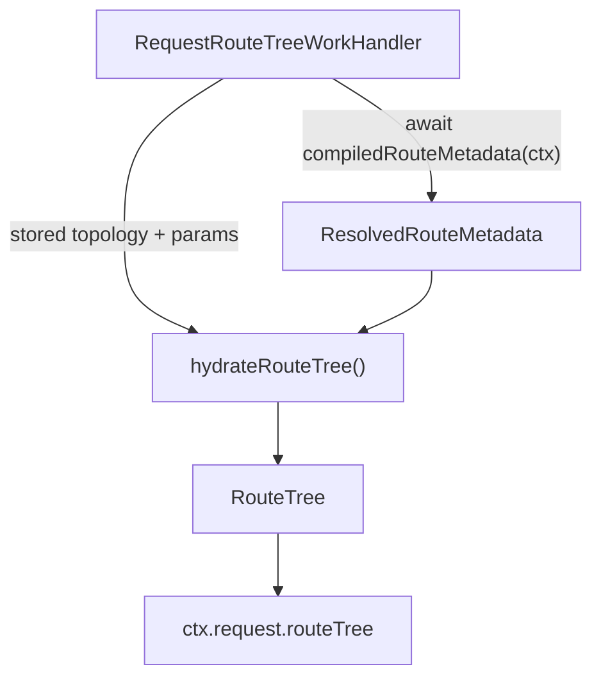

# Route Tree Phase

## Scope

This document covers `packages/forge-core/src/engine/runtime/evaluation/phases/route-tree`.

This code hydrates the statically built route topology into per-request render route-tree data.
It resolves `:param` placeholders, marks the active branch, and merges the resolved route metadata onto each node.

This document does not cover the package-level route-metadata compiler, mount-time route-tree construction, or render context assembly.

## Background

Route topology (segments, template paths, parent/child, node IDs) is built once at mount by `RouteTreeBuilder`.
Title, description, and metadata are authored as expressions, so they cannot live on that static tree.

The route-tree phase runs just before resolve on step requests.
Its request handler ([../../request/RequestRouteTreeWorkHandler.ts](../../request/RequestRouteTreeWorkHandler.ts)) evaluates the
package-level `compiledRouteMetadata` function once, then calls `hydrateRouteTree` to merge the resolved metadata onto the
stored topology by node ID. It publishes the result on `ctx.request.routeTree`, which the resolve phase reads when assembling
`RenderContext`.

## Responsibilities

- Resolve `:param` placeholders in stored template paths.
- Mark the active branch for the current step.
- Merge resolved `title`/`description`/`metadata` onto each node by node ID.
- Leave route metadata for nodes absent from the resolved map as `undefined`.

## Data Model

`hydrateRouteTree(routeTree, currentStepPath, params, routeMetadata)` takes:
- `routeTree`, the `StoredRouteTree` (topology only) from the mounted node.
- `currentStepPath`, the current step's template path, used for active state.
- `params`, the request params used to resolve `:param` placeholders.
- `routeMetadata`, the `ResolvedRouteMetadata` produced by the route-tree phase handler.

It returns a `RouteTree` of `RouteTreeNode`s, each carrying resolved `path`, `active`, `metadata`, and an optional
`route` with `title`/`description`/`metadata` looked up from `routeMetadata` by node ID.

## Flow

## Boundaries

- This folder owns turning a stored route tree into render route-tree data.
  It should not evaluate authored expressions — the compiled route-metadata function does that in the handler.
- The route-tree request handler owns metadata evaluation and stashing.
  Resolve owns reading `ctx.request.routeTree` into `RenderContext`.

## Editing Notes

- To change how metadata merges onto nodes, start in `hydrateRouteTree.ts`.
- To change when metadata is evaluated or where it is stashed, start in `../../request/RequestRouteTreeWorkHandler.ts`.

## Entry Points

- [hydrateRouteTree.ts](hydrateRouteTree.ts) answers how a stored route tree plus resolved metadata becomes a render route tree.
