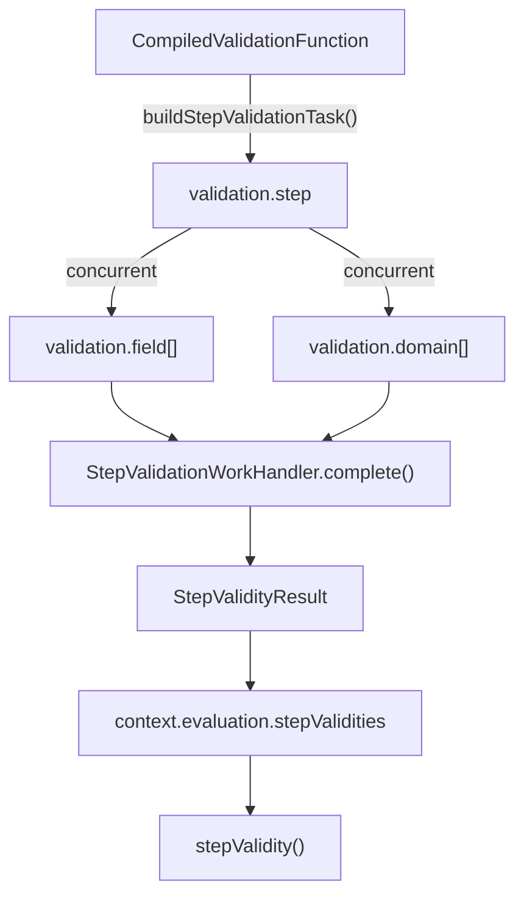

# Validation Phase

## Scope

This document covers `packages/forge-core/src/engine/runtime/evaluation/phases/validation`.

This code runs compiled step validation tasks and stores or projects their results.
It separates field failures from domain failures and applies validation group filters when readers ask for a view.

This document does not cover semantic validation, generated validation source, submit hook ordering, or request phase ordering.

## Background

Validation records the full failure set for a step, then projects it for each reader.

Compiled validation decides which field and domain validation tasks exist.
The runtime validation phase decides how to execute those tasks and how to fold their outputs.
Reachability asks for non-submission default-group validity.
Submit hooks ask for submission-mode validity with their configured groups.
Entry validation asks which groups should show on initial render.

The stored result is broader than any one view.
That matters because the same step validity can be read by navigation, submit branches, and render.
Filtering too early would throw away failures that another reader still needs.

## Responsibilities

- Run field validation tasks concurrently.
- Run domain validation tasks concurrently.
- Fold child failures into `StepValidityResult`.
- Store step validity results by `NodeId`.
- Project stored failures through `stepValidity()`.
- Build step validation tasks from compiled validation functions.
- Keep field failure `blockId` available for resolve.

## Data Model

`StepValidationWorkProps` contains:
- `fields`, the `FieldValidationWorkTask` list.
- `domains`, the `DomainValidationWorkTask` list.

`FieldValidationWorkProps` contains:
- `blockId`, the render block identity used later by resolve.
- `blockCode`, the field answer code, kept as metadata.
- `run()`, the compiled function that returns `StepValidationFailure[]`.

`DomainValidationWorkProps` contains `run()`, the compiled function that returns `DomainValidationFailure[]`.

`StepValidityResult` stores:
- `fieldFailures`.
- `domainFailures`.

`ValidationView` is a filtered read model with:
- `isValid`.
- filtered `fieldFailures`.
- filtered `domainFailures`.

`context.evaluation.stepValidities` stores full `StepValidityResult` values keyed by step `NodeId`.

### Example

A stored result can contain submission-only and grouped failures:

```ts
{
  fieldFailures: [
    { blockId: 'compile_ast:1', blockCode: 'name', message: 'Required', submissionOnly: true, groups: ['default'], passed: false },
  ],
  domainFailures: [],
}
```

Reachability reads it in non-submission mode:

```ts
stepValidity(stored, { isSubmission: false, groups: ['default'] })
// => { isValid: true, fieldFailures: [], domainFailures: [] }
```

Submit reads it in submission mode:

```ts
stepValidity(stored, { isSubmission: true, groups: ['default'] })
// => { isValid: false, fieldFailures: [...], domainFailures: [] }
```

## Flow



- [StepValidationWorkHandler.ts](StepValidationWorkHandler.ts) runs field and domain validation children and folds failures.
- [FieldValidationWorkHandler.ts](FieldValidationWorkHandler.ts) calls one compiled field validation `run()`.
- [DomainValidationWorkHandler.ts](DomainValidationWorkHandler.ts) calls one compiled domain validation `run()`.
- [stepValidationStore.ts](stepValidationStore.ts) builds and re-keys validation tasks and re-exports validation state helpers.
- [stepValidityState.ts](stepValidityState.ts) reads and writes stored `StepValidityResult` values.
- [stepValidity.ts](stepValidity.ts) filters stored failures into a `ValidationView`.

## Boundaries

- Work handlers own task execution and output folding.
  They should not decide request visibility.
- `stepValidity()` owns group and submission filtering.
  Callers should not duplicate that filtering.
- `stepValidationStore.ts` owns the bridge from compiled validation function to `validation.step` task.
  Request code should use `buildStepValidation()`.
- Resolve owns attaching failures to rendered fields.
  Validation must keep `blockId`, but it should not mutate render props.

## Quirks

- Field and domain validations both run concurrently.
  The folded failure arrays still follow child order, because `WorkExecutor` preserves the group order when it returns completed child work.
- Group filtering happens at read time.
  Generated validation stores every failure with its groups intact.
- Missing stored validity means valid.
  A step with no validation task should not block reachability.
- Submit validation overwrites the current step's stored result.
  That lets submit branches and render read the submission-mode result.

## Constraints

- Preserve `blockId` on `StepValidationFailure`.
  Resolve uses it to match failures to rendered fields by block identity.
- Do not filter failures before storing `StepValidityResult`.
  Other readers may need different groups or submission mode.
- Keep `validationTaskKey(stepId)` stable.
  Eager validities maps completed child work back to step IDs through that key.
- Keep `isStepValidationWorkTask()` strict.
  It prevents unrelated work tasks from being recorded as validation.

## Editing Notes

- To change validation execution order, start in `StepValidationWorkHandler`.
  Preserve folded failure order unless the caller explicitly wants a different display order.
- To change group filtering, start in `stepValidity.ts`.
- To change validation storage, start in `stepValidityState.ts`.
- To change how compiled validation is wrapped for runtime, start in `stepValidationStore.ts`.
- To change generated validation failures, edit the lowering validation compiler instead.

## Entry Points

- [StepValidationWorkHandler.ts](StepValidationWorkHandler.ts) answers how validation child tasks run.
- [FieldValidationWorkHandler.ts](FieldValidationWorkHandler.ts) answers how one field validation runs.
- [DomainValidationWorkHandler.ts](DomainValidationWorkHandler.ts) answers how one domain validation runs.
- [stepValidationStore.ts](stepValidationStore.ts) answers how compiled validation is converted to runtime work.
- [stepValidity.ts](stepValidity.ts) answers how stored failures become a filtered validation view.
- [stepValidityState.ts](stepValidityState.ts) answers how step validity is stored on `RuntimeContext`.
