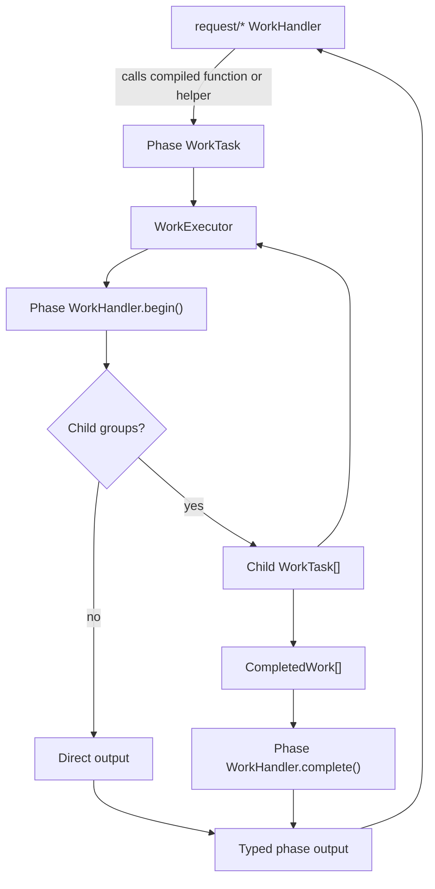

# Runtime Phases

## Scope

This document covers `packages/forge-core/src/engine/runtime/evaluation/phases`.

This code contains the runtime work handlers and helper functions that do phase-specific request work.
It validates answers, prepares answers, evaluates hooks, decides reachability redirects, hydrates the route tree, resolves render blocks, renders blocks, and clears stale answers.

This document does not cover request phase ordering, work executor mechanics, compiled source generation, or framework adapter routing.

## Background

Runtime phases are the executable pieces behind the request pipeline.

The request layer decides which phase runs next.
The work layer knows how to run a tree of `WorkTask`s.
The phase layer sits between them.
It gives each domain step a concrete work shape that the executor can run.

For example, compiled validation, resolve, hooks, and render all return or receive `WorkTask`s.
The phase handlers decide how those tasks fan out and how child outputs fold back into domain results.

The raw compiled function output is not enough because runtime still needs ordering, child fan-out, trace metadata, output folding, and mutation boundaries.
Those decisions live here.

These are runtime phases, not compiler phases.
They consume compiled functions and runtime data. They must not build AST, plans, or generated source.

## Responsibilities

- Execute answer-preparation work and collect field mutation summaries.
- Execute validation work and fold field and domain failures.
- Execute access and submit hook lifecycles.
- Run submit validation as a hook stage.
- Decide reachability redirects and backlinks from the stored reachability evaluation.
- Hydrate the route tree from resolved route metadata.
- Resolve compiled block tasks into branded `RenderBlock` values.
- Render visible blocks and assemble page output.
- Clear answers for unreachable stale steps.
- Record phase-specific trace metadata.
- Keep phase internals behind `WorkHandler` contracts.

## Data Model

Every executable phase unit is a `WorkHandler<K, TProps>`.
Each handler declares:
- a literal `kind`.
- a `begin(ctx)` method that returns either output or child groups.
- an optional `complete(ctx, children)` method that folds child output.
- optional `WorkInstrumentation` exported beside the handler.

`WorkOutputByKind` in [../../../contracts/runtime/workOutput.type.ts](../../../contracts/runtime/workOutput.type.ts) is the output registry.
Each handler kind in this directory has one matching output type there.
Typed helpers such as `childOutputs()` and `singleChildOutput()` depend on that map.

The main work families are:
- `answer.preparation` and `answer.preparation.field`.
- `validation.step`, `validation.field`, and `validation.domain`.
- `access.lifecycle`, `access.hook`, `access.hook.when`, `access.hook.next`, and `hook.effect`.
- `submit.lifecycle`, `submit.hook`, `submit.predicate`, `submit.branch`, `submit.validation`, and `hook.effect`.
- `resolve.blocks` and `resolve.block`.
- `render.render-blocks`, `render.render-blocks.block`, and `render.assemble-page`.

`RequestExecutionContext` is the shared request object available to every handler.
Handlers use it for:
- `context.domain.answers`.
- `context.evaluation.stepValidities`.
- `context.evaluation.reachability`.
- `context.evaluation.fieldsToClear`.
- `currentStepId`.
- `buildStepValidation()` and `recordStepValidation()`.
- `renderedBlocks`.

Some folders are full work-handler families.
`answer-cleardown`, `reachability`, and `route-tree` are the exceptions: they are helper folders called by their request-level handlers.

### Example

Compiled functions return work descriptions, not final domain output:

```ts
ctx.workTasks.stepValidation(fields, domains)
ctx.workTasks.resolveBlocks(blocks, step, ancestors)
ctx.workTasks.submitLifecycle(hooks)
```

Phase handlers turn those descriptions into child groups:

```ts
[
  { mode: 'concurrent', children },
  { mode: 'sequential', children },
  { mode: 'first-match', children, matches },
]
```

Then they fold completed children into typed outputs:

```ts
{
  kind: 'phase-specific result',
}
```

The important transform is from generated work description to runtime domain result.
The compiler chooses what work exists.
The phase handler chooses how that work runs and how child output is folded.

## Flow

Request handlers call compiled functions or create phase tasks.
Those tasks enter this directory's work handlers.
The handlers may produce child groups, then fold completed child work into typed outputs.



- [answer-preparation](answer-preparation) owns answer mutation work.
  See its README for field mutation ordering and trace rules.
- [validation](validation) owns field and domain validation work.
  See its README for group filtering, `StepValidityResult`, and `blockId` rules.
- [hooks](hooks) owns access and submit lifecycle work.
  See its README for lifecycle stage order and first-match behavior.
- [reachability](reachability) owns the redirect decision after reachability evaluation.
  See its README for redirect resolution, backlinks, and target URLs.
- [answer-cleardown](answer-cleardown) owns stale-answer clearing.
  See its README for unreachable-step clearing and `cleardown` mutations.
- [route-tree](route-tree) owns hydrating the route tree from resolved route metadata.
  See its README for param resolution, active state, and metadata merge.
- [resolve](resolve) owns conversion from compiled block work to `RenderBlock`.
  See its README for nested work replacement and render block branding.
- [render](render) owns renderer-facing work.
  See its README for block rendering, nested render blocks, and page assembly.

## Boundaries

- Request handlers own phase ordering.
  Phase handlers must not decide whether a step request is `GET`, `POST`, journey, or step.
- Work primitives own execution mechanics.
  Phase handlers should describe child groups and fold outputs, not run child tasks manually.
- Compiled functions own generated expressions and authored DSL evaluation.
  Phase handlers should call `props.run()` or consume compiled results, not inspect AST or DSL.
- `WorkTaskFactory` owns task construction for known handlers.
  Phase code should not hand-build branded tasks.
- Phase handlers own domain output folding.
  Request handlers should not know how to fold field failures, rendered blocks, or hook branches.
- Trace instrumentation beside a handler owns small metadata for that handler.
  It should not mutate request state.

## Quirks

- Many handlers return child groups from `begin()` and do the real domain fold in `complete()`.
  This keeps execution policy in the work executor and domain folding in the handler.
- Handler instrumentation is colocated with the handler.
  Trace fields should describe the runtime work, not duplicate large request state.
- `answer-cleardown`, `reachability`, and `route-tree` are helper-only phase folders.
  They still live here because they own phase-specific runtime behavior.

## Constraints

- Keep handler `kind` values aligned with `WorkOutputByKind`.
  Typed child-output helpers and work output checks depend on the literal kind.
- Keep task creation in `WorkTaskFactory`.
  Hand-built tasks can miss handlers, instrumentation, or stable keys.
- Do not run compiler code from phase handlers.
  Runtime phases consume compiled functions and runtime plans only.
- Keep phase-specific ordering rules in the child folder that owns them.
  Duplicating those rules in request handlers makes the phase boundary unclear.

## Editing Notes

- To add a new work handler, add its output to `WorkOutputByKind`, then add a `WorkTaskFactory` method and colocated tests.
- To change a phase family, start in that folder's README and entry-point files.
- To change request order, use `runtime/evaluation/request`, not this folder.
- To add trace fields, update the handler's `WorkInstrumentation`.
  Keep trace metadata small and serializable.

## Entry Points

- [answer-preparation/README.md](answer-preparation/README.md) explains answer preparation work.
- [validation/README.md](validation/README.md) explains validation work and stored validity projection.
- [hooks/README.md](hooks/README.md) explains access and submit hook lifecycles.
- [reachability/README.md](reachability/README.md) explains reachability redirect decisions and target resolution.
- [answer-cleardown/README.md](answer-cleardown/README.md) explains stale answer clearing.
- [route-tree/README.md](route-tree/README.md) explains route tree hydration from resolved metadata.
- [resolve/README.md](resolve/README.md) explains resolve-block work and render block creation.
- [render/README.md](render/README.md) explains renderer-facing work.
- [../../../contracts/runtime/workOutput.type.ts](../../../contracts/runtime/workOutput.type.ts) maps work kinds to output types.
