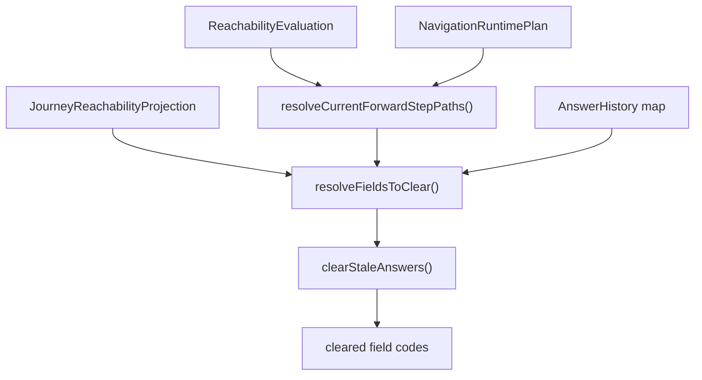

# Answer Cleardown Phase

## Scope

This document covers `packages/forge-core/src/engine/runtime/evaluation/phases/answer-cleardown`.

This code clears answers that belong to steps no active path can reach.
It adds `cleardown` mutations to answer history and returns the field codes cleared in this request.

This document does not cover reachability graph construction, request phase ordering, or answer preparation.

## Background

Answer cleardown keeps stale answers out of later runtime decisions.

Reachability can make previous answers invalid by changing which steps are reachable.
If a user changes an earlier answer, fields on now-unreachable steps should stop contributing to validation, hooks, and render logic.
The runtime cannot just leave those answers in place.

It also cannot delete all forward-looking answers blindly.
Some steps may be ahead of the current step but still belong to progress the user can return to.
This is why cleardown uses both the full reachability projection and the current step's forward edges.

## Responsibilities

- Resolve field codes that belong to unreachable steps.
- Match `cleardownFieldCodes` patterns against existing answer keys.
- Retain the current step's reachable forward paths.
- Clear stale answers in place.
- Push `cleardown` mutations onto answer history.
- Return the field codes cleared.

## Data Model

`evaluateAnswerCleardown()` receives:
- `reachability`, a `JourneyReachabilityProjection` from reachability projection.
- `answers`, the live `Record<string, AnswerHistory>`.
- `evaluation`, the current `ReachabilityEvaluation`.
- `navigationPlan`, used to find the current step's forward edges.
- `params`, used to resolve route-template paths.

`AnswerHistory` is mutated in place:
- `current` becomes `undefined`.
- `parsed` becomes `undefined`.
- `mutations` receives `{ value: undefined, source: 'cleardown' }`.

`JourneyReachabilityProjection.unreachableSteps` provides:
- concrete step paths.
- declared field codes.
- optional `cleardownFieldCodes` patterns.

### Example

If reachability reports an unreachable step with field code `petName`:

```ts
answers.petName = {
  current: 'Mabel',
  parsed: 'Mabel',
  mutations: [{ value: 'Mabel', source: 'post' }],
}
```

Cleardown mutates the history:

```ts
answers.petName = {
  current: undefined,
  parsed: undefined,
  mutations: [
    { value: 'Mabel', source: 'post' },
    { value: undefined, source: 'cleardown' },
  ],
}
```

## Flow



- [evaluateAnswerCleardown.ts](evaluateAnswerCleardown.ts) owns the whole cleardown algorithm.
  It resolves retained paths, resolves fields to clear, mutates answers, and returns the cleared field codes.

## Boundaries

- Reachability owns deciding which steps are unreachable.
  Cleardown should consume that projection, not rebuild it.
- Cleardown owns answer mutation for stale fields.
  Reachability should not mutate answers.
- Request handlers own when cleardown runs.
  This helper assumes reachability has already finished.
- Answer preparation owns post and parser mutations.
  Cleardown should only add `cleardown` mutations.

## Quirks

- Cleardown mutates answer history instead of deleting keys.
  Later trace and runtime code can still see that the answer existed and was cleared.
- Already-cleared answers are skipped.
  A request should not stack duplicate cleardown mutations.
- Steps on the current step's forward edges are retained.
  Current-step-relative reachability can mark future steps unreachable, but their answers may still be valid progress.
- Pattern matching only checks existing answer keys.
  Cleardown never invents field codes that are not in the answer store.

## Constraints

- Run cleardown after reachability.
  It needs both `JourneyReachabilityProjection` and `ReachabilityEvaluation`.
- Do not clear retained forward paths.
  Users would lose progress they can still return to.
- Do not delete `AnswerHistory` entries.
  That would erase mutation history and make traces less useful.
- Keep `source: 'cleardown'`.
  Other code can distinguish runtime clearing from post and processed mutations.

## Editing Notes

- To change which paths are retained, start in `resolveCurrentForwardStepPaths()`.
- To change which fields are cleared, start in `resolveFieldsToClear()`.
- To change answer mutation shape, start in `clearStaleAnswers()`.
- To change when cleardown runs, edit `RequestAnswerCleardownWorkHandler`, not this helper.

## Entry Points

- [evaluateAnswerCleardown.ts](evaluateAnswerCleardown.ts) answers which stale answers are cleared and how they are mutated.
- [evaluateAnswerCleardown.test.ts](evaluateAnswerCleardown.test.ts) shows retained paths, pattern matching, and duplicate-cleardown behavior.
