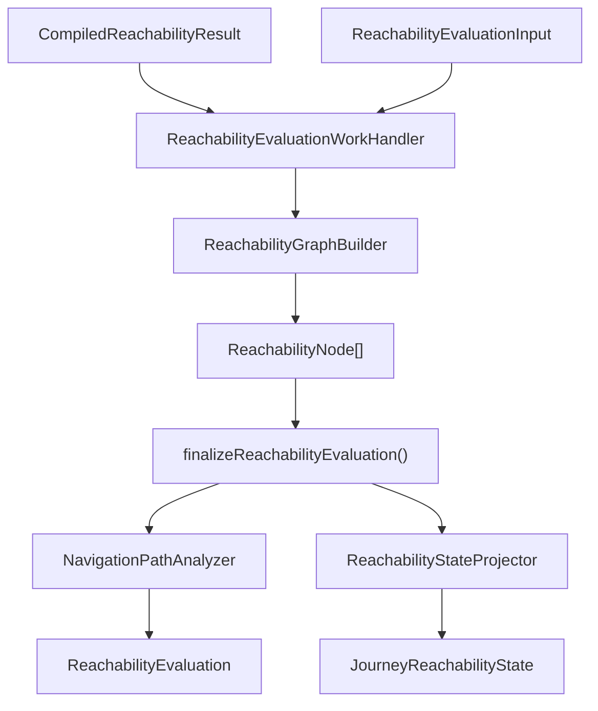

# Reachability Phase

## Scope

This document covers `packages/forge-core/src/engine/runtime/evaluation/phases/reachability`.

This code evaluates runtime navigation reachability from compiled navigation output.
It builds reachable step state, resolves redirect targets, projects unreachable field inventory, and handles resume behavior.

This document does not cover dependency-analysis reachability, route tree building, or request phase ordering.

## Background

Reachability decides which steps are currently available.

Compilation has already produced `NavigationRuntimePlan` and `CompiledReachabilityResult`.
Runtime still needs to combine that compiled output with current answers, request params, and step validities.
For example, an invalid step should block forward reachability in navigation mode.
A resume-enabled journey may redirect to the frontier.
A journey request should redirect to its default reachable step.

The compiled result is not enough by itself.
It contains evaluated predicates and outcomes, but runtime must walk the graph, apply validation gates, resolve route-template paths, and project unreachable steps for answer cleardown.

## Responsibilities

- Build reachable step nodes from `NavigationRuntimePlan.entries`.
- Seed static and conditional entry points.
- Walk forward navigation edges.
- Gate propagation through navigation-mode step validity.
- Resolve route-template target paths.
- Pick default entry and tie-breaker winners.
- Compute resume outcome and frontier path.
- Project `JourneyReachabilityState` for answer cleardown.
- Resolve redirect targets for journey and step requests.

## Data Model

`ReachabilityEvaluationWorkProps` contains:
- `input`, the reachability input built by `RequestReachabilityWorkHandler`.
- `compiledResult`, the `CompiledReachabilityResult` from generated navigation.

`ReachabilityEvaluationInput` contains:
- `plan`, the `NavigationRuntimePlan`.
- `currentStepId`, present for step requests.
- `routeTemplateCatalog`.
- `params`, present when projection can resolve concrete paths.
- `fieldInventory`, present when reachability projection can include field codes.
- `stepValidities`, filled by the eager validities request phase.

`ReachabilityNode` is the per-step runtime state.
It records route template path, declaration index, entry status, reachability, validity, forward paths, declared forward paths, and predecessor paths.

`ReachabilityEvaluation` is the request-facing result.
It contains reachable steps, default entry path, frontier path, canonical path, progress state, resume state, and unreachable redirect configuration.

`JourneyReachabilityState` is the projected state used by answer cleardown.
It records unreachable steps and their field inventories after params are resolved.

### Example

A compiled navigation result can say:

```ts
{
  entryResults: [undefined, true],
  outcomeValues: [['/b'], ['/c'], []],
  declaredOutcomeValues: [['/b'], ['/c'], []],
  tieBreakerPriorities: [undefined, undefined, undefined],
  resumeActive: true,
}
```

Runtime combines that with step validities:

```ts
stepValidities.get(stepA) // invalid
```

The graph can mark step A reachable but not propagate through it.
The compiled outcome said there was a forward path.
Runtime validity decides whether that path is usable now.

## Flow



- [ReachabilityEvaluationWorkHandler.ts](ReachabilityEvaluationWorkHandler.ts) builds the graph and finalizes the result.
- [ReachabilityGraphBuilder.ts](ReachabilityGraphBuilder.ts) creates step states, seeds entries, walks forward edges, and applies validity gates.
- [evaluateGeneratedNavigation.ts](evaluateGeneratedNavigation.ts) finalizes the evaluation, resume outcome, and optional projection.
- [NavigationPathAnalyzer.ts](NavigationPathAnalyzer.ts) derives canonical path, frontier, and progress state.
- [ReachabilityStateProjector.ts](ReachabilityStateProjector.ts) projects unreachable steps and field inventory for cleardown.
- [navigationRedirects.ts](navigationRedirects.ts) decides whether the request should redirect.
- [redirectTarget.ts](redirectTarget.ts) resolves redirect targets against the current request location.
- [routeTemplateTargetResolver.ts](routeTemplateTargetResolver.ts) resolves authored navigation targets to route-template paths.

## Boundaries

- Compiled navigation owns evaluating predicates and outcome expressions.
  Runtime reachability should not re-evaluate authored expressions.
- `ReachabilityGraphBuilder` owns graph walk state.
  Redirect helpers should not mutate graph nodes.
- `NavigationPathAnalyzer` owns path analysis.
  The graph builder should not decide resume outcome.
- `ReachabilityStateProjector` owns cleardown projection.
  Answer cleardown should not rebuild reachability.
- Request handlers own whether a redirect stops the pipeline.
  Reachability helpers only compute targets and evaluations.

## Quirks

- Missing step validity means valid.
  Steps without compiled validation should not block navigation.
- Reachability-disabled plans mark every step reachable.
  They still populate declared forward paths and tie-breaker priority.
- Current-step-relative reachability can make forward steps appear unreachable.
  Answer cleardown compensates by retaining the current step's forward paths.
- Resume can be active but still no-op.
  It redirects only when progress exists and the current step is not already the frontier.
- Projection only happens when `fieldInventory` and `params` are present.
  Journey redirects do not need answer-cleardown projection.

## Constraints

- Keep eager validities before reachability in the request layer.
  The graph walk depends on `stepValidities`.
- Do not propagate reachability through invalid steps.
  Navigation would allow progress through failed validation.
- Preserve declared forward paths separately from reachable forward paths.
  Devtools and diagnostics need declared navigation even when runtime gates it.
- Do not run compiled navigation inside graph helpers.
  They must consume `CompiledReachabilityResult`.
- Keep route-template paths distinct from resolved paths.
  The navigation graph operates on route templates; render and redirects resolve params later.

## Editing Notes

- To change graph traversal, start in `ReachabilityGraphBuilder`.
- To change resume or frontier behavior, start in `evaluateGeneratedNavigation.ts` and `NavigationPathAnalyzer.ts`.
- To change unreachable projection for cleardown, start in `ReachabilityStateProjector`.
- To change redirect choice, start in `navigationRedirects.ts`.
- To change target path resolution, start in `routeTemplateTargetResolver.ts` or `redirectTarget.ts`.
- To change compiled navigation output shape, update lowering and contracts before changing this folder.

## Entry Points

- [ReachabilityEvaluationWorkHandler.ts](ReachabilityEvaluationWorkHandler.ts) answers how one reachability work task runs.
- [ReachabilityGraphBuilder.ts](ReachabilityGraphBuilder.ts) answers how reachable steps are built.
- [evaluateGeneratedNavigation.ts](evaluateGeneratedNavigation.ts) answers how graph output becomes `ReachabilityEvaluationResult`.
- [NavigationPathAnalyzer.ts](NavigationPathAnalyzer.ts) answers how canonical path, frontier, and progress are derived.
- [ReachabilityStateProjector.ts](ReachabilityStateProjector.ts) answers how unreachable field state is projected.
- [navigationRedirects.ts](navigationRedirects.ts) answers when reachability redirects.
- [routeTemplateTargetResolver.ts](routeTemplateTargetResolver.ts) answers how navigation targets become route-template paths.
- [redirectTarget.ts](redirectTarget.ts) answers how redirect targets become concrete URLs.
