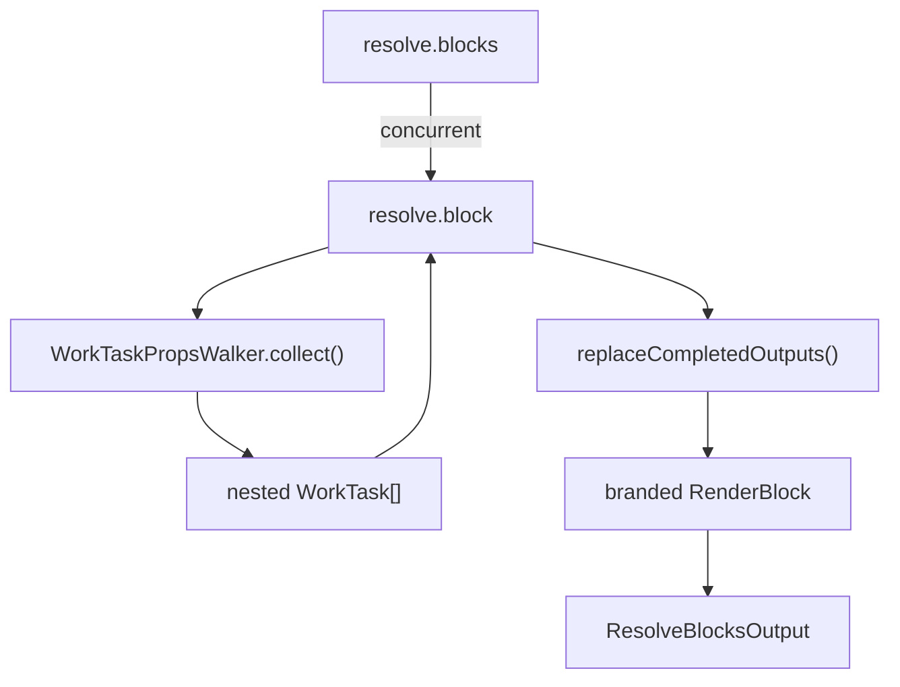

# Resolve Phase

## Scope

This document covers `packages/forge-core/src/engine/runtime/evaluation/phases/resolve`.

This code turns compiled resolve-block work into branded `RenderBlock` values.
It resolves nested work tasks inside block properties before the render phase sees them.

This document does not cover generated resolve source, component rendering, or request-level validation visibility.

## Background

Resolve prepares renderable data.

Compiled resolve functions return `resolve.blocks` work.
Each `resolve.block` carries an ID, variant, block type, and evaluated properties.
Some properties can contain nested `WorkTask`s, usually from nested blocks inside authored block props.
Resolve must run those nested tasks and replace them with completed outputs before a `RenderBlock` is returned.

The raw compiled block props are not enough.
Renderers need plain render blocks, not work tasks hidden inside property values.
The request resolve handler combines those block outputs with the route tree built by the route-tree phase to build `RenderContext`.

## Responsibilities

- Run `resolve.block` tasks under one `resolve.blocks` task.
- Replace nested `WorkTask`s inside block properties with completed outputs.
- Return branded `RenderBlock` values.
- Preserve block ID, variant, block type, and properties.
- Count visible blocks for trace metadata.

## Data Model

`ResolveBlocksWorkProps` contains:
- `blocks`, the child `ResolveBlockWorkTask` list.
- `step`, resolved step metadata.
- `ancestors`, resolved journey ancestor metadata.

`ResolveBlockWorkProps` contains:
- `id`, the render block ID.
- `variant`, the component variant.
- `blockType`, the authored block type.
- `properties`, evaluated block properties.

`RenderBlock` contains:
- the `RENDER_BLOCK_BRAND`.
- `id`.
- `variant`.
- `blockType`.
- `properties`.

`ResolveBlocksOutput` contains:
- `blocks`.
- `step`.
- `ancestors`.

### Example

A compiled block property can contain nested work:

```ts
{
  id: 'compile_ast:1',
  variant: 'details',
  properties: {
    summary: 'More information',
    content: ctx.workTasks.resolveBlock('compile_ast:2', 'html', 'BlockType.basic', { html: '<p>Hello</p>' }),
  },
}
```

`ResolveBlockWorkHandler` runs the nested task and replaces it:

```ts
{
  id: 'compile_ast:1',
  variant: 'details',
  properties: {
    summary: 'More information',
    content: RenderBlock,
  },
}
```

## Flow



- [ResolveBlocksWorkHandler.ts](ResolveBlocksWorkHandler.ts) runs block tasks concurrently and folds `RenderBlock` outputs.
- [ResolveBlockWorkHandler.ts](ResolveBlockWorkHandler.ts) collects nested work from properties, replaces completed output, and brands the block.
- [typeguards.ts](typeguards.ts) contains the `isRenderBlock` type guard, exported through the public and framework APIs.

## Boundaries

- Compiled resolve owns creating resolve work tasks.
  Runtime resolve should not re-evaluate authored expressions.
- `ResolveBlocksWorkHandler` owns folding block outputs with step and ancestor metadata.
  It should not inspect block properties.
- `ResolveBlockWorkHandler` owns nested property work replacement.
  It should not render components.
- `WorkTaskPropsWalker` owns traversal and replacement semantics.
  Resolve should use it rather than hand-walking props.
- Request resolve owns `RenderContext` assembly.
  This folder only returns resolve outputs.

## Quirks

- `resolve.blocks` runs block tasks concurrently.
  Block order is still preserved by completed child order.
- `resolve.block` can have no child groups.
  Plain property blocks return directly from `complete()`.
- Nested work tasks are matched by traversal position.
  Keys are checked, but duplicate-tolerant replacement belongs to `WorkTaskPropsWalker`.
- The returned block is branded.
  Render uses the brand to identify nested blocks inside arbitrary properties.
- Visibility is not filtering at resolve.
  Invisible blocks remain in the block list with `visibleWhen: false`.

## Constraints

- Keep `RenderBlock` branding.
  Render cannot safely distinguish nested render blocks from ordinary records without it.
- Keep property replacement before returning a block.
  Renderers should never receive unresolved work tasks inside block props.
- Keep block IDs unchanged.
  Validation and trace data rely on render block identity.
- Do not filter invisible blocks in resolve.
  Render owns whether invisible blocks produce output.

## Editing Notes

- To change block folding, start in `ResolveBlocksWorkHandler`.
- To change nested property replacement, start in `ResolveBlockWorkHandler`.
- To change traversal semantics, start in `WorkTaskPropsWalker`.
- To change route tree hydration, start in the route-tree phase (`../route-tree`).
- To change validation error attachment, start in request-level `RequestResolveWorkHandler`.

## Entry Points

- [ResolveBlocksWorkHandler.ts](ResolveBlocksWorkHandler.ts) answers how block tasks are collected into resolve output.
- [ResolveBlockWorkHandler.ts](ResolveBlockWorkHandler.ts) answers how one compiled block becomes `RenderBlock`.
- [typeguards.ts](typeguards.ts) answers how callers identify branded render blocks.
