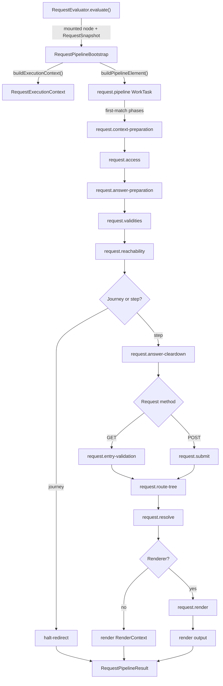

# Request Evaluation

## Scope

This document covers `packages/forge-core/src/engine/runtime/evaluation/request`.

This code turns one mounted route and one `RequestSnapshot` into a request work pipeline.
It orders runtime phases, threads `RequestExecutionContext`, handles redirects and render outcomes, and records phase trace snapshots.

This document does not cover phase internals, work execution mechanics, compiled source generation, routing lookup, or component rendering.

## Background

Request evaluation is the runtime bridge between a compiled Forge plan and one evaluation request.

Compilation has already produced mounted nodes with compiled functions.
That is still not enough to answer a request. Runtime needs to decide which phases run, in which order,
which phases can stop the request, and which pieces of state later phases can read.

For example, a step `POST` needs answer preparation before submit hooks, because submit validation reads the updated answer store.
Reachability needs eager step validities before it decides whether the current step is reachable.
Resolve needs validation failures before it can attach `validWhen` errors to rendered fields.
Render only runs when a renderer was supplied; otherwise resolve returns the `RenderContext` directly.

No compilation, tree walking etc happens at runtime. Request evaluation calls compiled functions and runtime work handlers.

## Responsibilities

- Build the ordered phase list for a journey or step request.
- Build the shared `RequestExecutionContext` for one request.
- Populate `RuntimeContext.request` from `RequestSnapshot`.
- Run request phases as a `request.pipeline` work task.
- Stop the pipeline on redirect, error, or render.
- Convert phase outputs into `RequestPipelineResult`.
- Store mutable request signals for later phases.
- Build compiled-function contexts for access, answer preparation, reachability, route metadata, validation, submit, and resolve.
- Project work traces into request trace phases.
- Preserve partial trace data when request work fails.

## Data Model

The request pipeline starts with `RequestPipelineConfig`.
It contains:
- `method`, the request method.
- `node`, the mounted journey or step from `MountRegistry`.
- `snapshot`, the request input from the framework adapter.
- `renderer`, optional render output support.

`RequestPipelineBootstrap` builds two things:
- a root `WorkTask` from `buildPipelineElement()`.
- a `RequestExecutionContext` from `buildExecutionContext()`.

`RequestExecutionContext` is the mutable request object threaded through every phase.
It contains:
- `context`, the `RuntimeContext` with request, domain, and evaluation state.
- `responseBindings`, used by hook effects.
- `functionRegistry`, used by compiled functions.
- `currentStepId`, present for step requests.
- `hasRenderer`, which decides whether resolve is terminal.
- `reachabilityEvaluation`, written by `request.reachability`.
- `validation` and `showValidationFailures`, written by submit or entry validation and read by resolve.
- `renderContext`, written by resolve when a renderer is present and read by render.
- `pipelineResult`, written by `request.pipeline` for `RequestEvaluator`.
- `buildStepValidation()` and `recordStepValidation()`, shared validation hooks used by validities and submit validation.

`PhaseWorkOutput` is the common output contract for request phases:
- `continue`, for phases that finish and let the next phase run.
- `halt-redirect`, for access, submit, reachability, and journey entry redirects.
- `halt-error`, for access and submit errors.
- `render`, for terminal render output.

`RequestPipelineResult` is the final pipeline result:
- `render`, carrying a `RenderContext` and optional renderer output.
- `redirect`, carrying the target path.
- `error`, carrying status and message.

The phase props live in `RequestPipelineWork.type.ts`.
Most phase props follow `PhaseWorkProps<TCompiled>`, which means they carry a compiled function and a path.
Reachability, validities, answer cleardown, route-tree, resolve, render, and context preparation have extra runtime inputs.

Special cases:
- Journey requests do not run submit, entry validation, answer cleardown, route-tree, resolve, or render.
  They run enough phases to resolve reachability and redirect to a step.
- Step `GET` and step `POST` share the early phases, then split.
  `GET` runs entry validation before terminal phases.
  `POST` runs submit hooks before terminal phases.
- Resolve can be terminal.
  If `hasRenderer` is false, `request.resolve` returns `render`.
  If `hasRenderer` is true, it stores `renderContext` and returns `continue`.

### Example

A step `POST` with a renderer becomes an ordered phase list:

```ts
[
  'request.context-preparation',
  'request.access',
  'request.answer-preparation',
  'request.validities',
  'request.reachability',
  'request.answer-cleardown',
  'request.submit',
  'request.route-tree',
  'request.resolve',
  'request.render',
]
```

If submit validation fails but does not redirect, the pipeline still reaches resolve:

```ts
request.submit
// writes:
ctx.request.showValidationFailures = true

request.resolve
// reads:
ctx.request.validation?.fieldFailures
ctx.request.showValidationFailures

// returns or stores:
RenderContext
```

The important transform is from mounted-node request input to one terminal outcome.
The request pipeline owns phase order and shared request signals.
Each phase owns its own domain result.

## Flow

`RequestEvaluator` creates a pipeline, executes it through `WorkExecutor`, and turns the `RequestPipelineResult` into a `ForgeOutcome`.



- [RequestPipelineBootstrap.ts](RequestPipelineBootstrap.ts) builds the root task and the execution context.
  It owns phase ordering for journey, step `GET`, and step `POST`.
- [RequestPipelineWorkHandler.ts](RequestPipelineWorkHandler.ts) runs phases as one `first-match` work group.
  It stops on the first `PhaseWorkOutput` whose `action` is not `continue`.
- [RequestContextPreparationWorkHandler.ts](RequestContextPreparationWorkHandler.ts) copies `RequestSnapshot` into `RuntimeContext.request` and merges static data.
- [RequestAccessWorkHandler.ts](RequestAccessWorkHandler.ts) runs the compiled access lifecycle and maps its result to continue, redirect, or error.
- [RequestAnswerPreparationWorkHandler.ts](RequestAnswerPreparationWorkHandler.ts) runs compiled answer preparation.
  It relies on answer preparation work to mutate `context.domain.answers`.
- [RequestValiditiesWorkHandler.ts](RequestValiditiesWorkHandler.ts) eagerly validates compiled steps in non-submission mode and records step validities.
- [RequestReachabilityWorkHandler.ts](RequestReachabilityWorkHandler.ts) runs compiled navigation evaluation and decides journey redirects, unreachable-step redirects, and resume redirects.
- [RequestAnswerCleardownWorkHandler.ts](RequestAnswerCleardownWorkHandler.ts) clears stale answers after reachability has been evaluated.
- [RequestEntryValidationWorkHandler.ts](RequestEntryValidationWorkHandler.ts) selects entry-validation groups on step `GET` and projects stored validation failures for render.
- [RequestSubmitWorkHandler.ts](RequestSubmitWorkHandler.ts) runs compiled submit hooks on step `POST` and decides whether validation failures should be shown.
- [RequestRouteTreeWorkHandler.ts](RequestRouteTreeWorkHandler.ts) evaluates compiled route metadata and hydrates the route tree before resolve.
- [RequestResolveWorkHandler.ts](RequestResolveWorkHandler.ts) runs compiled resolve, builds `RenderContext`, and attaches validation errors.
- [RequestRenderWorkHandler.ts](RequestRenderWorkHandler.ts) renders blocks, then assembles the page.
- [requestPhase.ts](requestPhase.ts) contains shared helpers for compiled-task phases and phase trace snapshots.
- [RequestPipelineTraceProjector.ts](RequestPipelineTraceProjector.ts) turns the work-unit tree into request trace phases.

## Boundaries

- `RequestPipelineBootstrap` owns phase creation and ordering.
  It should not execute phases.
- `RequestPipelineWorkHandler` owns first-match phase execution and final result selection.
  It should not know phase-specific validation, hook, render, or navigation rules.
- Phase work handlers own request-level orchestration for one phase.
  They should build compiled contexts, call compiled functions, and translate child output into `PhaseWorkOutput`.
- Phase work handlers should not implement phase internals.
  Those belong in `runtime/evaluation/phases/*`.
- Compiled functions own generated runtime logic.
  Request handlers should call them, not recreate their source-time decisions.
- `RequestExecutionContext` owns mutable cross-phase signals.
  It should not become a dumping ground for local variables that only one phase needs.
- `RequestPipelineTraceProjector` owns request trace projection.
  It should not change work execution or request state.
- Runtime request evaluation must not own compilation.
  It must not build `CompilationPlan`, lower source, register AST nodes, or inspect authored DSL.

## Quirks

- The pipeline uses `first-match`, not a normal sequential group.
  That is why access redirects, reachability redirects, submit redirects, and render can stop later phases from running.
- `request.validities` runs before `request.reachability` on every request.
  Reachability reads step validities to decide whether navigation can pass through validation-gated steps.
  It runs the mounted node's journey-scoped `compiledStepValidations` index, not every step's local `compiledValidation` function.
- `request.entry-validation` does not run field validation itself.
  It selects active groups and projects the already-stored current step validity.
- `request.submit` does not write `ctx.request.validation` directly.
  Submit validation runs inside the hook lifecycle through `buildStepValidation()` and `recordStepValidation()`.
- `request.answer-cleardown` runs after reachability and before submit or entry validation.
  It needs the reachability projection and current answers from the same request point.
- `request.resolve` groups field failures by render block ID.
  Field code is answer identity and metadata. It is not render block identity.
- `request.resolve` and `request.render` split terminal rendering.
  Without a renderer, resolve returns `RenderContext`; with a renderer, resolve stores it and render produces output.
- Every request phase uses `phaseInstrumentation()`.
  The trace records a context snapshot after each completed phase, not just after the full request.

## Constraints

- Keep `request.context-preparation` first.
  Later phases read `context.request`, static data, params, post data, session, headers, and cookies.
- Keep access before answer preparation and reachability.
  Access hooks must be able to halt a request before later phase side effects.
- Keep answer preparation before validities, reachability, submit, and resolve.
  Validation, navigation, hooks, and render read prepared answers.
- Keep validities before reachability.
  Reachability would otherwise evaluate navigation against missing step validity data.
- Keep answer cleardown after reachability.
  It needs `context.evaluation.reachability` and `ctx.request.reachabilityEvaluation`.
- Keep submit on `POST` only.
  Running submit on `GET` would execute effects and validation at the wrong time.
- Keep entry validation on `GET` only.
  Running it on `POST` would mix initial display validation with submission validation.
- Keep route-tree before resolve.
  Resolve reads `ctx.request.routeTree`, which the route-tree phase builds.
- Keep resolve before render.
  Render requires `ctx.request.renderContext`, which resolve creates.
- Do not continue after terminal `PhaseWorkOutput`.
  Later phases may mutate answers, session, validation, or render state after a redirect or error.
- Do not key field failures by `blockCode`.
  Repeated template fields can share one code. Matching by code would attach failures to the wrong rendered block.
- Do not run compilation inside request handlers.
  Runtime must consume compiled functions from mounted nodes. Running compilation here would make request behavior depend on compiler state.

## Editing Notes

- To change phase order, start in `RequestPipelineBootstrap.buildPhases()`.
  Check journey, step `GET`, and step `POST` paths separately.
- To add a new request phase, add its props to `RequestPipelineWork.type.ts`, add a `WorkTaskFactory` method, then add the handler in this directory.
  Wire it into `RequestPipelineBootstrap`.
- To change when the pipeline stops, start in `RequestPipelineWorkHandler.begin()`.
  Be careful: every phase relies on `PhaseWorkOutput.action`.
- To change request state initialization, start in `RequestContextPreparationWorkHandler`.
  Do not duplicate snapshot copying in later phases.
- To change compiled context shape, start in `runtime/evaluation/context/compiledEvaluationContext.ts`.
  Then update the request handler that calls the compiled function.
- To change validation visibility on `GET`, start in `RequestEntryValidationWorkHandler`.
- To change validation visibility on `POST`, start in `RequestSubmitWorkHandler` and the submit validation phase.
- To change how validation errors attach to rendered fields, start in `RequestResolveWorkHandler`.
  Keep failures keyed by block ID.
- To change tracing, start in `RequestPipelineTraceProjector` and `requestPhase.ts`.
  Do not put trace projection rules in individual phase handlers unless the data is phase-specific.

## Entry Points

- [RequestPipelineBootstrap.ts](RequestPipelineBootstrap.ts) answers which phases are created for a mounted node and request method.
- [RequestPipelineWorkHandler.ts](RequestPipelineWorkHandler.ts) answers how phases stop or complete the request.
- [RequestContextPreparationWorkHandler.ts](RequestContextPreparationWorkHandler.ts) answers how `RequestSnapshot` becomes `RuntimeContext.request`.
- [RequestAccessWorkHandler.ts](RequestAccessWorkHandler.ts) answers how access hooks can halt a request.
- [RequestAnswerPreparationWorkHandler.ts](RequestAnswerPreparationWorkHandler.ts) answers where compiled answer preparation runs.
- [RequestValiditiesWorkHandler.ts](RequestValiditiesWorkHandler.ts) answers how step validities are populated before navigation.
- [RequestReachabilityWorkHandler.ts](RequestReachabilityWorkHandler.ts) answers how navigation evaluation redirects or continues.
- [RequestAnswerCleardownWorkHandler.ts](RequestAnswerCleardownWorkHandler.ts) answers when stale answers are cleared.
- [RequestEntryValidationWorkHandler.ts](RequestEntryValidationWorkHandler.ts) answers how GET validation groups are selected for render.
- [RequestSubmitWorkHandler.ts](RequestSubmitWorkHandler.ts) answers how POST submit hooks halt, continue, or show validation failures.
- [RequestRouteTreeWorkHandler.ts](RequestRouteTreeWorkHandler.ts) answers how route metadata is resolved and the route tree hydrated.
- [RequestResolveWorkHandler.ts](RequestResolveWorkHandler.ts) answers how resolved blocks become `RenderContext`.
- [RequestRenderWorkHandler.ts](RequestRenderWorkHandler.ts) answers how a stored `RenderContext` becomes renderer output.
- [requestPhase.ts](requestPhase.ts) answers how compiled phase tasks are validated and how phase snapshots are recorded.
- [RequestPipelineTraceProjector.ts](RequestPipelineTraceProjector.ts) answers how request work traces are projected for instrumentation.
- [../../../contracts/runtime/RequestExecutionContext.type.ts](../../../contracts/runtime/RequestExecutionContext.type.ts) defines `RequestExecutionContext`, `PhaseWorkOutput`, and `RequestPipelineResult`.
- [../../../contracts/runtime/RequestPipelineWork.type.ts](../../../contracts/runtime/RequestPipelineWork.type.ts) defines request phase props.
