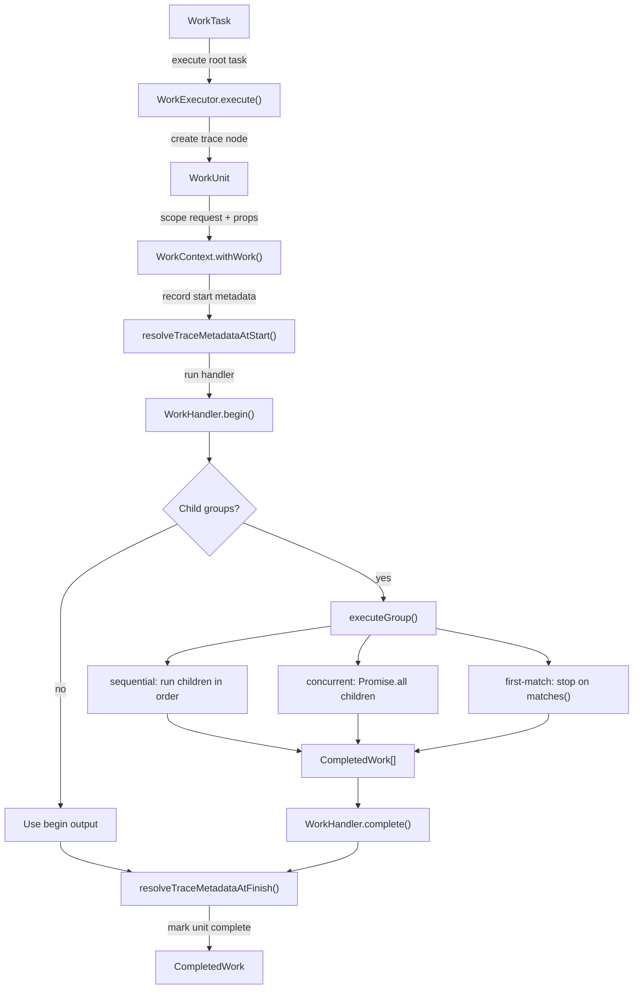

# Runtime Work

## Scope

This document covers `packages/forge-core/src/engine/runtime/evaluation/work`.

This code runs `WorkTask` trees for the runtime.
It executes work handlers, drains child groups, records trace units, and returns completed work output.

This document does not cover request phase ordering, phase-specific business rules, compiled function generation, or component rendering.

## Background

Runtime work is the execution model behind a Forge request.

Compiled functions and request phases do not usually do all of their child work directly.
They describe that work as `WorkTask`s.
For example, a compiled validation function returns one `validation.step` task that contains field and domain validation tasks.
A resolve function returns one `resolve.blocks` task that contains one `resolve.block` task per block.
The request pipeline itself is also one `request.pipeline` task with ordered request-phase children.

That shape matters because runtime needs one consistent way to run nested work.
Some children must run in order.
Some can run concurrently.
Some stop at the first useful result, like hook branches and request phases.
The raw function output is not enough because it does not tell runtime how to order children, how to fold child outputs, or how to record a trace.

This is not a job queue.
`WorkExecutor` runs an in-memory tree for one request.
It does not persist work, retry work, or schedule work outside the current request.

## Responsibilities

- Create branded `WorkTask` values.
- Execute a `WorkTask` by calling its `WorkHandler`.
- Drain child `WorkGroup`s in `sequential`, `concurrent`, or `first-match` mode.
- Pass a scoped `WorkContext` to every handler.
- Fold child outputs through the parent handler's `complete()` method.
- Record `WorkUnit` trace nodes as the tree runs.
- Serialize work-unit trees for request traces.
- Replace nested `WorkTask` props with completed outputs when a handler needs renderable values.
- Preserve partial trace state when execution fails.

## Data Model

The core contracts live in [work.type.ts](../../../contracts/runtime/work.type.ts).

`WorkTask<K, TProps>` is the executable description.
It contains:
- `$$typeof`, the `FORGE_WORK` brand used by `isWorkTask()`.
- `key`, the task key within its siblings.
- `handler`, the `WorkHandler` that knows how to run the task.
- `props`, the handler input.
- `instrumentation`, optional trace metadata hooks.

`WorkHandler<K, TProps>` owns behavior for one work kind.
Its `begin(ctx)` returns either an `output` or child `groups`.
Its optional `complete(ctx, children)` folds completed child work into the handler output.

`WorkBegin` has two arms:
- `{ output }`, for leaf work.
- `{ groups }`, for parent work that needs children.

`WorkGroup` controls child execution:
- `sequential` runs every child in declaration order.
- `concurrent` starts every child together and preserves declaration order in the completed output array.
- `first-match` runs children in order and stops when `matches(completedWork)` returns `true`.

`CompletedWork` is the immutable result returned by the executor.
It contains the task `key`, handler `kind`, handler `output`, and completed child results.

`WorkUnit` is the mutable trace node created while a task runs.
It records key, kind, parent, children, timing, begin fields, complete fields, output, and `omitFromTrace`.

`WorkContext` carries the request context and the current task props.
`withWork()` creates a new context for one work unit, with the same request object and different work props.

`WorkOutputByKind` in [workOutput.type.ts](../../../contracts/runtime/workOutput.type.ts) maps each known work kind to its output type.
This keeps handler outputs and child-output readers aligned.
Unknown string kinds still run, but their output type is `unknown`.

`WorkTaskFactory` is the runtime's task creation surface.
It wires known handlers, props, keys, and instrumentation together.
Generated functions call this through `ctx.workTasks`.

### Example

A parent handler can describe two child tasks and fold their results:

```ts
const childHandler: WorkHandler<'example.child', { readonly value: string }> = {
  kind: 'example.child',
  begin: ctx => ({ output: ctx.props.value }),
}

const parentHandler: WorkHandler<'example.parent'> = {
  kind: 'example.parent',
  begin: () => ({
    groups: [
      {
        mode: 'sequential',
        children: [
          createWorkTask('first', childHandler, { value: 'one' }),
          createWorkTask('second', childHandler, { value: 'two' }),
        ],
      },
    ],
  }),
  complete: (_ctx, children) => children.map(child => child.output),
}
```

`WorkExecutor.execute()` turns that task tree into completed work:

```jsonc
{
  "key": "parent",
  "kind": "example.parent",
  "output": ["one", "two"],
  "children": [
    { "key": "first", "kind": "example.child", "output": "one", "children": [] },
    { "key": "second", "kind": "example.child", "output": "two", "children": [] }
  ]
}
```

The important transform is from a description of work to completed output.
The executor owns the ordering and the child folding.
The handler owns the domain meaning of the output.

## Flow

Work execution starts when runtime calls `WorkExecutor.execute()` or `WorkExecutor.executeWithUnit()` with a root `WorkTask` and root `WorkContext`.
Each task creates one `WorkUnit`, runs `begin()`, executes any child groups, then runs `complete()` or returns the begin output.



- [WorkExecutor.ts](WorkExecutor.ts) owns the execution loop.
  `execute()` returns `CompletedWork`; `executeWithUnit()` also returns the root `WorkUnit` and wraps failures in `WorkExecutionError`.
- [WorkContext.ts](WorkContext.ts) carries the request context, current props, and current `WorkUnit`.
  `withWork()` keeps the request context shared while giving each task its own props and trace node.
- [WorkUnit.ts](WorkUnit.ts) records the trace tree.
  It is mutable while work runs and read later by trace projection.
- [workTask.ts](workTask.ts) creates branded tasks and provides child-output helpers such as `singleChildOutput()`, `childOutputs()`, and `findChildByTask()`.
- [WorkTaskFactory.ts](WorkTaskFactory.ts) wires known work kinds to their handlers and instrumentation.
  It is the main factory used by compiled functions and request pipeline builders.
- [WorkTaskPropsWalker.ts](WorkTaskPropsWalker.ts) finds nested `WorkTask`s inside plain props and replaces them with completed outputs.
  Resolve uses it when block props contain nested render work.
- [tracing/WorkUnitTraceSerializer.ts](tracing/WorkUnitTraceSerializer.ts) turns a `WorkUnit` tree into trace data and drops children marked `omitFromTrace`.
- [tracing/contextSnapshot.ts](tracing/contextSnapshot.ts) deep-clones request evaluation state for after-phase trace snapshots.

## Boundaries

- `WorkExecutor` owns execution order.
  It should not know request phases, validation rules, hook semantics, or rendering rules.
- `WorkHandler` implementations own domain behavior.
  They should return `WorkBegin` from `begin()` and fold child outputs in `complete()`.
- `WorkTaskFactory` owns known task creation.
  Generated functions and request builders should use it instead of hand-assembling branded task objects.
- `workTask.ts` owns generic task helpers and type guards.
  It should not import phase handlers.
- `WorkContext` owns request and props threading.
  It should not clone request state or isolate phase state.
- `WorkUnit` owns trace state.
  It should not decide which request outcome or phase output is correct.
- `WorkTaskPropsWalker` owns positional task collection and output replacement inside plain props.
  It should not execute tasks.
- Tracing helpers own serialization and snapshots.
  They should not mutate runtime state.

## Quirks

- `execute()` and `executeWithUnit()` differ only in failure shape and trace access.
  `executeWithUnit()` is used when callers need the partial `WorkUnit` tree after a failure.
- `concurrent` groups preserve child declaration order in results.
  `Promise.all()` lets children run together, but the completed array still lines up with the original children.
- `first-match` is sequential.
  It stops after the first completed child that matches. It never starts later children.
- A work unit is left incomplete when `begin()`, child execution, `complete()`, or instrumentation throws.
  This is deliberate so failed traces can show where execution stopped.
- `WorkTaskPropsWalker` matches completed work by position, then checks key and kind.
  Generated compiler output should normally give sibling tasks distinct keys, but the walker still tolerates duplicate keys so nested prop replacement stays deterministic.
- `WorkTaskPropsWalker` only walks arrays and plain records.
  It ignores dates, class instances, primitives, malformed task-like objects, and task props below a valid task boundary.
- `omitFromTrace()` is best effort.
  It only works when the current context has a real `WorkUnit`.

## Constraints

- Keep `begin()` before child execution and `complete()` after child execution.
  Reordering this would break every parent handler that expects completed child outputs in `complete()`.
- Do not run `first-match` children concurrently.
  Later children must not start after an earlier child has produced a terminal result.
- Preserve child result order for `sequential` and `concurrent` groups.
  `WorkTaskPropsWalker.replaceCompletedOutputs()` depends on the completed work array matching collection order.
- Do not swallow handler or instrumentation errors.
  Runtime needs real failures, and `executeWithUnit()` needs to carry the partial tree through `WorkExecutionError`.
- Only use `WorkUnit` as the parent trace object inside `WorkExecutor`.
  A foreign `WorkUnitReference` cannot be mutated safely into the trace tree.
- Keep task branding on `FORGE_WORK`.
  `isWorkTask()` and `WorkTaskPropsWalker` use the brand to distinguish work tasks from render blocks and ordinary records.
- Do not expose `WorkUnit` as the stable output of execution.
  `CompletedWork` is the execution result; `WorkUnit` is trace state.
- Do not make work handlers call request pipeline or compiler code directly.
  Work handlers execute runtime work for the current request; compilation must already be done.

## Editing Notes

- To add a new work kind, start in [workOutput.type.ts](../../../contracts/runtime/workOutput.type.ts).
  Add the output entry, then add or update the handler and factory method.
- To add a new handler, follow the existing handler shape.
  Declare a literal `kind`, implement `begin()`, and implement `complete()` only when the handler has children to fold.
- To create a task for a known handler, add a method to [WorkTaskFactory.ts](WorkTaskFactory.ts).
  Keep the key stable enough for traces and child matching.
- To add trace metadata for a task, add a `WorkInstrumentation` object beside the handler and pass it through `WorkTaskFactory`.
  Keep metadata small and serializable.
- To change group execution behavior, start in [WorkExecutor.ts](WorkExecutor.ts).
  Update tests for order, failure state, and trace shape at the same time.
- To read child outputs, use `singleChildOutput()`, `childOutputs()`, or `findChildByTask()`.
  Do not hand-cast `CompletedWork.output` in handlers unless the generic helper cannot express the lookup.
- To support nested tasks inside props, use [WorkTaskPropsWalker.ts](WorkTaskPropsWalker.ts).
  Keep collect and replacement traversal aligned, or duplicate keys can pair with the wrong output.
- To change trace projection, start in [tracing/WorkUnitTraceSerializer.ts](tracing/WorkUnitTraceSerializer.ts).
  Do not put trace serialization rules in `WorkExecutor`.

## Entry Points

- [WorkExecutor.ts](WorkExecutor.ts) answers how a `WorkTask` tree is executed.
- [workTask.ts](workTask.ts) answers how work tasks are created, identified, and read from completed children.
- [WorkTaskFactory.ts](WorkTaskFactory.ts) answers which known runtime handlers are wired to which task kinds.
- [WorkContext.ts](WorkContext.ts) answers how request context and task props are threaded through execution.
- [WorkUnit.ts](WorkUnit.ts) answers how the live trace tree is recorded.
- [WorkExecutionError.ts](WorkExecutionError.ts) answers how a failed execution carries the partial work tree.
- [WorkTaskPropsWalker.ts](WorkTaskPropsWalker.ts) answers how nested work tasks inside props are collected and replaced.
- [tracing/WorkUnitTraceSerializer.ts](tracing/WorkUnitTraceSerializer.ts) answers how live work units become trace output.
- [tracing/contextSnapshot.ts](tracing/contextSnapshot.ts) answers how request evaluation state is captured for phase traces.
- [../../../contracts/runtime/work.type.ts](../../../contracts/runtime/work.type.ts) defines `WorkTask`, `WorkHandler`, `WorkBegin`, `WorkGroup`, `CompletedWork`, and `WorkUnitContract`.
- [../../../contracts/runtime/workOutput.type.ts](../../../contracts/runtime/workOutput.type.ts) maps work kinds to their output types.
