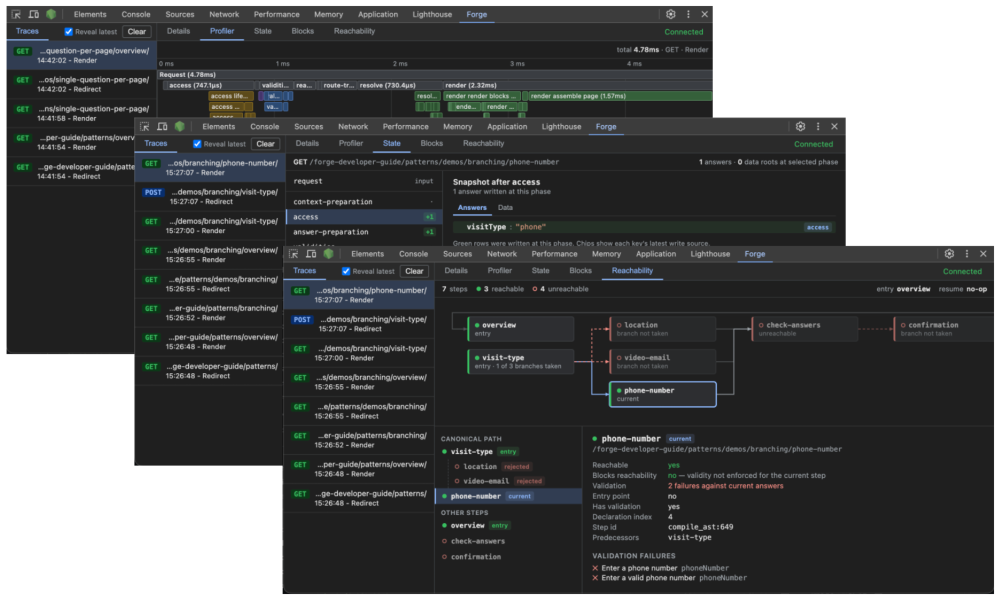

# Forge DevTools

A Chrome DevTools panel for debugging Forge applications.

Every request the engine evaluates streams into the panel live - what ran, how long it took, how the
snapshot changed, what the page resolved to, and why navigation went where it
did.



It has two halves:

- A websocket bridge that runs inside your app. It's a Forge instrumentation
  sink, so the engine hands it a trace for every request it evaluates.
- A Chrome extension that renders the panel and talks to the bridge.


## Setting up the bridge

The bridge ships in the main package under the `/devtools` subpath. Create it
once at startup, register it as an instrumentation sink, and attach it to your
HTTP server:

```typescript
import { setUpForgeDevTools } from '@ministryofjustice/hmpps-forge/devtools'

const devTools = setUpForgeDevTools({ logger })

const forge = new Forge({ logger, instrumentation: { sinks: [devTools] } })

// after http.createServer(app)
devTools.attach(httpServer)
```

`setUpForgeDevTools` takes:

- `path` - where the websocket lives, defaults to `/__forge-devtools`
- `logger` - anything with an `info(message)` method, defaults to `console`
- `noAuth` - skips the auth code prompt entirely. Local development only.

## Installing the extension

The extension is attached to each [GitHub release](https://github.com/ministryofjustice/hmpps-forge/releases)
as a zip. Chrome can't install extensions from outside the Web Store, so it
loads as an unpacked extension:

1. Download the zip from the latest release and unzip it somewhere stable,
   e.g. `~/tools/forge-devtools/`.
2. Open `chrome://extensions` and turn on **Developer mode** (top right).
3. Click **Load unpacked** and select the unzipped folder.
4. Open DevTools on your Forge app - a **Forge** panel appears alongside the
   built-in tabs.

To update, unzip the new release over the *same* folder and hit the reload
icon on `chrome://extensions`. Chrome derives an unpacked extension's identity
from its folder path, so unzipping somewhere new installs a second copy
instead of updating the first.

To build it from source instead: `cd packages && npm install && npm run build`,
then load `packages/dist/plugin` as the unpacked folder.

## Connecting

With the app running and the panel open, the extension connects to the
websocket on the inspected page's origin. The bridge prints a one-time code to
the app's terminal - enter it in the panel and you're in.

On success the panel sets a cookie on the inspected page, and the bridge only
forwards a request's trace to the panel whose cookie it carries. Two
developers pointed at the same environment each see their own browsing and
nobody else's.

With `noAuth: true` the code prompt is skipped, but each panel still gets its
own cookie - traces stay scoped to the browser that made the requests.

## The panels

The panel is the full story of a single request - you pick a trace in the
left rail, then read it through five lenses.

**Traces** - every request the engine evaluates streams in live: method,
path, outcome, timing. "Reveal latest" follows new traces as they land, Clear
bins the buffer. Everything else in the panel reads from whichever entry is
selected here.

**Details** - the at-a-glance view. Method, path, step title and node id,
metric cards for outcome and duration, the phase list, and the route facts
underneath (package, DSL path, route template, redirect target). Failed
traces show the error status and message with an expandable stack.

**Profiler** - Chrome's Performance tab pointed at the pipeline. A flame
chart of every work unit across the phases with self/total time, plus a
bottom-up table for finding where the time actually went. Selecting a bar
opens the unit's props, where block references render as clickable chips -
click to jump between units, hover to highlight the block on the page.

**State** - the pipeline as a rail of phases, each with a snapshot diff
against the previous one: added, removed and changed answer counts, and a
marker when domain data loaded. The inspector shows Answers and Data as
expandable trees - answers carry provenance chips (`access` / `submission` /
`default`) from their mutation history, new values get a green tint, and data
roots show which phase last wrote them. Pinned above the phases is the
Request item: the raw inputs the adapter passed in, split into Post, Query,
Params, State, Headers, Cookies and Session.

**Blocks** - React DevTools' component tree, but for Forge blocks. The
resolved page as a tree with variant names, content previews, `field` chips
and per-block failure badges - hovering a row draws the box-model overlay on
the actual page. The inspector has Props and Validation, with failure cards
showing blocking vs on-submit failures and their groups. Domain failures sit
on the step root, and "Only invalid" filters the tree down to just the
failing subtrees.

**Reachability** - the journey's step graph for this request: reachable,
unreachable and invalid steps, evaluated vs declared edges, the canonical
path, the frontier, and the resume outcome. Selecting a step tells you why
it's in the state it's in, including its validation failures.
